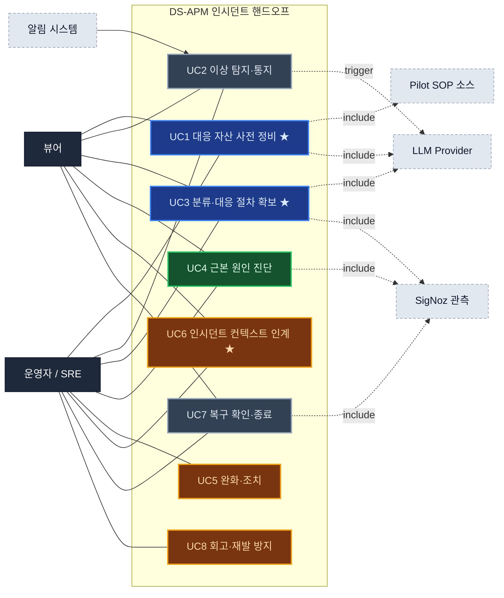
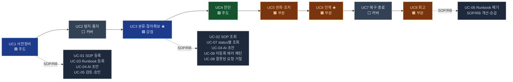

# Claude DS-APM Use Case 최종본 (병합)

`docs/usecase`의 Claude 운영자 UC 모델과 Codex SOP/Runbook UC를 **사용자 목표(user-goal)** 기준으로 병합한 최종 유스케이스 문서다.
장애별 상세 대응 절차·curl 실행 예시·fixture는 유스케이스가 아니라 SOP/runbook 예시이므로 `docs/sop/`에 둔다.

> **Claude 버전 특징** — ① 스텝마다 커버리지 3분류(🟦 DS-APM / 🟩 SigNoz / 🟥 공백) ② Codex의 SOP/Runbook 세부 UC(UC-01~09)를 라이프사이클 UC 아래로 매핑 ③ 인터랙티브 버전은 `claude-ds-apm-usecase-final.html`.

## 병합 기준

**반영:** Claude의 운영자 인시던트 라이프사이클(8 UC) · 스텝 단위 커버리지/갭 · route 기반 기능 그룹 / Codex의 SOP·Runbook 세부 사용자 행위(UC-01~09) · "등록되지 않은 에러 패턴 처리" · 상태/안전 규칙.
**제외:** 특정 장애 처리 절차 · script 실행 방법 · 개별 curl smoke test · validation 실패를 SOP처럼 길게 설명하는 내용. → 상세는 `docs/sop/codex-sop-runbook-case-*.md` 참조.

> 커버리지 표기 🟦 DS-APM(우리) · 🟩 SigNoz 플랫폼 · 🟥 공백(갭) · ⚠️ 부분/확인필요 · ★ 제품 정체성·강점 UC

---

## 1. 액터

| 액터 | 역할 |
|---|---|
| 운영자 / SRE | SOP·Runbook·AI 설정·알림 대응 자산을 만들고, incident 중 대응 절차를 확보·실행한다. |
| 뷰어 | 등록된 알림·SOP·Runbook·AI 전략 이력을 조회한다. (실행 script 변경 불가) |
| 알림 시스템 | alert rule 발화·dispatch 흐름으로 incident context를 만든다. |
| LLM Provider | AI 전략과 Runbook 초안을 생성한다. (Claude·Codex / API·CLI) |
| SigNoz 관측 | trace·log·metric·dashboard·service map으로 진단 근거를 제공한다. |
| Pilot SOP 소스 | managed markdown 등 외부 SOP 원천을 제공한다. |

## 2. 전체 컨텍스트 (유스케이스 다이어그램)



## 3. 라이프사이클 + SOP/Runbook 세부 UC 매핑



## 4. 유스케이스 목록

| ID | 유스케이스 | 주 액터 | 제품 책임 | 커버리지 |
|---|---|---|---|---|
| UC1 ★ | 대응 자산을 사전 정비한다 | 운영자 | alert·SOP·runbook·AI·downtime 준비 | 🟦 높음 |
| UC2 | 이상을 탐지하고 통지받는다 | 알림 시스템·운영자 | alert 발화 + AI 전략 연결 | ⬜ 중간 |
| UC3 ★ | 분류하고 대응 절차를 확보한다 | 운영자 | 관련 SOP/runbook 탐색, 없으면 draft | 🟦 높음 |
| UC4 | 근본 원인을 진단한다 | 운영자 | SigNoz 관측 + AI 전략 | 🟩 플랫폼 의존 |
| UC5 | 인시던트를 완화·조치한다 | 운영자 | SOP/runbook 읽고 수동 조치 | 🟧 부분 |
| UC6 ★ | 인시던트 컨텍스트를 인계한다 | 운영자 | SOP+runbook+AI 전략 묶음 전달 | 🟧 부분 |
| UC7 | 복구를 확인하고 종료한다 | 운영자 | metric·alert·downtime로 복구 확인 | ⬜ 중간 |
| UC8 | 회고하고 재발을 방지한다 | 운영자 | SOP·runbook·alert·AI 이력 개선 | 🟧 부분 |

---

## 5. 유스케이스 상세

### UC1 · 대응 자산을 사전 정비한다 ★ — 🟦 우리 주도
**주 액터** 운영자 · **연계** LLM(런북 초안), Pilot SOP 소스
incident 전에 대응 자산을 준비한다. DS-APM의 강점 구간.

**포함 사용자 행위** — alert rule 정의 · 알림 템플릿 preview · SOP 등록/버전 관리 · Runbook 수동 등록 · AI Runbook 초안 생성/검토 · AI provider·model 설정 · 점검 downtime 등록.

**SOP/Runbook 세부 UC** (상세 `docs/usecase/codex-sop-runbook-index.md`)
| 세부 UC | 목표 | 성공 기준 |
|---|---|---|
| UC-01 SOP 문서 등록 | 장애 패턴에 연결할 SOP 저장 | `sopId`+`version`으로 조회됨 |
| UC-03 Runbook 등록 | SOP version에 실행 절차 부착 | 부모 SOP version 목록에 표시 |
| UC-04 AI 초안 생성 | error example으로 후보 생성 | 초안 반환, **자동 저장 안 됨** |
| UC-05 Draft 검토·승인 | draft를 운영 절차로 확정 | status `draft → approved` |

**커버리지**
| 스텝 | 분류 | 근거/갭 |
|---|---|---|
| alert rule·SOP·runbook·AI·downtime 정비 | 🟦 | DS-APM 핵심 기능 |
| 골든시그널 대시보드 구성 | 🟩 | SigNoz 대시보드 |
| 온콜·에스컬레이션 정책 | 🟥 | 별도 엔티티 없음 |
| 서비스 카탈로그/소유자(CMDB) | 🟥 | 제한적 |
| SLO/에러버짓 정의 | 🟥⚠️ | SigNoz 플랫폼 확인필요 |

```text
POST /api/v2/ds/sop/documents
POST /api/v2/ds/sop/documents/{sopId}/versions/{version}/runbooks
PUT  /api/v2/ds/sop/documents/{sopId}/versions/{version}/runbooks/{runbookId}
PUT  /api/v2/ds/ai/config   ·   POST /api/v2/ds/ai/config/test
```

### UC2 · 이상을 탐지하고 통지받는다 — ⬜ 커버됨
**주 액터** 알림 시스템(트리거) → 운영자 · **연계** LLM
알림 시스템이 이상을 감지하고 incident context를 운영자에게 전달한다.

**포함 사용자 행위** — alert rule 발화 확인 · payload(labels·severity·service) 확인 · dispatch 중 생성된 AI 전략/preview 확인 · 대시보드 이상 확인.

**커버리지**
| 스텝 | 분류 | 근거/갭 |
|---|---|---|
| 임계값 초과 알림 수신 | 🟦 | Alert Rule 발화 |
| dispatch 시 AI 전략 자동 생성 | 🟦 | dispatchhook·LLM |
| 대시보드 이상 시각 확인 / 예외 급증 | 🟩 | SigNoz 대시보드·Exceptions |
| ML 기반 anomaly detection | 🟥⚠️ | DS-APM 소유 미확인 |
| 중복 알림 그룹핑·noise suppression | 🟥⚠️ | 제한적 |

```text
GET  /api/v2/rules   ·   POST /api/v2/rules/test
POST /api/v2/rules/notification_template/preview
POST /api/v2/ds/ai/strategy/preview   ·   GET /api/v2/ds/ai/strategy/history/latest
```

### UC3 · 분류하고 대응 절차를 확보한다 ★ — 🟦 핵심 강점
**주 액터** 운영자 · **연계** LLM, SigNoz
alert와 error example로 관련 SOP/runbook을 찾고, 없으면 draft를 만든다. **DS-APM의 핵심 가치.**

**포함 사용자 행위** — alert label로 SOP 탐색 · SOP version 연결 runbook 조회 · approved/draft/deprecated 구분 · error example으로 AI 초안 생성 · 미등록 에러 패턴을 draft 지식으로 남김.

**SOP/Runbook 세부 UC**
| 세부 UC | 목표 | 성공 기준 |
|---|---|---|
| UC-02 SOP 조회 | incident 중 관련 SOP 탐색 | 목록/상세/version 읽기 |
| UC-07 status별 조회 | approved/draft/deprecated 구분 | `status` query로 필터 |
| UC-04 AI 초안 생성 | 없는 절차를 후보로 | 초안 반환(자동저장 X) |
| UC-08 잘못된 요청 거절 | 잘못된 입력 사전 차단 | 4xx 또는 typed failure envelope |
| **UC-09 미등록 에러 패턴 처리** | 매칭 안 되는 에러를 임시 대응+지식화 | SOP 탐색→draft 생성→검토 대기 |

**미등록 에러 패턴 처리 흐름** (핵심)
```text
1. 에러/alert label로 관련 SOP를 찾는다.
2. SOP가 없으면 새 SOP 등록 대상으로 분류한다.
3. SOP는 있지만 runbook이 없으면 errorExamples로 AI draft를 요청한다.
4. 반환된 후보는 자동 저장하지 않는다.
5. 운영자가 검토 후 draft로 저장하거나 approved로 승격한다.
```

**커버리지**
| 스텝 | 분류 | 근거/갭 |
|---|---|---|
| 알림↔SOP 자동 매칭 / 즉시 런북 초안 | 🟦 | SOP 바인딩·RunbookDraftFromError |
| 영향 서비스 식별 | 🟩 | 서비스 맵 |
| 심각도/비즈니스 영향도 산정 | 🟥 | 별도 기능 없음 |
| 중복 알림 그룹핑 | 🟥⚠️ | dedup 미흡 |
| 과거 유사 incident 검색 | 🟥 | 제한적 |

**성공/안전 기준** — 관련 SOP·runbook이 있으면 빠르게 찾고, 없으면 draft 생성으로 이어진다. draft는 승인 전까지 자동 실행/approved 취급되지 않는다. LLM 실패는 typed failure envelope로 원인을 보여준다.

```text
POST /api/v2/ds/sop/bindings/preview   ·   GET /api/v2/ds/sop/documents
GET  /api/v2/ds/sop/documents/{sopId}/versions/{version}/runbooks?status=approved,draft
POST /api/v2/ds/runbooks/draft
```

### UC4 · 근본 원인을 진단한다 — 🟩 플랫폼 주도
**주 액터** 운영자 · **연계** SigNoz, LLM
SigNoz 관측과 AI 전략으로 원인을 좁힌다.

**포함 사용자 행위** — trace/span 분석 · log 검색·상관 · metric 시계열 · service dependency 추적 · AI strategy preview 참고.
**제품 책임 분담** — DS-APM: SOP/AI 전략/Runbook context 제공 · SigNoz: trace/log/metric/service map 진단 제공.

**커버리지**
| 스텝 | 분류 | 근거/갭 |
|---|---|---|
| 트레이스·로그·메트릭·의존성 분석 | 🟩 | SigNoz APM/Logs/Metrics/Map |
| AI 근본원인·전략 제안 | 🟦 | AI 전략 프리뷰·LLM |
| 배포·변경 이력 상관 | 🟥 | 별도 기능 없음 |
| 과거 incident timeline 자동 비교 | 🟥 | 없음 |

### UC5 · 인시던트를 완화·조치한다 — 🟧 부분 (실행 자동화 핵심 갭)
**주 액터** 운영자
확보한 SOP/runbook을 읽고 조치한다. **v0.1은 시스템이 script를 실행하지 않는다.**

**포함 사용자 행위** — 관련 SOP 열기 · approved runbook 읽기 · script 복사 · **운영자가 외부 shell/control plane에서 직접 실행** · 임시완화 후 runbook 수정 · 필요 시 downtime으로 알림 축소.

**커버리지**
| 스텝 | 분류 | 근거/갭 |
|---|---|---|
| 관련 SOP/런북 열람·갱신 | 🟦 | SOP/런북 조회·수정 |
| 대응 중 알림 뮤트 | 🟦⚠️ | Downtime(부분) |
| **실제 조치 자동실행(재시작/스케일/롤백)** | 🟥 | **오케스트레이션 없음** |
| 트래픽 차단·feature flag | 🟥 | 제어평면 연동 없음 |

**명확한 비범위** — 자동 restart/scale/rollback 없음 · feature flag·traffic control 직접 제어 없음 · confidence threshold 기반 auto-exec은 v0.1 범위 아님.

```text
GET  /api/v2/ds/sop/documents/{sopId}/versions/{version}/runbooks/{runbookId}
PUT  /api/v2/ds/sop/documents/{sopId}/versions/{version}/runbooks/{runbookId}
GET  /api/v1/downtime_schedules   ·   POST /api/v1/downtime_schedules
```

### UC6 · 인시던트 컨텍스트를 인계한다 ★ — 🟧 부분 (제품 정체성)
**주 액터** 운영자
교대·에스컬레이션·협업 상황에서 현재 context를 넘긴다.

**포함 사용자 행위** — SOP link 공유 · runbook 상태/선택 절차 공유 · AI strategy headline·first actions·hypotheses 공유 · alert labels·tenant scope 함께 전달.

**커버리지**
| 스텝 | 분류 | 근거/갭 |
|---|---|---|
| 핸드오프 컨텍스트(SOP+런북+AI전략) 전달 | 🟦 | 묶음 제공 가능 |
| 표준 통지 발송 | 🟦 | 알림 템플릿 preview |
| 구조화 교대 노트·incident timeline | 🟥 | timeline 객체 없음 |
| 에스컬레이션·페이징 / ChatOps | 🟥 | on-call·채널 연동 없음 |
| 외부 status page | 🟥 | 연동 없음 |

### UC7 · 복구를 확인하고 종료한다 — ⬜ 커버됨
**주 액터** 운영자 · **연계** SigNoz
조치 후 복구 여부를 확인하고 마감한다.

**포함 사용자 행위** — metric으로 정상화 확인 · alert 해제 확인 · downtime 종료/유지 판단 · 필요 시 runbook/SOP 개선 대상으로 표시.

**커버리지**
| 스텝 | 분류 | 근거/갭 |
|---|---|---|
| 메트릭으로 복구 확인 | 🟩 | SigNoz 대시보드 |
| 알림 해제 확인 / downtime 종료 | 🟦 | Alert Rule 상태·Downtime |
| incident 종료·상태 기록 | 🟥 | 1급 incident 객체 없음 |

### UC8 · 회고하고 재발을 방지한다 — 🟧 부분
**주 액터** 운영자
incident 이후 대응 자산과 알림 품질을 개선한다.

**포함 사용자 행위** — SOP 수정/새 version 관리 · Runbook 수정·승인·폐기 · alert threshold/template 조정 · AI strategy history 리뷰 · 반복 미등록 에러 패턴을 정식 SOP/runbook으로 승급.

**SOP/Runbook 세부 UC**
| 세부 UC | 목표 | 성공 기준 |
|---|---|---|
| UC-06 Runbook 폐기 | 안 쓰는 절차를 기본 목록에서 숨김 | status `deprecated`, deprecated 조회에서만 보임 |

**커버리지**
| 스텝 | 분류 | 근거/갭 |
|---|---|---|
| 런북/SOP 개선·버전 / 알림 규칙 튜닝 / AI 이력 리뷰 | 🟦 | 수정·버전·이력 기능 |
| 포스트모템 작성·관리 | 🟥 | 도구 없음 |
| incident timeline 자동 수집 / 액션아이템 추적 | 🟥 | 없음 |
| 반복 incident trend 분석 | 🟥 | 없음 |

```text
PUT   /api/v2/ds/sop/documents/{sopId}/versions/{version}/runbooks/{runbookId}
GET   /api/v2/ds/ai/strategy/history/latest
PUT   /api/v2/rules/{id}   ·   PATCH /api/v2/rules/{id}
```

---

## 6. 상태와 안전 규칙

**Runbook status:** `draft` · `approved` · `deprecated`

**허용 전이**
```text
draft      -> approved        approved   -> deprecated
draft      -> deprecated      approved   -> draft
deprecated -> draft
```
**금지 전이**
```text
deprecated -> approved        same-status no-op update
```

**안전 원칙** — AI draft는 자동 저장되지 않음 · draft는 자동 실행되지 않음 · approved runbook도 시스템이 직접 실행하지 않음 · deprecated는 기본 목록에 노출 안 됨 · 잘못된 입력은 저장 전에 거절(UC-08).

---

## 7. Route 대응표

| 그룹 | 유스케이스 | Method · Path | 권한 |
|---|---|---|---|
| Alert Rule | 규칙 목록 | `GET /api/v2/rules` | View |
| Alert Rule | 규칙 조회 | `GET /api/v2/rules/{id}` | View |
| Alert Rule | 규칙 생성 | `POST /api/v2/rules` | Edit |
| Alert Rule | 규칙 수정 | `PUT /api/v2/rules/{id}` | Edit |
| Alert Rule | 규칙 삭제 | `DELETE /api/v2/rules/{id}` | Edit |
| Alert Rule | 규칙 패치 | `PATCH /api/v2/rules/{id}` | Edit |
| Alert Rule | 규칙 테스트 | `POST /api/v2/rules/test` | Edit |
| Alert Rule | 알림 템플릿 프리뷰 | `POST /api/v2/rules/notification_template/preview` | Edit |
| SOP | SOP 프리뷰 | `POST /api/v2/rules/sop/preview` | Edit |
| SOP | Pilot managed markdown fetch | `POST /api/v2/rules/sop/pilot/managed_markdown/fetch` | Edit |
| SOP | Pilot 소스 목록 | `GET /api/v2/ds/sop/sources` | View |
| SOP | Pilot 소스 헬스 | `GET /api/v2/ds/sop/sources/{id}/health` | View |
| SOP | SOP 문서 생성 | `POST /api/v2/ds/sop/documents` | Edit |
| SOP | SOP 문서 목록 | `GET /api/v2/ds/sop/documents` | View |
| SOP | SOP 문서 조회 | `GET /api/v2/ds/sop/documents/{sopId}` | View |
| SOP | SOP 버전 조회 | `GET /api/v2/ds/sop/documents/{sopId}/versions/{version}` | View |
| SOP | SOP 바인딩 프리뷰 | `POST /api/v2/ds/sop/bindings/preview` | View |
| Runbook | Runbook 목록 | `GET .../{sopId}/versions/{version}/runbooks` | View |
| Runbook | Runbook 조회 | `GET .../runbooks/{runbookId}` | View |
| Runbook | Runbook 생성 | `POST .../runbooks` | Edit |
| Runbook | Runbook 수정 | `PUT .../runbooks/{runbookId}` | Edit |
| Runbook | Runbook 삭제 | `DELETE .../runbooks/{runbookId}` | Edit |
| Runbook | Runbook LLM 초안 생성 | `POST /api/v2/ds/runbooks/draft` | Edit |
| AI | AI 전략 프리뷰 | `POST /api/v2/ds/ai/strategy/preview` | View |
| AI | 최신 AI 전략 이력 | `GET /api/v2/ds/ai/strategy/history/latest` | View |
| AI | AI 설정 조회 | `GET /api/v2/ds/ai/config` | View |
| AI | AI 설정 수정 | `PUT /api/v2/ds/ai/config` | Edit |
| AI | AI 설정 테스트 | `POST /api/v2/ds/ai/config/test` | Edit |
| Downtime | Downtime 목록 | `GET /api/v1/downtime_schedules` | View |
| Downtime | Downtime 조회 | `GET /api/v1/downtime_schedules/{id}` | View |
| Downtime | Downtime 생성 | `POST /api/v1/downtime_schedules` | Edit |
| Downtime | Downtime 수정 | `PUT /api/v1/downtime_schedules/{id}` | Edit |
| Downtime | Downtime 삭제 | `DELETE /api/v1/downtime_schedules/{id}` | Edit |

---

## 8. 갭 클러스터

| 클러스터 | 걸리는 UC | 의미 |
|---|---|---|
| 실행/자동조치 | UC5 | Runbook은 문서·copy 대상. 실행 오케스트레이션이 다음 단계. |
| 협업/통지 | UC6 | on-call·ChatOps·status page·escalation은 별도 설계 필요. |
| Incident 객체 | UC6·UC7·UC8 | timeline·종료 상태·postmortem·action item을 묶으려면 1급 incident 모델 필요. |
| 변경 상관 | UC4·UC8 | 배포/설정 변경 이력 + incident history가 진단 정확도를 높임. |
| 반복 패턴 분석 | UC8 | 미등록 에러 반복 여부를 집계하는 기능은 아직 없음. |

**스텝 집계:** 🟦 DS-APM 22 · 🟩 SigNoz 9 · 🟥 공백 19 (⚠️ 4). 강점은 사전정비·분류·진단 보조, 갭은 대응실행·협업·사후관리.
