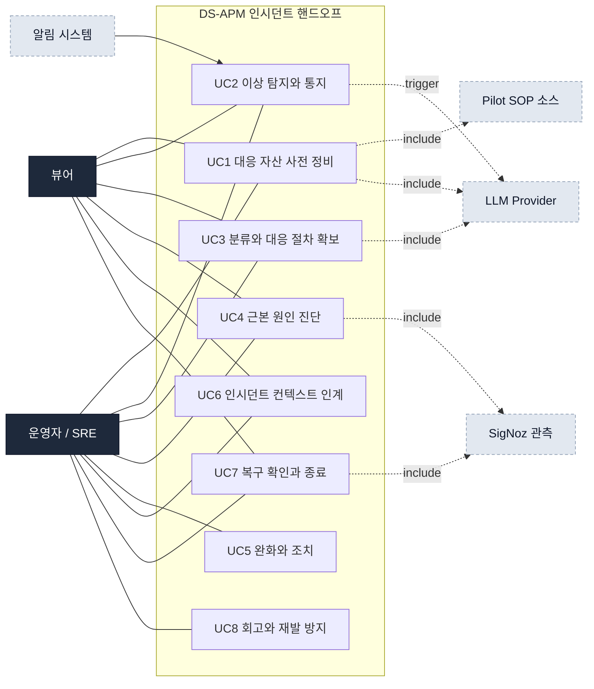

# Codex DS-APM Use Case 최종본

이 문서는 `docs/usecase`에 있던 Claude 버전과 Codex 버전을 병합한 최종
유스케이스 문서다. 기준은 **사용자 목표**다. 장애별 대응 절차, curl 실행 예시,
fixture는 유스케이스가 아니라 SOP/runbook 예시이므로 `docs/sop/`에 둔다.

## 병합 기준

반영한 내용:

- Claude 문서의 운영자 인시던트 라이프사이클
- Claude 문서의 커버리지/갭 관점
- Claude 문서의 route 기반 기능 그룹
- Codex 문서의 SOP/Runbook 세부 사용자 행위
- Codex 문서의 “등록되지 않은 에러 패턴 처리” 유스케이스

제외한 내용:

- 특정 장애 처리 절차
- 특정 script 실행 방법
- 개별 curl smoke test
- validation 실패를 장애 대응 SOP처럼 길게 설명하는 내용

상세 예시는 `docs/sop/codex-sop-runbook-case-*.md`를 참조한다.

## 액터

| 액터 | 역할 |
|---|---|
| 운영자 / SRE | SOP, Runbook, AI 설정, 알림 대응 자산을 만들고 incident 중 대응 절차를 확보한다. |
| 뷰어 | 등록된 알림, SOP, Runbook, AI 전략 이력을 조회한다. |
| 알림 시스템 | alert rule 발화와 dispatch 흐름을 통해 incident context를 만든다. |
| LLM Provider | AI 전략과 Runbook draft를 생성한다. |
| SigNoz 관측 기능 | trace, log, metric, dashboard, service map으로 진단 근거를 제공한다. |
| Pilot SOP 소스 | managed markdown 같은 외부 SOP 원천을 제공한다. |

## 전체 컨텍스트



## 라이프사이클


## 유스케이스 목록

| ID | 유스케이스 | 주 액터 | 제품 책임 | 현재 커버리지 |
|---|---|---|---|---|
| UC1 | 대응 자산을 사전 정비한다 | 운영자 / SRE | alert, SOP, runbook, AI 설정, downtime을 준비한다 | 높음 |
| UC2 | 이상을 탐지하고 통지받는다 | 알림 시스템, 운영자 | alert 발화와 AI 전략 생성을 연결한다 | 중간 |
| UC3 | 분류하고 대응 절차를 확보한다 | 운영자 / SRE | 관련 SOP/runbook을 찾고 없는 절차는 draft로 만든다 | 높음 |
| UC4 | 근본 원인을 진단한다 | 운영자 / SRE | SigNoz 관측 근거와 AI 전략을 사용한다 | 플랫폼 의존 |
| UC5 | 인시던트를 완화·조치한다 | 운영자 / SRE | SOP/runbook을 읽고 수동 조치한다 | 부분 |
| UC6 | 인시던트 컨텍스트를 인계한다 | 운영자 / SRE | SOP, runbook, AI 전략을 묶어 전달한다 | 부분 |
| UC7 | 복구를 확인하고 종료한다 | 운영자 / SRE | metric/alert/downtime 상태로 복구를 확인한다 | 중간 |
| UC8 | 회고하고 재발을 방지한다 | 운영자 / SRE | SOP/runbook/alert/AI 이력을 개선한다 | 부분 |

## UC1. 대응 자산을 사전 정비한다

운영자는 incident 전에 대응 자산을 준비한다. 이 단계는 DS-APM의 강점이다.

포함되는 사용자 행위:

- alert rule을 만든다.
- 알림 템플릿을 preview한다.
- SOP 문서를 등록하고 version을 관리한다.
- Runbook을 수동 등록한다.
- AI Runbook draft를 만든 뒤 검토한다.
- AI provider와 model 설정을 관리한다.
- 점검 downtime을 등록한다.

SOP/Runbook 세부 유스케이스:

| 세부 UC | 목표 | 성공 기준 |
|---|---|---|
| SOP 문서를 등록한다 | 서비스 장애 패턴에 연결할 SOP를 저장한다 | `sopId`와 `version`으로 조회된다 |
| Runbook을 등록한다 | 특정 SOP version에 실행 절차를 붙인다 | runbook이 부모 SOP version 목록에 표시된다 |
| Draft Runbook을 검토하고 승인한다 | draft를 운영 가능한 절차로 확정한다 | status가 `approved`가 된다 |

주요 route:

```text
POST /api/v2/ds/sop/documents
GET  /api/v2/ds/sop/documents/{sopId}/versions/{version}
POST /api/v2/ds/sop/documents/{sopId}/versions/{version}/runbooks
PUT  /api/v2/ds/sop/documents/{sopId}/versions/{version}/runbooks/{runbookId}
PUT  /api/v2/ds/ai/config
POST /api/v2/ds/ai/config/test
```

갭:

- 온콜/에스컬레이션 정책은 별도 엔티티가 없다.
- 서비스 카탈로그/소유자 모델은 제한적이다.
- SLO/에러버짓은 SigNoz 플랫폼 기능 확인이 필요하다.

## UC2. 이상을 탐지하고 통지받는다

알림 시스템이 이상을 감지하고 운영자에게 incident context를 전달한다.

포함되는 사용자 행위:

- alert rule 발화를 확인한다.
- 알림 payload의 labels, severity, service 정보를 확인한다.
- dispatch 과정에서 생성된 AI 전략 또는 preview를 확인한다.
- 대시보드에서 이상 징후를 본다.

주요 route:

```text
GET  /api/v2/rules
POST /api/v2/rules/test
POST /api/v2/rules/notification_template/preview
POST /api/v2/ds/ai/strategy/preview
GET  /api/v2/ds/ai/strategy/history/latest
```

갭:

- ML 기반 anomaly detection은 명확한 DS-APM 소유 기능으로 확인되지 않았다.
- 중복 알림 그룹핑과 noise suppression은 제한적이다.

## UC3. 분류하고 대응 절차를 확보한다

운영자는 alert와 error example을 바탕으로 관련 SOP/runbook을 찾는다. 기존
절차가 없으면 draft를 만든다. 이 단계가 DS-APM의 핵심 가치다.

포함되는 사용자 행위:

- alert label로 관련 SOP를 찾는다.
- SOP version에 연결된 runbook을 조회한다.
- status별로 approved/draft/deprecated runbook을 구분한다.
- error example으로 AI Runbook draft를 생성한다.
- 등록되지 않은 에러 패턴을 draft 지식으로 남긴다.

등록되지 않은 에러 패턴 처리:

```text
1. 에러/alert label로 관련 SOP를 찾는다.
2. SOP가 없으면 새 SOP 등록 대상으로 분류한다.
3. SOP는 있지만 runbook이 없으면 errorExamples로 AI draft를 요청한다.
4. 반환된 후보는 자동 저장하지 않는다.
5. 운영자가 검토 후 draft로 저장하거나 approved로 승격한다.
```

주요 route:

```text
POST /api/v2/ds/sop/bindings/preview
GET  /api/v2/ds/sop/documents
GET  /api/v2/ds/sop/documents/{sopId}/versions/{version}/runbooks?status=approved,draft
GET  /api/v2/ds/sop/documents/{sopId}/versions/{version}/runbooks?status=deprecated
POST /api/v2/ds/runbooks/draft
```

성공 기준:

- 관련 SOP와 runbook이 있으면 빠르게 찾을 수 있다.
- runbook이 없으면 draft 생성 흐름으로 이어진다.
- draft는 승인 전까지 자동 실행되거나 approved로 취급되지 않는다.
- LLM 실패는 typed failure envelope로 원인을 보여준다.

갭:

- 비즈니스 영향도 산정은 별도 기능이 없다.
- 과거 유사 incident 검색은 제한적이다.

## UC4. 근본 원인을 진단한다

운영자는 SigNoz의 관측 기능과 AI 전략을 사용해 원인을 좁힌다.

포함되는 사용자 행위:

- trace/span을 분석한다.
- log를 검색하고 상관관계를 본다.
- metric 시계열을 확인한다.
- service dependency를 추적한다.
- AI strategy preview를 참고한다.

주요 제품 책임:

- DS-APM은 SOP/AI 전략/Runbook context를 제공한다.
- SigNoz 플랫폼은 trace/log/metric/service map 진단을 제공한다.

갭:

- 배포/변경 이력 상관은 별도 기능이 없다.
- 과거 incident timeline과 자동 비교하는 기능은 없다.

## UC5. 인시던트를 완화·조치한다

운영자는 확보한 SOP/runbook을 읽고 조치한다. v0.1에서는 시스템이 script를
실행하지 않는다.

포함되는 사용자 행위:

- 관련 SOP를 연다.
- approved runbook을 읽는다.
- script를 복사한다.
- 운영자가 외부 shell/control plane에서 직접 실행한다.
- 임시완화 후 runbook을 수정한다.
- 필요하면 downtime으로 알림을 줄인다.

주요 route:

```text
GET /api/v2/ds/sop/documents/{sopId}/versions/{version}/runbooks/{runbookId}
PUT /api/v2/ds/sop/documents/{sopId}/versions/{version}/runbooks/{runbookId}
GET /api/v1/downtime_schedules
POST /api/v1/downtime_schedules
```

명확한 비범위:

- 자동 restart, scale, rollback은 없다.
- feature flag나 traffic control plane 직접 제어는 없다.
- confidence threshold 기반 auto-exec은 v0.1 범위가 아니다.

## UC6. 인시던트 컨텍스트를 인계한다

운영자는 교대, 에스컬레이션, 협업 상황에서 현재 context를 넘긴다.

포함되는 사용자 행위:

- SOP link를 공유한다.
- runbook 상태와 선택한 절차를 공유한다.
- AI strategy headline, first actions, hypotheses를 공유한다.
- alert labels와 tenant scope를 함께 전달한다.

현재 커버:

- SOP + Runbook + AI 전략 묶음은 가능하다.
- 알림 템플릿을 통한 표준 메시지 preview가 가능하다.

갭:

- incident timeline 객체가 없다.
- 교대 노트, ChatOps 채널, on-call escalation은 없다.
- 외부 status page 연동은 없다.

## UC7. 복구를 확인하고 종료한다

운영자는 조치 후 복구 여부를 확인한다.

포함되는 사용자 행위:

- metric으로 정상화 여부를 확인한다.
- alert 해제를 확인한다.
- downtime을 종료하거나 유지 여부를 판단한다.
- 필요한 경우 runbook/SOP 개선 대상으로 남긴다.

현재 커버:

- SigNoz dashboard/metric 확인
- Alert rule 상태 확인
- Downtime schedule 관리

갭:

- incident 종료 상태를 기록하는 1급 incident 객체가 없다.

## UC8. 회고하고 재발을 방지한다

운영자는 incident 이후 대응 자산과 알림 품질을 개선한다.

포함되는 사용자 행위:

- SOP를 수정하거나 새 version으로 관리한다.
- Runbook을 수정, 승인, 폐기한다.
- alert rule threshold 또는 template을 조정한다.
- AI strategy history를 리뷰한다.
- 반복되는 미등록 에러 패턴을 정식 SOP/runbook으로 승격한다.

주요 route:

```text
PUT /api/v2/ds/sop/documents/{sopId}/versions/{version}/runbooks/{runbookId}
GET /api/v2/ds/ai/strategy/history/latest
PUT /api/v2/rules/{id}
PATCH /api/v2/rules/{id}
```

갭:

- postmortem 작성/관리 기능은 없다.
- action item 추적 기능은 없다.
- 반복 incident trend 분석은 없다.

## 상태와 안전 규칙

Runbook status:

```text
draft
approved
deprecated
```

허용되는 전이:

```text
draft      -> approved
draft      -> deprecated
approved   -> deprecated
approved   -> draft
deprecated -> draft
```

금지되는 전이:

```text
deprecated -> approved
same-status no-op update
```

안전 원칙:

- AI draft는 자동 저장되지 않는다.
- Draft는 자동 실행되지 않는다.
- Approved runbook도 시스템이 직접 실행하지 않는다.
- Deprecated runbook은 기본 목록에 노출하지 않는다.
- 잘못된 입력은 저장 전에 거절한다.

## Route 대응표

| 그룹 | 유스케이스 | Method · Path | 권한 |
|---|---|---|---|
| Alert Rule | 규칙 목록 | `GET /api/v2/rules` | View |
| Alert Rule | 규칙 조회 | `GET /api/v2/rules/{id}` | View |
| Alert Rule | 규칙 생성 | `POST /api/v2/rules` | Edit |
| Alert Rule | 규칙 수정 | `PUT /api/v2/rules/{id}` | Edit |
| Alert Rule | 규칙 삭제 | `DELETE /api/v2/rules/{id}` | Edit |
| Alert Rule | 규칙 패치 | `PATCH /api/v2/rules/{id}` | Edit |
| Alert Rule | 규칙 테스트 | `POST /api/v2/rules/test` | Edit |
| Alert Rule | 알림 템플릿 프리뷰 | `POST /api/v2/rules/notification_template/preview` | Edit |
| SOP | SOP 프리뷰 | `POST /api/v2/rules/sop/preview` | Edit |
| SOP | Pilot managed markdown fetch | `POST /api/v2/rules/sop/pilot/managed_markdown/fetch` | Edit |
| SOP | Pilot 소스 목록 | `GET /api/v2/ds/sop/sources` | View |
| SOP | Pilot 소스 헬스 | `GET /api/v2/ds/sop/sources/{id}/health` | View |
| SOP | SOP 문서 생성 | `POST /api/v2/ds/sop/documents` | Edit |
| SOP | SOP 문서 목록 | `GET /api/v2/ds/sop/documents` | View |
| SOP | SOP 문서 조회 | `GET /api/v2/ds/sop/documents/{sopId}` | View |
| SOP | SOP 버전 조회 | `GET /api/v2/ds/sop/documents/{sopId}/versions/{version}` | View |
| SOP | SOP 바인딩 프리뷰 | `POST /api/v2/ds/sop/bindings/preview` | View |
| Runbook | Runbook 목록 | `GET /api/v2/ds/sop/documents/{sopId}/versions/{version}/runbooks` | View |
| Runbook | Runbook 조회 | `GET /api/v2/ds/sop/documents/{sopId}/versions/{version}/runbooks/{runbookId}` | View |
| Runbook | Runbook 생성 | `POST /api/v2/ds/sop/documents/{sopId}/versions/{version}/runbooks` | Edit |
| Runbook | Runbook 수정 | `PUT /api/v2/ds/sop/documents/{sopId}/versions/{version}/runbooks/{runbookId}` | Edit |
| Runbook | Runbook 삭제 | `DELETE /api/v2/ds/sop/documents/{sopId}/versions/{version}/runbooks/{runbookId}` | Edit |
| Runbook | Runbook LLM 초안 생성 | `POST /api/v2/ds/runbooks/draft` | Edit |
| AI | AI 전략 프리뷰 | `POST /api/v2/ds/ai/strategy/preview` | View |
| AI | 최신 AI 전략 이력 | `GET /api/v2/ds/ai/strategy/history/latest` | View |
| AI | AI 설정 조회 | `GET /api/v2/ds/ai/config` | View |
| AI | AI 설정 수정 | `PUT /api/v2/ds/ai/config` | Edit |
| AI | AI 설정 테스트 | `POST /api/v2/ds/ai/config/test` | Edit |
| Downtime | Downtime 목록 | `GET /api/v1/downtime_schedules` | View |
| Downtime | Downtime 조회 | `GET /api/v1/downtime_schedules/{id}` | View |
| Downtime | Downtime 생성 | `POST /api/v1/downtime_schedules` | Edit |
| Downtime | Downtime 수정 | `PUT /api/v1/downtime_schedules/{id}` | Edit |
| Downtime | Downtime 삭제 | `DELETE /api/v1/downtime_schedules/{id}` | Edit |

## 갭 클러스터

| 클러스터 | 걸리는 UC | 의미 |
|---|---|---|
| 실행/자동조치 | UC5 | Runbook은 문서와 copy 대상이다. 실행 오케스트레이션은 다음 단계다. |
| 협업/통지 | UC6 | on-call, ChatOps, status page, escalation은 별도 설계가 필요하다. |
| Incident 객체 | UC6, UC7, UC8 | timeline, 종료 상태, postmortem, action item을 연결하려면 1급 incident 모델이 필요하다. |
| 변경 상관 | UC4, UC8 | 배포/설정 변경 이력과 incident history가 진단 정확도를 높인다. |
| 반복 패턴 분석 | UC8 | 등록되지 않은 에러가 반복되는지 집계하는 기능은 아직 없다. |

