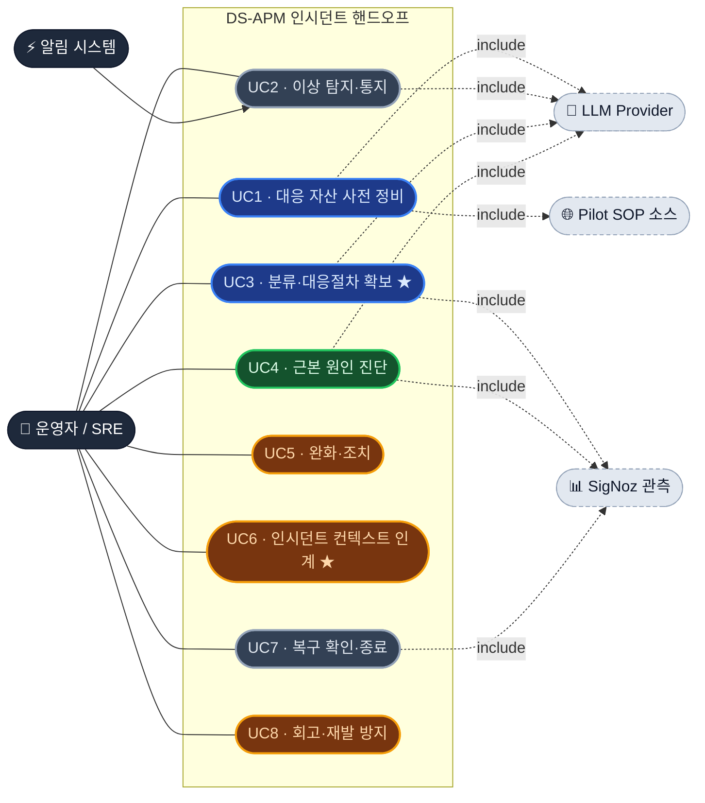

# DS-APM 운영자 Use Case (User-goal 레벨) + 커버리지

운영자(SRE/온콜)의 **목표 단위 유스케이스 8개**. 각 UC 안에 상세 스텝(50개)을 흡수했고,
스텝마다 우리 제품이 커버하는지 3분류로 표시했다.

> **UC 판정** 🟦 우리(DS-APM) 주도 · 🟩 SigNoz 플랫폼 주도 · 🟧 부분(갭 있음) · ⬜ 혼합/커버됨
> **스텝 분류** 🟦 DS-APM · 🟩 SigNoz · 🟥 공백 · ⚠️ 확인필요
> ★ = 제품 정체성/강점 UC

---

## 1. 유스케이스 다이어그램 (액터 ↔ 목표)

## 2. 라이프사이클 순서 + UC 판정

---

## 3. 유스케이스 명세 (UC별 스텝 + 커버리지)

### UC1 · 대응 자산을 사전 정비한다 — 🟦 우리 주도
**액터** 운영자 · **연계** LLM, Pilot SOP 소스
| 스텝 | 분류 | 근거/갭 |
|---|---|---|
| 알림 규칙·임계값 정의 | 🟦 | Alert Rule |
| 알림 템플릿 표준화 | 🟦 | 알림 템플릿 프리뷰 |
| SOP 작성·버전 관리 | 🟦 | SOP 문서/버전 |
| 런북 작성(수동) | 🟦 | 런북 생성/수정 |
| 런북 LLM 초안 생성 | 🟦 | 런북 draft(LLM) |
| AI provider/모델 설정 | 🟦 | AI 설정 |
| 점검 다운타임 등록 | 🟦 | Downtime 스케줄 |
| 골든시그널 대시보드 구성 | 🟩 | SigNoz 대시보드 |
| 온콜·에스컬레이션 정책 | 🟥 | 없음 |
| 서비스 카탈로그/소유자(CMDB) | 🟥 | 없음 |
| SLO/에러버짓 정의 | 🟥⚠️ | SigNoz 확인필요 |

### UC2 · 이상을 탐지하고 통지받는다 — ⬜ 커버됨
**액터** 알림 시스템(트리거) → 운영자 · **연계** LLM
| 스텝 | 분류 | 근거/갭 |
|---|---|---|
| 임계값 초과 알림 수신 | 🟦 | Alert Rule 발화 |
| dispatch 시 AI 전략 자동 생성 | 🟦 | dispatchhook(LLM) |
| 대시보드 이상 시각 확인 | 🟩 | SigNoz 대시보드 |
| 예외/에러 급증 포착 | 🟩 | SigNoz Exceptions |
| ML 기반 이상탐지 | 🟥⚠️ | anomaly 확인필요 |

### UC3 · 분류하고 대응 절차를 확보한다 ★ — 🟦 핵심 강점
**액터** 운영자 · **연계** LLM, SigNoz
| 스텝 | 분류 | 근거/갭 |
|---|---|---|
| 알림↔관련 SOP 자동 매칭 | 🟦 | SOP 바인딩 |
| 알림에서 즉시 런북 초안 | 🟦 | RunbookDraftFromError(LLM) |
| 영향 서비스 식별 | 🟩 | 서비스 맵 |
| 심각도/비즈니스 영향 판단 | 🟥 | 영향도 산정 없음 |
| 중복 알림 그룹핑·노이즈 억제 | 🟥⚠️ | dedup 미흡 |

### UC4 · 근본 원인을 진단한다 — 🟩 플랫폼 주도
**액터** 운영자 · **연계** SigNoz, LLM
| 스텝 | 분류 | 근거/갭 |
|---|---|---|
| 트레이스/스팬 분석 | 🟩 | SigNoz APM |
| 로그 검색·상관 | 🟩 | SigNoz Logs |
| 메트릭 시계열 분석 | 🟩 | SigNoz Metrics |
| 서비스 의존성 추적 | 🟩 | 서비스 맵 |
| AI 근본원인·전략 제안 | 🟦 | AI 전략 프리뷰(LLM) |
| 배포·변경 이력 상관 | 🟥 | 변경 추적 없음 |
| 과거 유사 인시던트 검색 | 🟥 | 이력 저장소 없음 |

### UC5 · 인시던트를 완화·조치한다 — 🟧 부분 (실행 자동화 핵심 갭)
**액터** 운영자
| 스텝 | 분류 | 근거/갭 |
|---|---|---|
| 관련 SOP/런북 열람 | 🟦 | SOP/런북 조회 |
| 임시완화 후 런북 갱신 | 🟦 | 런북 수정 |
| 대응 중 알림 뮤트 | 🟦⚠️ | Downtime(부분) |
| **실제 조치 자동실행(재시작/스케일/롤백)** | 🟥 | **오케스트레이션 없음** |
| 트래픽 차단·feature flag | 🟥 | 제어평면 연동 없음 |

### UC6 · 인시던트 컨텍스트를 인계한다 ★ — 🟧 부분 (제품 정체성)
**액터** 운영자
| 스텝 | 분류 | 근거/갭 |
|---|---|---|
| 핸드오프 컨텍스트 전달(SOP/런북/AI전략) | 🟦 | SOP+런북+AI 묶음 |
| 표준 통지 발송 | 🟦 | 알림 템플릿 |
| 구조화 교대 노트·인시던트 타임라인 | 🟥 | 타임라인 객체 없음 |
| 에스컬레이션·페이징 | 🟥 | 온콜/페이징 없음 |
| 인시던트 채널·ChatOps | 🟥 | 연동 없음 |
| 외부 상태페이지 | 🟥 | 없음 |

### UC7 · 복구를 확인하고 종료한다 — ⬜ 커버됨
**액터** 운영자 · **연계** SigNoz
| 스텝 | 분류 | 근거/갭 |
|---|---|---|
| 메트릭으로 복구 확인 | 🟩 | SigNoz 대시보드 |
| 알림 해제 확인 | 🟦 | Alert Rule 상태 |
| 다운타임 종료 | 🟦 | Downtime |
| 인시던트 종료·상태 기록 | 🟥 | 인시던트 객체 없음 |

### UC8 · 회고하고 재발을 방지한다 — 🟧 부분
**액터** 운영자
| 스텝 | 분류 | 근거/갭 |
|---|---|---|
| 런북/SOP 개선 반영 | 🟦 | 런북/SOP 수정+버전 |
| 알림 규칙 튜닝(오탐↓) | 🟦 | Alert Rule 수정 |
| AI 전략 이력 리뷰 | 🟦 | AI 전략 이력 |
| 포스트모템 작성·관리 | 🟥 | 도구 없음 |
| 인시던트 타임라인 자동 수집 | 🟥 | 없음 |
| 액션아이템 추적 | 🟥 | 없음 |
| 반복 인시던트 트렌드 분석 | 🟥 | 없음 |

---

## 4. 갭 클러스터 (UC 횡단)

| 클러스터 | 주로 걸리는 UC | 시사점 |
|---|---|---|
| **① 실행/자동조치** | UC5 | 런북이 "문서"에 머묾 — 실행 오케스트레이션이 다음 가치 |
| **② 협업/통지** | UC6 | PagerDuty/Slack/Statuspage 연동 필요 |
| **③ 인시던트 객체** | UC6·UC7·UC8 | 인시던트를 1급 엔티티로 모델링해야 회고 루프 완성 |
| **④ 변경 상관** | UC4 | 배포 추적 + 인시던트 이력이 진단 정확도 핵심 |

**스텝 집계 (50):** 🟦 22 · 🟩 9 · 🟥 19 (⚠️ 4) — 강점은 사전정비·분류·진단 보조, 갭은 대응실행·협업·사후관리.
