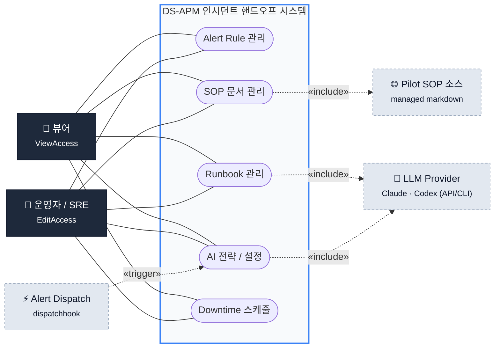
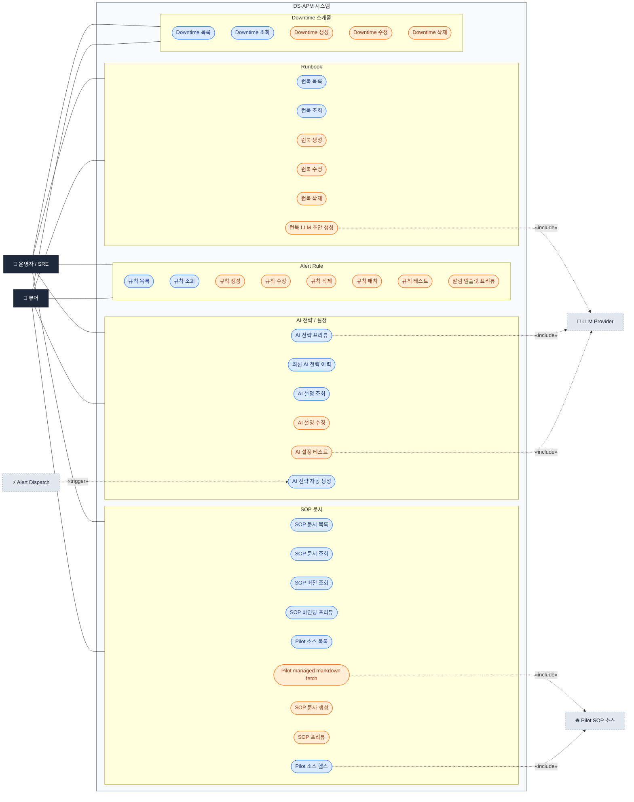

# DS-APM 인시던트 핸드오프 — Use Case 다이어그램 (Mermaid)

> 출처: 실제 등록 라우트 (`pkg/apiserver/signozapiserver/ruler.go`) + 핸들러
> (`pkg/ruler/signozruler/*.go`) + AI/런북 드래프터 (`pkg/ruler/aigenerator`, `pkg/ruler/runbookdrafter`).
> 색상 규약 — 🟦 **View**(뷰어+운영자 가능) / 🟧 **Edit**(운영자만). 외부/시스템 액터는 회색.

---

## 1. 컨텍스트 다이어그램 (액터 ↔ 5개 유스케이스 그룹)

---

## 2. 상세 다이어그램 (전체 유스케이스)

> 운영자/SRE는 모든 케이스 수행 가능. 뷰어는 🟦 View 케이스만.
> 점선 화살표는 외부 액터에 대한 «include»/«trigger».

---

## 3. 유스케이스 ↔ 라우트 대응표

| 그룹 | 유스케이스 | Method · Path | 권한 |
|---|---|---|---|
| Alert Rule | 규칙 목록 | `GET /api/v2/rules` | View |
| Alert Rule | 규칙 조회 | `GET /api/v2/rules/{id}` | View |
| Alert Rule | 규칙 생성 | `POST /api/v2/rules` | Edit |
| Alert Rule | 규칙 수정 | `PUT /api/v2/rules/{id}` | Edit |
| Alert Rule | 규칙 삭제 | `DELETE /api/v2/rules/{id}` | Edit |
| Alert Rule | 규칙 패치 | `PATCH /api/v2/rules/{id}` | Edit |
| Alert Rule | 규칙 테스트 | `POST /api/v2/rules/test` | Edit |
| Alert Rule | 알림 템플릿 프리뷰 | `POST /api/v2/rules/notification_template/preview` | Edit |
| SOP 문서 | SOP 프리뷰 | `POST /api/v2/rules/sop/preview` | Edit |
| SOP 문서 | Pilot managed markdown fetch | `POST /api/v2/rules/sop/pilot/managed_markdown/fetch` | Edit |
| SOP 문서 | Pilot 소스 목록 | `GET /api/v2/ds/sop/sources` | View |
| SOP 문서 | Pilot 소스 헬스 | `GET /api/v2/ds/sop/sources/{id}/health` | View |
| SOP 문서 | SOP 문서 생성 | `POST /api/v2/ds/sop/documents` | Edit |
| SOP 문서 | SOP 문서 목록 | `GET /api/v2/ds/sop/documents` | View |
| SOP 문서 | SOP 문서 조회 | `GET /api/v2/ds/sop/documents/{sopId}` | View |
| SOP 문서 | SOP 버전 조회 | `GET /api/v2/ds/sop/documents/{sopId}/versions/{version}` | View |
| SOP 문서 | SOP 바인딩 프리뷰 | `POST /api/v2/ds/sop/bindings/preview` | View |
| Runbook | 런북 목록 | `GET .../{sopId}/versions/{version}/runbooks` | View |
| Runbook | 런북 조회 | `GET .../runbooks/{runbookId}` | View |
| Runbook | 런북 생성 | `POST .../runbooks` | Edit |
| Runbook | 런북 수정 | `PUT .../runbooks/{runbookId}` | Edit |
| Runbook | 런북 삭제 | `DELETE .../runbooks/{runbookId}` | Edit |
| Runbook | 런북 LLM 초안 생성 | `POST /api/v2/ds/runbooks/draft` | Edit |
| AI 전략/설정 | AI 전략 프리뷰 | `POST /api/v2/ds/ai/strategy/preview` | View |
| AI 전략/설정 | 최신 AI 전략 이력 | `GET /api/v2/ds/ai/strategy/history/latest` | View |
| AI 전략/설정 | AI 설정 조회 | `GET /api/v2/ds/ai/config` | View |
| AI 전략/설정 | AI 설정 수정 | `PUT /api/v2/ds/ai/config` | Edit |
| AI 전략/설정 | AI 설정 테스트 | `POST /api/v2/ds/ai/config/test` | Edit |
| AI 전략/설정 | AI 전략 자동 생성 | `dispatchhook` (알림 발생 시 내부 트리거) | — |
| Downtime | Downtime 목록 | `GET /api/v1/downtime_schedules` | View |
| Downtime | Downtime 조회 | `GET /api/v1/downtime_schedules/{id}` | View |
| Downtime | Downtime 생성 | `POST /api/v1/downtime_schedules` | Edit |
| Downtime | Downtime 수정 | `PUT /api/v1/downtime_schedules/{id}` | Edit |
| Downtime | Downtime 삭제 | `DELETE /api/v1/downtime_schedules/{id}` | Edit |
