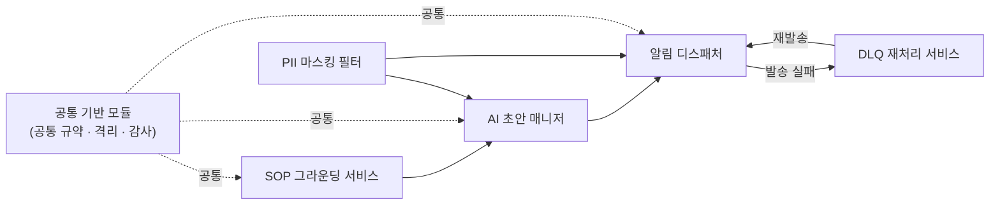
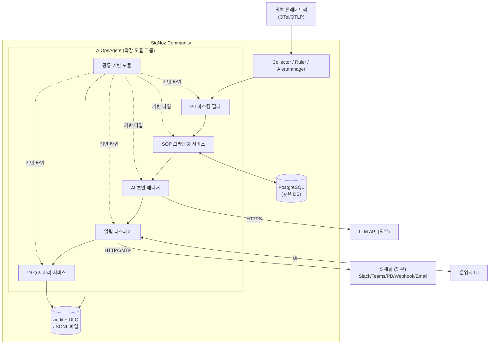

# DS-APM 기능 명세 (요약본)

> **대상**: 개발 디테일을 보지 않아도 되는 분 (팀장 · 매니저 · 의사결정자).
> **읽는 시간**: 약 10~15분.
> **목적**: DS-APM이 무엇을 만들었는가를 **6 컴포넌트**로 압축합니다. 각 컴포넌트가 하는 일, 보장하는 결과, 알려진 한계를 한 번에 정리합니다.

## 개요

**AIOpsAgent**는 SigNoz Community 빌드의 알림 처리 경로에 운영 자동화(SOP 그라운딩·AI 초안·DLQ 재처리) 단계를 추가하는 확장 모듈 그룹입니다. SigNoz Community 빌드(`cmd/community/`)에 내장된 6개 컴포넌트로 구성되며, 각 컴포넌트는 일감 분해(WBS) 1개 묶음에 1:1로 대응합니다.

| 컴포넌트 | 한 줄 요약 | 일감 묶음 |
|---|---|---|
| **공통 기반 모듈 (Foundation Core)** | 모든 컴포넌트가 의존하는 공통 규약·격리 정책·감사 기록 | WBS-1.0 |
| **SOP 그라운딩 서비스 (SOP Grounding Service)** | 알람과 미리 등록된 운영 절차서(SOP)를 자동 매칭 | WBS-1.1 |
| **AI 초안 매니저 (AI Drafter Manager)** | 매칭된 절차서로 대응 초안을 작성, 한도 초과 시 안전하게 우회 | WBS-1.2 |
| **알림 디스패처 (Notification Dispatcher)** | Slack · MS Teams · PagerDuty · Webhook · Email 동시 발송 | WBS-1.3 |
| **PII 마스킹 필터 (PII Masking Filter)** | 알림에 섞여 들어온 이메일·전화·토큰을 외부로 내보내기 전에 가림 | WBS-1.4 |
| **DLQ 재처리 서비스 (DLQ Replay Service)** | 발송 실패한 알림을 잃지 않고 보관, 운영자가 다시 보낼 때 중복 방지 | WBS-1.5 |

---

## 1. 공통 기반 모듈 (Foundation Core) — 공통 규약·격리·감사

### 하는 일
다른 다섯 컴포넌트가 모두 사용하는 토대입니다. (a) 각 컴포넌트가 주고받는 데이터의 **공통 규약**을 정의하고, (b) 여러 조직(테넌트)의 데이터가 섞이지 않도록 **격리 정책**을 적용하며, (c) 누가 언제 무엇을 했는지 **감사 기록**을 영속 파일로 남깁니다.

### 어떤 결과를 보장하는가
- 감사 기록 누락률 **0%** — 모든 SOP 조회, AI 초안 요청, 발송이 한 줄씩 영속 파일로 기록됩니다.
- 감사 파일은 **50 MiB 단위 자동 회전** — 디스크 폭주를 방지합니다.
- 한 조직의 SOP를 다른 조직이 조회하면 **"존재 자체가 없는 것처럼"** 응답합니다(존재 누설 금지).
- 자격증명(토큰·시크릿)은 외부로 나가는 응답에 **절대 노출되지 않음** — 자동 차단 검증을 수행합니다.

### 알려진 한계
- 다중 테넌트 격리는 라벨 기반 필터 수준입니다. 데이터베이스 단의 **행 단위 보안(row-level security)이 아니므로 운영 환경 적용에는 미흡합니다**. 내부 단일 테넌트 운영은 무방하나, 외부 고객사 다수를 한 인스턴스에 수용하는 경우 격리 강화가 필요합니다.

### 확인 방법
운영 담당자가 SOP 한 건을 조회하면, 같은 순간 감사 파일에 "누가·언제·무엇을·결과는 무엇" 한 줄이 추가되어야 합니다. 감사 sink가 디스크 오류 등으로 초기화에 실패하더라도 서버 부팅 자체는 막히지 않아야 합니다(가용성 우선).

---

## 2. SOP 그라운딩 서비스 (SOP Grounding Service) — 알람과 절차서 자동 매칭

### 하는 일
운영 절차서(SOP, Standard Operating Procedure, 운영 절차서)를 데이터베이스에 저장하고, 알람이 들어왔을 때 **알람 라벨**(예: `signoz_pilot_sop_id=SOP-PAY-5xx`)을 단서로 어떤 SOP를 적용할지 자동으로 찾습니다. SOP는 markdown 본문으로 등록되며 버전 관리되고, 운영 담당자가 승인(draft → approved)해야 매칭 대상이 됩니다.

### 어떤 결과를 보장하는가
- 매칭은 명시적 라벨 기반 — **결과가 항상 결정적**(같은 입력은 같은 결과)이며 추론 오류가 없습니다.
- SOP 본문 최대 크기 **256 KiB** 상한, 그 이상은 등록 단계에서 거부합니다.
- SOP가 비활성화(disabled) 상태이면 "사용 불가" 상태로 명시되어 운영 담당자가 인지할 수 있습니다.

### 알려진 한계
- 현재는 **명시적 라벨 매칭만 지원**합니다. "비슷한 알람을 의미 기반으로 찾아주는" 벡터 검색은 v0.1에 포함되지 않습니다. SOP 등록 시 알람 라벨과 명확한 ID 연결이 필수입니다.
- 90일이 지난 오래된 SOP는 자동으로 보류 처리되어 운영 담당자에게 원본(raw) 알람만 전달됩니다(staleness(노후도) 정책).

### 확인 방법
"결제 5xx 오류" 알람에 `signoz_pilot_sop_id=SOP-PAY-5xx` 라벨이 붙어 있고 데이터베이스에 같은 ID의 SOP가 approved 상태로 존재하면, 시스템은 그 SOP를 5초 안에 찾아 다음 단계(AI 초안 매니저)로 전달해야 합니다. 다른 조직 소속 SOP를 조회하면 "찾을 수 없음"으로 통일된 응답이 돌아와야 합니다.

---

## 3. AI 초안 매니저 (AI Drafter Manager) — 초안 작성 + 한도 제어

### 하는 일
SOP 그라운딩 서비스가 찾아준 절차서와 알람 라벨을 묶어 **외부 대규모 언어 모델**(LLM, Large Language Model, 대규모 언어 모델 — 예: Claude·OpenAI·자체 호스팅 모델)에 전달하고, **대응 초안**(가설, 첫 조치, 고객 안내문 초안, 벤더 요청 초안)을 한국어로 받아옵니다. 동시에 조직별로 **호출 한도·실행 시간 한도·라이선스**를 검사하여, 한도를 넘거나 외부 API가 실패하더라도 알림 발송 자체는 절대 멈추지 않도록 합니다(장애 시 통과(fail-open), 보호 메커니즘 실패 시 정지 대신 우회).

### 어떤 결과를 보장하는가
- 초안 생성 시도는 알림 발송 경로에서 **1초 안에 결판** — 그 안에 응답이 없으면 초안 없이 SOP 원문만으로 발송을 진행합니다.
- 모든 첫 조치 항목은 **"운영 담당자 승인 필요"** 플래그가 강제됩니다 — 자동 실행 주장(예: "자동 재시작했습니다") 패턴은 검증기가 거부합니다.
- 호출 한도가 소진되거나 라이선스가 없을 때 응답에 **사유가 명시되어 감사가 가능**합니다.

### 알려진 한계
- AI 초안은 **운영 담당자 승인 전 자동 실행되지 않습니다**. 사람의 판단·승인 책임은 그대로 유지됩니다.
- 외부 LLM API에 의존합니다. 다만 장애 시 통과(fail-open) 정책으로 API 장애가 운영자 대응 정지로 이어지지 않습니다.
- 한도 정책(요청·시간·라이선스)은 장애 시 통과(fail-open) 기본입니다. 보안 민감 테넌트의 fail-closed 옵션은 후속(follow-up) 결정 사항입니다.

### 확인 방법
LLM API가 401(인증 실패) 또는 429(쿼터 초과) 응답을 주는 경우, 시스템은 1초 안에 **SOP 원문 그대로** 알림 디스패처(Notification Dispatcher)로 흘려보내고, 운영 담당자에게는 "AI 초안 없음, SOP 원문 사용" 표시가 보여야 합니다. 별도로 SRE 채널에 "LLM 인증/쿼터 실패" 메타 알림이 한 건 발송됩니다.

---

## 4. 알림 디스패처 (Notification Dispatcher) — 5채널 동시 발송

### 하는 일
SigNoz Alertmanager의 발송 핵심 경로(dispatcher hot path)에 SOP 매칭·AI 초안·DLQ 단계를 삽입하고, 합쳐진 알림을 **5개 채널에 동시 발송**합니다: Slack · MS Teams · PagerDuty · Webhook · Email. 각 채널의 메시지 형식은 자동 변환되며(예: Slack은 Block Kit, MS Teams는 Adaptive Card), `severity`(심각도)·`service_name`(서비스명)·`sop_url`(SOP 링크)·`ai_headline`(AI 한 줄 요약) 같은 22가지 표준 필드를 채널에 맞게 끼워 넣습니다. 외부 HTTP 호출은 LLM API와 5채널뿐입니다.

### 어떤 결과를 보장하는가
- 5채널 동시 발송 — 수동 운영 시 자주 발생하던 **누락률(약 5%)을 0%로** 감소시킵니다.
- 발송 경로의 95퍼센타일 처리 시간 **30초 이내**(운영 담당자 승인 시간 제외)를 보장합니다.
- 한 채널 발송이 실패해도 **다른 채널 발송이 멈추지 않음** — 실패는 로그 기록 후 DLQ로 흡수됩니다.
- 사용 불가능한 템플릿 변수(`$incident.xxx` 형태)는 등록 단계에서 보고됩니다(잘못된 템플릿이 운영에 투입되지 않음).

### 알려진 한계
- MS Teams는 incoming webhook의 제약으로 **"승인 버튼"(Action.Submit)이 작동하지 않습니다**. 현재는 SOP 링크를 여는 버튼(Action.OpenUrl)만 지원합니다.
- Slack 대화형 승인 버튼(협업 도구(메신저) 안에서 직접 승인) 지원은 후속(follow-up) 항목입니다.

### 확인 방법
결제 5xx 알람이 들어오면 시스템은 SOP "SOP-PAY-5xx"와 매칭하여 AI 초안을 만들고, Slack 채널·MS Teams 채널·PagerDuty escalation 세 곳에 30초 안에 도달해야 합니다. 그 중 Slack API가 일시 장애로 실패하면 시스템은 실패를 로그·DLQ에 기록하고 나머지 채널 발송은 계속해야 합니다.

---

## 5. PII 마스킹 필터 (PII Masking Filter) — 외부 발송 전 자동 가림

### 하는 일
알람에 섞여 들어오는 개인 식별 정보(PII, Personally Identifiable Information, 개인 식별 정보)·민감정보를 **외부로 나가기 전에 자동으로 가립니다**. 가리는 대상은 다음과 같습니다.

- **이메일 주소** → `[redacted-email]`
- **한국 휴대전화 번호**(010·+82-10 등) → `[redacted-phone]`
- **32자 이상의 알파벳·숫자 시크릿**(추정 토큰) → `[redacted-secret]`
- **Bearer 토큰 · JWT · API 키 마커** → 값 전체를 `[redacted]`로 교체
- **URL 안의 민감 쿼리 파라미터**(`access_token`, `api_key` 등) → 키만 남기고 값 제거

22개 알림 필드(서비스명, SOP 링크, AI 헤드라인 등 모두 포함)에 일괄 적용됩니다.

### 어떤 결과를 보장하는가
- AI 초안 매니저와 외부 5채널로 나가는 페이로드에서 위 4종 패턴의 **누출률 0%**(정규식 기반 자동 검출)를 보장합니다.
- URL의 사용자 정보(`user:password@host`)는 **항상 제거**됩니다.
- 가림 처리는 채널 어댑터 호출 **이전**에 완료됩니다 — 정제(sanitize)되지 않은 값이 외부로 나갈 수 없습니다.

### 알려진 한계
- 현재는 **AIOpsAgent 입구의 단일 지점**에서만 가림 처리합니다. OpenTelemetry 가이드가 권장하는 "OTel Collector 단의 가장 이른 단계 적용"은 **미구현이며 README에 운영 환경 적용 미흡임을 명시**하고 있습니다.
- 가림 처리율 메트릭(카테고리별 카운트)은 아직 노출되지 않습니다. 임계치 초과 시 메타 알림 발화는 후속(follow-up) 과제입니다.
- 신용카드·IP 부분 가림·user_id 해싱 등 카테고리 확장도 후속(follow-up) 과제입니다.

### 확인 방법
알람 페이로드에 `Contact ops@example.com for details` 또는 `긴급 010-1234-5678` 문자열이 포함되면, 외부 5채널로 발송되는 메시지에서는 각각 `Contact [redacted-email] for details` 와 `긴급 [redacted-phone]` 로 치환되어 있어야 합니다.

---

## 6. DLQ 재처리 서비스 (DLQ Replay Service) — 발송 실패도 잃지 않음

### 하는 일
5채널 중 어떤 채널이 일시 장애로 발송에 실패하면, 원본 페이로드와 실패 사유를 **DLQ**(Dead Letter Queue, 미전송 사장 큐)로 표현된 영속 파일에 한 줄씩 보관합니다. 운영 담당자가 채널 정상화를 확인한 뒤 재전송을 트리거하면, 시스템은 **재전송 원장(replay ledger)**(이벤트 ID 장부)으로 중복 발송을 차단하면서 다시 시도합니다. 프로세스가 중간에 종료되었다 재기동되어도 같은 이벤트는 두 번 발송되지 않습니다.

### 어떤 결과를 보장하는가
- 모든 재시도 실패 후에도 **원본 알림 정보 손실 0건** — DLQ 영속 파일에 보존됩니다.
- DLQ 파일 **50 MiB 단위 자동 회전** — 디스크 폭주를 방지합니다.
- DLQ 쓰기 자체가 실패해도 **알림 발송 자체는 멈추지 않음**(best-effort).
- 같은 이벤트 ID로 재전송을 두 번 호출하면 두 번째는 자동으로 건너뜁니다 — 프로세스 재시작 후에도 유효합니다.

### 알려진 한계
- **HMAC(Hash-based Message Authentication Code) 서명 정책이 미정**입니다(보안 미해결 후속 과제). 재전송 시 페이로드 위변조 검증 정책이 확정되어야 운영 환경 적용(production-ready) 선언이 가능합니다. (NF-5.3.1, 팀장 의사결정 D-1 필요)
- 중복 방지 키는 현재 알람 fingerprint(지문)만 사용합니다. 같은 알람을 여러 채널로 보내는 경우의 "채널별 독립 원장(ledger)" 확장은 후속(follow-up) 과제입니다.
- 운영 담당자가 DLQ를 조회하고 재전송하는 화면(UI 또는 CLI)은 본 컴포넌트 범위 밖입니다. 해당 인터페이스는 후속(follow-up) 과제입니다.

### 확인 방법
Slack API가 5xx로 응답해 발송이 실패하면, DLQ 파일에 채널 `ops-slack`, 이벤트 ID = 알람 fingerprint, 실패 사유가 한 줄로 추가되어야 합니다. 같은 이벤트 ID로 재전송을 두 번 호출하면 첫 번째만 실제 발송되고 두 번째는 건너뜀이 원장(ledger)에 기록되어야 합니다.

---

## 외부 시스템과 어떻게 주고받나

AIOpsAgent는 SigNoz Community 빌드에 내장된 확장 모듈 그룹입니다. "외부와 주고받는다"는 표현은 **바이너리 바깥으로 나가는 통신**만을 가리킵니다. 실제 외부 HTTP 호출은 LLM API와 5채널뿐입니다.

실제 바이너리 바깥으로 나가는 인터페이스는 다음 4종뿐입니다.

| 외부 인터페이스 | 통신 프로토콜 | 방향 | 비고 |
|---|---|---|---|
| OTel/OTLP 텔레메트리 | OTLP | 입구 | SigNoz Collector가 수신 (DS-APM 직접 관여 없음) |
| LLM API | HTTPS | 출구 | AI 초안 매니저가 호출. OpenAI·Anthropic·자체 호스팅 모두 호환. 401/403/429/5xx 응답이 장애 시 통과(fail-open) 분기의 트리거 |
| 5채널 (Slack / MS Teams / PagerDuty / Webhook / Email) | HTTP / SMTP | 출구 | DS-APM 알림 디스패처가 호출 |
| 운영 담당자 UI | HTTP | 양방향 | SigNoz UI 안에 검수 화면이 포함됨 |

**내부 (같은 바이너리)**: PostgreSQL (bun ORM으로 SigNoz와 같은 DB 사용, 별도 SOP 테이블), 감사 JSONL(JSON Lines, 한 줄당 한 JSON 객체) (`var/audit/pilot-events.jsonl`), DLQ JSONL (`var/dlq/*.jsonl`, 50 MiB 단위 회전) — 모두 같은 프로세스에서 같은 디스크에 접근합니다.

---

## 비기능 요건(NFR) 요약

비기능 요건(NFR, Non-functional Requirement, 비기능 요건)으로 운영 약속에 해당하는 3대 정량 지표입니다.

| 카드 | 목표 | 측정 기준 | 의미 |
|---|---|---|---|
| **성능 (Performance)** | 알람 → 협업 도구(메신저) 도달 95퍼센타일 30초 이내 | p95 latency ≤ 30s (운영 담당자 승인 시간 제외) | 새벽 알람의 5~15분 노동을 30초로 단축 |
| **보안 (Security)** | 외부로 나가는 페이로드의 PII 누출 0%, 자격증명 노출 0% | 카테고리별 가림 패턴 일치 + 자격증명 노출 차단 검증기 통과 | AI 초안 매니저·외부 채널 모두 정제(sanitize)된 값만 사용 |
| **신뢰성 (Reliability)** | 모든 재시도 실패 후에도 원본 알림 정보 손실 0건 | DLQ 영속 보존 + 재전송 중복 0건 | "정보 손실 0" — 무성 유실(silent drop)이 가장 나쁘다는 운영 원칙 |

비고: **개인정보 마스킹**(컴포넌트 5)과 **DLQ + 재전송**(컴포넌트 6)은 **운영 환경 적용 미흡(production-readiness 격차)**이 있습니다.
- 마스킹은 입구 단일 지점에서만 적용 — OTel Collector 단으로 이동 권장 (README 경고)
- DLQ 재전송의 HMAC 서명 정책 미정 — 운영 환경 적용(production-ready) 선언 전 결정 필요

---

## 관련 산출물

| 산출물 | 대상 독자 | 링크 |
|---|---|---|
| **종합 브리핑** (배경·시나리오·의사결정 요청) | 팀장·매니저·의사결정자 | [brief.html](brief.html) |
| **Overview** | 신규 멤버·외부 컨설턴트·감사 — 아키텍처와 시스템 경계 | [../01-overview/index.md](../01-overview/index.md) |
| **Use Case** | QA·개발자 — 정상 흐름 + 실패 시나리오 2건 | [../02-usecase/index.md](../02-usecase/index.md) |
| **기능명세서 (상세본)** | 개발자 — 모듈 9개 인터페이스 + BDD 시나리오 표기법(Gherkin) 기반 인수 기준(Acceptance Criteria) | [../03-functional-spec/index.md](../03-functional-spec/index.md) |
| **WBS** | PM·일정 관리 — 작업 분해·마일스톤·의존도 | [../04-wbs/index.md](../04-wbs/index.md) |
| 용어집 (31개 용어) | 전체 | [glossary.md](../_shared/glossary.md) |

---

> 본 문서는 9개 상세 모듈(F0~F8)을 **6개 컴포넌트로 압축**한 요약본입니다.
> 모듈별 인터페이스·데이터 구조·BDD 시나리오 표기법(Gherkin) 기반 인수 기준(Acceptance Criteria)은 [기능명세서](../03-functional-spec/index.md)를 참조하시기 바랍니다.
