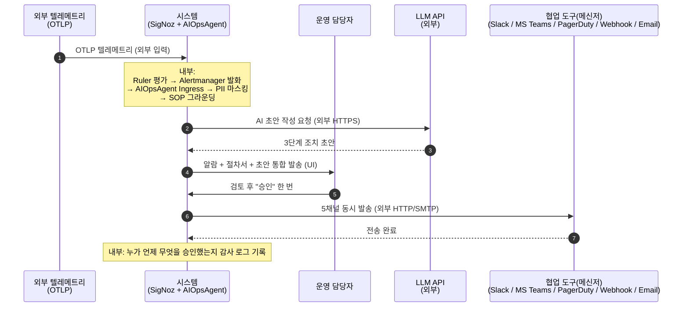
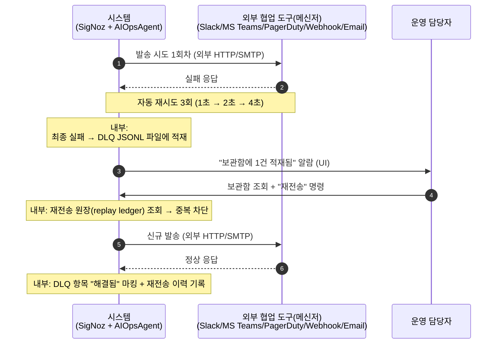
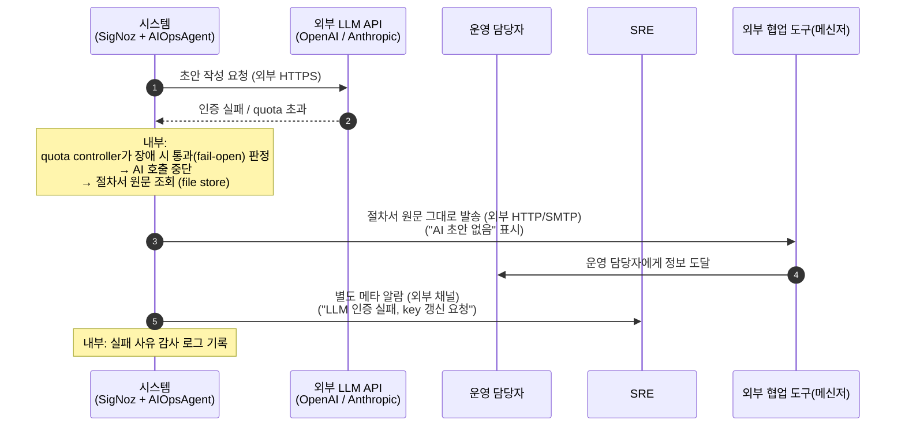

# DS-APM 실사용 시나리오 (요약본)

> **대상**: 팀장 · 매니저 · 의사결정자. **읽는 시간**: 약 10~15분.
> **목적**: DS-APM이 실제 새벽 장애 상황에서 어떻게 동작하는지, 세 가지 대표 장면으로 보입니다. 개발 디테일은 모두 걷어내고 "누가, 무엇을, 어떻게"만 남겼습니다.

## 개요

**AIOpsAgent**는 SigNoz Community 빌드의 알림 처리 경로에 운영 자동화(SOP 그라운딩·AI 초안·DLQ 재처리) 단계를 추가하는 확장 모듈 그룹입니다. SigNoz Alertmanager의 dispatcher 경로에 SOP(Standard Operating Procedure, 운영 절차서)/AI/DLQ(Dead Letter Queue, 미전송 사장 큐) 단계를 삽입하는 방식으로 동작합니다. 아래 시퀀스 다이어그램의 "시스템" lane 안에서 일어나는 일은 모두 같은 프로세스 안의 함수 호출이고, 외부 HTTP 호출은 출구의 5채널(Slack/MS Teams/PagerDuty/Webhook/Email)과 LLM(Large Language Model, 대규모 언어 모델) API뿐입니다.

새벽 3시. 결제 시스템에 5xx 오류가 임계치를 넘어 알람이 발화하는 동일한 상황에서 세 가지 결말이 가능합니다.

| 시나리오 | 한 줄 요약 | 무엇이 일어나나 |
|---|---|---|
| **시나리오 1 — 정상 흐름** | 장애 발생 → 협업 도구(메신저) 발송까지 약 30초 | 시스템이 절차서를 찾아 AI 초안과 함께 운영 담당자에게 띄우고, 운영 담당자가 한 번 승인하면 5채널 동시 발송 |
| **시나리오 2 — 메신저 전송 실패** | 메신저가 안 받으면 보관함에 모아 두고 운영 담당자가 재전송 | 일시 장애로 메신저가 안 받을 때 자동 재시도 → 그래도 안 되면 보관함(DLQ)에 보존 → 운영 담당자가 직접 다시 보냄 |
| **시나리오 3 — AI가 답을 못 줄 때** | AI 인증 실패·quota 초과 시 절차서 원문 그대로 발송 | 외부 AI가 응답을 거부하면 가공 없이 절차서 원문 그대로 운영 담당자에게 도달 — 침묵하지 않습니다 |

등장하는 참여자(Actor)는 세 부류입니다.

- **운영 담당자 (당직 운영자, on-call)** — 새벽 알람을 받는 당직자입니다. DS-APM이 반복 노동을 덜어 주는 대신, **판단과 승인**은 그대로 남습니다.
- **SRE** — 운영 안정성 담당입니다. 보관함이 차오르거나 AI가 광역 실패하면 SRE에게 별도 메타 알람이 발송됩니다.
- **시스템 (SigNoz + AIOpsAgent)** — SigNoz Ruler·Alertmanager와 AIOpsAgent 모듈이 함께 동작합니다. Alertmanager가 알람을 발화시키면 AIOpsAgent가 받아 절차서를 찾고, 외부 LLM에 초안을 요청하고, 협업 도구(메신저)로 발송하는 일까지 자동 수행합니다.
## 누가 무엇을 하나

| 역할 | 시나리오 1 (정상) | 시나리오 2 (메신저 실패) | 시나리오 3 (AI 실패) |
|---|---|---|---|
| **운영 담당자** | 알람과 AI 초안을 검토하고 **한 번 승인** | 보관함의 미발송 건을 확인하고 **재전송 명령** | 절차서 원문을 받아 그대로 대응 시작 |
| **SRE** | 관여 없음 | 보관함 적재량이 임계치를 넘으면 별도 알람 수신 | AI가 인증 실패·광역 장애일 때 별도 알람 수신, 자격증명 회전 |
| **시스템** | 알람 수신 → 절차서 매칭 → AI 초안 → 5채널 발송 | 메신저 실패 자동 감지 → 재시도 → 보관함 적재 → 재전송 처리 | AI 실패 자동 감지 → 절차서 원문으로 대체 발송 |

운영 담당자의 핵심 책임 — **이 알람이 진짜인지, 이 조치가 맞는지 판단** — 은 어느 시나리오에서도 시스템이 대체하지 않습니다.
## 시나리오 1 — 정상 시나리오 (Golden Path)

**한 줄 요약**: 장애 발생 → 5채널 협업 도구(메신저) 도달까지 **약 30초**. 운영 담당자의 손이 들어가는 부분은 "검토하고 승인" 한 번뿐입니다.

### 운영 담당자 입장에서 본 흐름

새벽 3시. 운영 담당자의 폰이 울립니다.

1. **알람 도착** — SigNoz Alertmanager가 알람을 발화시키면 AIOpsAgent가 받습니다. "결제 5xx 오류 임계치 초과"라는 한 줄에 그치지 않고, **관련 절차서**와 **AI가 정리한 3단계 조치 초안**(예: 게이트웨이 확인 → 최근 배포 확인 → 롤백)이 함께 도달합니다. 위키를 뒤질 필요가 없습니다.
2. **검토 + 승인** — 운영 담당자는 절차서·초안이 합리적인지 5초간 검토한 뒤 "approve"를 누릅니다.
3. **자동 발송** — Slack · MS Teams · PagerDuty · Webhook · Email 5채널에 동시 도달합니다. 이 5채널이 **유일한 외부 HTTP/SMTP 출구**입니다. 운영 담당자는 곧바로 절차서 1단계로 진입합니다.

이전 같으면 절차서 찾기에만 2~5분이 소요되었습니다.

### 시퀀스 다이어그램 (단순화)

### 잘못되면 어떻게 되나

- **절차서를 못 찾을 때** — 운영 담당자에게 "절차서 없음" 표시와 함께 원본 알람만 도달합니다.
- **개인정보 마스킹이 실패할 때** — 시스템은 발송을 **중단**합니다 (외부 노출 방지). 운영 담당자에게 "PII(Personally Identifiable Information, 개인 식별 정보) 처리 실패" 알람이 발송됩니다.
- **운영 담당자가 거부할 때** — 절차서 원문이 대신 발송되거나, 운영 담당자가 직접 편집 후 재승인합니다.
- **운영 담당자가 정해진 시간 안에 응답 못 할 때** (긴급 5분 / 일반 15분) — 시스템은 절차서 원문을 자동 발송합니다. **침묵하지 않습니다.**
## 시나리오 2 — 메신저 전송 실패

같은 알람을 처리하던 중 발송 시점에 **외부 Slack API가 일시 장애**라고 가정합니다. 외부 메신저가 응답하지 않는데 운영 담당자가 모르면 새벽 장애가 침묵 속에 묻힙니다. AIOpsAgent가 다음 순서로 대응합니다 (보관함은 JSONL 파일 sink입니다).

1. **자동 재시도** — 1초 → 2초 → 4초 간격으로 최대 3회 수행합니다. 일시 장애라면 대부분 이 단계에서 회복됩니다.
2. **보관함 적재** — 3회 모두 실패하면 **원본 알람·시도 이력·실패 사유**를 보관함(DLQ)에 보존합니다. 보관함은 같은 프로세스가 쓰는 JSONL 파일이며 외부 큐가 아닙니다. 시스템이 임의로 버리지 않습니다.
3. **운영 담당자 알람** — "보관함에 1건 적재됨" 알람을 운영 담당자에게 발송합니다. 보관함이 차오른 사실 자체는 침묵하지 않습니다.
4. **운영 담당자 재전송** — 운영 담당자가 Slack 정상화 확인 후 보관함 화면에서 **"재전송" 한 번**을 누릅니다.
5. **중복 방지 확인 후 발송** — 시스템이 이미 전달된 메시지인지 자동 확인합니다. 같은 알람을 두 번 보내는 사고를 차단합니다.

**핵심 약속**: 무손실. 외부 메신저가 안 받았다고 알람이 사라지지 않습니다. 보관함이라는 그물이 모든 실패를 받아 냅니다.

### 시퀀스 다이어그램 (단순화)

### 잘못되면 어떻게 되나

- **보관함 자체가 가득 차거나 쓰기 실패** — SRE에게 critical 알람이 발송됩니다. 시스템은 임시 메모리에 버퍼링합니다.
- **재전송도 실패** — 새 시도 이력이 보관함에 다시 적재되고 운영 담당자에게 escalation(상위 보고)됩니다 (반복 실패가 일정 횟수를 초과하면 SEV-2 수준).
- **알람이 이미 자동 해소된 경우** — 운영 담당자는 보관함 항목을 "버림"으로 처리합니다.
- **여러 건 동시 재전송** — 보관함에서 다중 선택 후 일괄 재전송이 가능하며, 각 건은 독립 처리됩니다.
## 시나리오 3 — AI가 답을 못 줄 때

AIOpsAgent는 외부 LLM API(OpenAI, Anthropic 등)에 HTTPS로 초안을 요청합니다. 그런데 그 외부 LLM이 **인증을 거부**(API key 만료)하거나 **quota를 다 써서** 응답을 안 줄 수 있습니다. 이때 운영 담당자가 새벽 장애 대응을 받지 못하면 안 됩니다. AIOpsAgent는 이런 상황을 위해 **장애 시 통과(fail-open) — 열려서 실패하는** 정책을 채택했습니다. 장애 시 통과(fail-open) 결정은 AI 초안 매니저(AI Drafter Manager) 안의 quota controller가 판단합니다.

> "AI가 답을 못 주어도, 운영 담당자에게는 **절차서 원문 그대로** 전달한다. 한 자도 빠뜨리지 않는다."

운영 담당자에게는 평소처럼 알람과 절차서가 도달하고, 메시지에 **"AI 초안 없음, 절차서 원문 사용"** 이라는 작은 표시가 붙습니다. AI 초안이 없을 뿐 대응에 필요한 정보는 모두 도달합니다. 동시에 시스템은 **SRE에게 별도 알람**을 발송합니다 — "외부 LLM 인증 실패, API key 갱신 요청". 운영 담당자는 대응을 멈추지 않고, SRE는 별도로 AI 문제를 해결합니다.

**핵심 약속**: AI 실패가 운영 담당자 대응의 정지를 만들지 않습니다. AI 초안이 보너스라면, 절차서는 본체입니다.

### 시퀀스 다이어그램 (단순화)

### 잘못되면 어떻게 되나

- **절차서 조회도 실패** — 원본 알람만이라도 운영 담당자에게 도달합니다. SRE에 critical 알람이 발송됩니다.
- **AI가 빈 응답·이상 형식** — 절차서 원문 대체 흐름으로 동일하게 처리합니다.
- **SRE 알람 채널도 실패** — 시스템이 운영 담당자에게 SRE 알람을 함께 띄워 침묵 실패를 막습니다.
- **AI 실패가 너무 자주 발생** (분당 N회 초과) — "AI 광역 장애 의심" 메타 알람이 SRE와 플랫폼 팀에게 동시 발송됩니다.
## 공통 가정 (이게 있어야 동작합니다)

세 시나리오 모두 다음 조건이 필요합니다 — 운영 환경 점검 체크 항목.

1. **SigNoz 알람 규칙이 활성** — 대상 규칙이 평가 중이고, 임계 시간 경과 시 발화 상태로 전환됩니다.
2. **협업 도구(메신저) 채널 1개 이상 정상 가동** — Slack / MS Teams / PagerDuty / Webhook / Email 중 최소 1개가 직전 health check를 통과해야 합니다.
3. **절차서가 최신** (90일 이내) — 저장소에 대응 절차 1건 이상이 등록되어 있어야 합니다.
4. **AI 외부 서비스 자격증명 유효** (없어도 시나리오 3으로 단계적 축소(graceful degrade) — 절차서 원문이 대신 도달).
5. **개인정보 마스킹 활성** — 외부 AI 호출 직전 항상 동작합니다. 실패 시 시스템은 발송을 중단합니다.
6. **당직 운영자(on-call)가 당직 순번에 1인 이상 등재** (정해진 시간 안에 응답이 없으면 절차서 원문이 자동 발송됩니다).

## 관련 산출물

| 자료 | 누가 보나 | 무엇이 다른가 |
|---|---|---|
| [상세본 Use Case 산출물](../02-usecase/index.html) | 개발자 · QA | 유스케이스 표준 템플릿 Cockburn Fully Dressed. 단계별 검증 항목·예외 분기·시퀀스 다이어그램·상태 머신 포함 |
| [한장 브리핑](brief.html) | 팀장 (5분) | DS-APM 전체를 1페이지로 |
| [개요 브리핑](brief-overview.html) | 팀장 (20~30분) | 배경·문제·해결 방식·위험·다음 단계 종합 |
| [기능명세 브리핑](brief-spec.html) | 팀장 / PM | 6개 컴포넌트별로 무엇이 가능한지 |
| [WBS 브리핑](brief-wbs.html) | PM | 완료된 작업 11건 + 남은 의사결정 |

> 본 문서는 [상세본 Use Case 산출물](../02-usecase/index.html)을 운영 담당자 시선으로 재구성한 것입니다. 기술 식별자는 모두 제거하고, 흐름의 의미만 남겼습니다.
