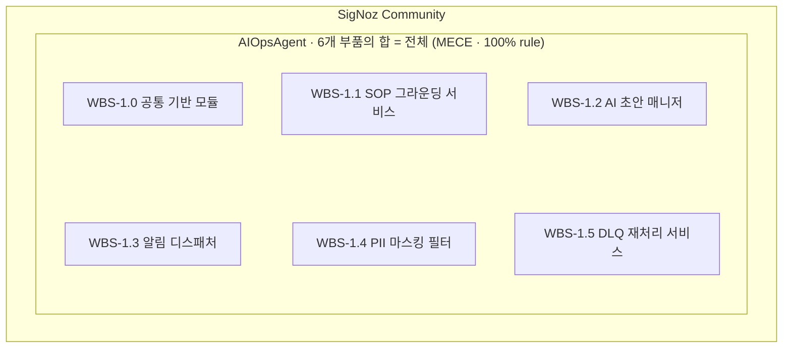

# DS-APM WBS

> **대상**: 팀장 · 매니저 · 의사결정자.
> **목적**: 무엇을 만들었나 · 비즈니스 가치 · 진행 상황 · 남은 일 — 4가지만 정리합니다.
> **읽는 시간**: 약 10분.

## 1. 개요

**AIOpsAgent**는 SigNoz Community 빌드의 알림 처리 경로에 운영 자동화(SOP 그라운딩·AI 초안·DLQ 재처리) 단계를 추가하는 확장 모듈 그룹입니다. SigNoz Community 빌드(`cmd/community/`)의 alertmanager dispatcher 경로에 6개 컴포넌트를 삽입하는 방식으로 설계됩니다.

- **현 상태**: 착수 예정(planned) — 사전 PoC 검증 완료, 본격 착수 전.
- **6개 컴포넌트(구성 부품)로 분해 예정** — 공통 기반 모듈 (Foundation Core) / SOP 그라운딩 서비스 (SOP Grounding Service) / AI 초안 매니저 (AI Drafter Manager) / 알림 디스패처 (Notification Dispatcher) / PII 마스킹 필터 (PII Masking Filter) / DLQ 재처리 서비스 (DLQ Replay Service).
- **상세본 산출물(Deliverable) 4종 착수 후 순차 작성 예정** — Overview · Use Case · 기능명세서 · WBS.

## 2. 컴포넌트 정의

AIOpsAgent를 **하나의 큰 덩어리로 두지 않고 6개 부품으로 분해하였습니다**. PMI(Project Management Institute, 미국 PM 표준 기구) 표준 규칙인 100% 규칙(100% rule, MECE 원칙)에 따라 **이 6개를 합치면 AIOpsAgent 전체가 되며 누락도 중복도 없도록** 구성하였습니다. 각 부품의 책임 범위가 명확하여, 향후 한 부품을 교체하거나 강화할 때 다른 부품에 미치는 영향이 최소화됩니다.

| 컴포넌트(Component) | 한 줄 설명 | 상태 |
|---|---|---|
| WBS-1.0 공통 기반 모듈 (Foundation Core) | 모든 모듈이 공유하는 기반 (감사 기록·테넌트 격리·공통 타입) | 착수 예정(planned) |
| WBS-1.1 SOP 그라운딩 서비스 (SOP Grounding Service) | 운영 절차서(SOP, Standard Operating Procedure)를 저장하고 알람과 매칭 | 착수 예정(planned) |
| WBS-1.2 AI 초안 매니저 (AI Drafter Manager) | LLM(Large Language Model, 대규모 언어 모델)으로 조치 초안 생성, 실패 시 SOP 원문 대체(fallback) | 착수 예정(planned) |
| WBS-1.3 알림 디스패처 (Notification Dispatcher) | Slack/MS Teams/PagerDuty/Webhook/Email 5채널 동시 발송 | 착수 예정(planned) |
| WBS-1.4 PII 마스킹 필터 (PII Masking Filter) | 이메일·전화번호·토큰 등 페이로드에서 마스킹 | 착수 예정(planned) |
| WBS-1.5 DLQ 재처리 서비스 (DLQ Replay Service) | 발송 실패 시 영속 보관, 중복 차단 후 재발송 | 착수 예정(planned) |

---

## 3. 컴포넌트 상세

각 컴포넌트를 누르면 산출물·인수 기준·미해결 항목과 **하위 작업(work package) 일정**이 펼쳐집니다.

<b>WBS-1.0 공통 기반 모듈</b> — 착수 예정 · 모든 모듈이 공유하는 기반 — 감사 기록·테넌트 격리·공통 타입

- **산출물** · 기반 타입(pilot 계약·관리형 markdown), 감사 기록 통로(audit sink), 다중 테넌트 격리 정책, community 진입점(`cmd/community/`) 와이어업.
- **인수 기준** · pilot 계약 직렬화 라운드트립, SOP·draft·dispatch 이벤트가 audit sink로 모두 기록되는지 확인.
- **미해결** · 테넌트 정책 단위 테스트 보강. 감사 sink 원격 저장소(ClickHouse 등)는 후속 단계로 이관.

**하위 작업(work package) 일정** (2026-05-25 ~ 2026-06-12, 영업일 기준)

| 작업ID | 작업명 | 선행 | 시작일 | 종료일 | 기간(일) |
|---|---|---|---|---|---|
| 1.0.1 | Pilot 계약 스키마 | — | 2026-05-25 | 2026-05-27 | 3 |
| 1.0.2 | 관리형 Markdown 페이로드 | 1.0.1 | 2026-05-28 | 2026-06-01 | 3 |
| 1.0.3 | 테넌트 격리 정책 | 1.0.2 | 2026-06-02 | 2026-06-04 | 3 |
| 1.0.4 | 감사 Sink 추상화 | 1.0.3 | 2026-06-05 | 2026-06-08 | 2 |
| 1.0.5 | JSONL 감사 Sink 구현 | 1.0.4 | 2026-06-09 | 2026-06-10 | 2 |
| 1.0.6 | community 진입점 와이어업 | 1.0.5 | 2026-06-11 | 2026-06-12 | 2 |

<b>WBS-1.1 SOP 그라운딩 서비스</b> — 착수 예정 · 운영 절차서(SOP)를 저장하고 알람과 자동 매칭

- **산출물** · SOP 저장소, 등록·조회 API, alert 라벨(`alertname`·`runbook_url`) 기반 grounding 로직, 파일 영속화.
- **인수 기준** · 라벨로 SOP 조회 시 정확한 문서 반환, 등록→재기동→재로드 라운드트립 보존 확인.
- **미해결** · 없음 (M-1 범위 내).

**하위 작업(work package) 일정** (2026-06-15 ~ 2026-07-03, 영업일 기준)

| 작업ID | 작업명 | 선행 | 시작일 | 종료일 | 기간(일) |
|---|---|---|---|---|---|
| 1.1.1 | SOP Store 인터페이스 정의 | 1.0.6 | 2026-06-15 | 2026-06-17 | 3 |
| 1.1.2 | SQL 스토어 구현체 | 1.1.1 | 2026-06-18 | 2026-06-22 | 3 |
| 1.1.3 | 파일 영속화 구현체 | 1.1.2 | 2026-06-23 | 2026-06-25 | 3 |
| 1.1.4 | SOP 도메인 타입 | 1.1.3 | 2026-06-26 | 2026-06-29 | 2 |
| 1.1.5 | Grounding 로직 | 1.1.4 | 2026-06-30 | 2026-07-01 | 2 |
| 1.1.6 | Runbook Handler SOP 라우트 | 1.1.5 | 2026-07-02 | 2026-07-03 | 2 |

<b>WBS-1.2 AI 초안 매니저</b> — 착수 예정 · LLM으로 조치 초안 생성, 실패 시 SOP 원문 대체(fail-open)

- **산출물** · runbook drafter, AI 호출 추상화, 호출 이력·전략 영속화, 쿼터 제어(fail-open), 발송 직전 dispatch hook.
- **인수 기준** · SOP-grounded 알람에 초안 생성, LLM 실패 시 SOP 대체(fallback) 동작 확인 (UC-003).
- **미해결** · 실제 Provider별 통합 테스트 (현재 mock 위주).

**하위 작업(work package) 일정** (2026-06-15 ~ 2026-07-10, 영업일 기준)

| 작업ID | 작업명 | 선행 | 시작일 | 종료일 | 기간(일) |
|---|---|---|---|---|---|
| 1.2.1 | AI Strategy 도메인 타입 | 1.0.6 | 2026-06-15 | 2026-06-18 | 4 |
| 1.2.2 | LLM Provider 어댑터 | 1.2.1 | 2026-06-19 | 2026-06-24 | 4 |
| 1.2.3 | Strategy 생성·persistence | 1.2.2 | 2026-06-25 | 2026-06-29 | 3 |
| 1.2.4 | Strategy History append | 1.2.3 | 2026-06-30 | 2026-07-02 | 3 |
| 1.2.5 | Quota Controller (fail-open) | 1.2.4 | 2026-07-03 | 2026-07-07 | 3 |
| 1.2.6 | Dispatch Hook Integration | 1.2.5 | 2026-07-08 | 2026-07-10 | 3 |

<b>WBS-1.3 알림 디스패처</b> — 착수 예정 · 5채널(Slack·Teams·PagerDuty·Webhook·Email) 동시 발송

- **산출물** · 5채널 adapter, 채널 독립 dispatcher, 알람·SOP·AI 초안 통합 템플릿, 운영자용 미리보기. 외부 HTTP는 5채널뿐.
- **인수 기준** · SOP·AI 초안이 5채널 포맷으로 전달, 4xx/5xx 시 DLQ 분기 확인 (UC-002).
- **미해결** · 없음 (6번째 채널 추가는 향후 ADR 작성 트리거).

**하위 작업(work package) 일정** (2026-07-13 ~ 2026-07-31, 영업일 기준)

| 작업ID | 작업명 | 선행 | 시작일 | 종료일 | 기간(일) |
|---|---|---|---|---|---|
| 1.3.1 | Dispatcher wrapping | 1.2.6 | 2026-07-13 | 2026-07-15 | 3 |
| 1.3.2 | AI context propagation | 1.3.1 | 2026-07-16 | 2026-07-20 | 3 |
| 1.3.3 | Slack + MS Teams v2 adapter | 1.3.2 | 2026-07-21 | 2026-07-23 | 3 |
| 1.3.4 | PagerDuty adapter | 1.3.3 | 2026-07-24 | 2026-07-27 | 2 |
| 1.3.5 | Webhook + Email adapter | 1.3.4 | 2026-07-28 | 2026-07-29 | 2 |
| 1.3.6 | 5채널 통합 라우팅·전송 검증 | 1.3.5 | 2026-07-30 | 2026-07-31 | 2 |

<b>WBS-1.4 PII 마스킹 필터</b> — 착수 예정 · 이메일·전화·토큰 등 개인정보를 발송 전 마스킹

- **산출물** · incident 페이로드 마스킹 유틸(이메일·KR 전화·long secret 3종), dispatcher hot path 삽입으로 일관 적용.
- **인수 기준** · 3종 마스킹, alert 식별자 유지, 미마스킹 페이로드 발송 차단 확인.
- **미해결** · 카테고리 추가(주민번호·여권·카드), OTel Collector 단 이동 검토, 오탐/미탐 지표 노출.

**하위 작업(work package) 일정** (2026-07-13 ~ 2026-07-24, 영업일 기준)

| 작업ID | 작업명 | 선행 | 시작일 | 종료일 | 기간(일) |
|---|---|---|---|---|---|
| 1.4.1 | Redaction rule engine | 1.0.6 | 2026-07-13 | 2026-07-14 | 2 |
| 1.4.2 | Incident payload redaction 적용 | 1.4.1 | 2026-07-15 | 2026-07-16 | 2 |
| 1.4.3 | Audit sink 연동 | 1.4.2 | 2026-07-17 | 2026-07-20 | 2 |
| 1.4.4 | Tenant별 룰 확장 훅 | 1.4.3 | 2026-07-21 | 2026-07-22 | 2 |
| 1.4.5 | OTel Collector 단 이동 검토 | 1.4.4 | 2026-07-23 | 2026-07-24 | 2 |

<b>WBS-1.5 DLQ 재처리 서비스</b> — 착수 예정 · 발송 실패분 영속 보관 + 중복 차단 재발송 — 무손실

- **산출물** · JSONL 기반 DLQ, 중복 차단 idempotency ledger, 알림 디스패처 자동 연동.
- **인수 기준** · 채널 5xx/429 시 DLQ enqueue, rotation, replay 중복 차단 확인 (UC-002).
- **미해결** · HMAC 정책 결정(팀장 D-1 필요), 수동 replay UI/CLI 노출 범위.

**하위 작업(work package) 일정** (2026-08-03 ~ 2026-08-21, 영업일 기준)

| 작업ID | 작업명 | 선행 | 시작일 | 종료일 | 기간(일) |
|---|---|---|---|---|---|
| 1.5.1 | JSONL DLQ Sink | 1.3.6 | 2026-08-03 | 2026-08-05 | 3 |
| 1.5.2 | Idempotent Replay Ledger | 1.5.1 | 2026-08-06 | 2026-08-10 | 3 |
| 1.5.3 | Dispatcher 통합 | 1.5.2 | 2026-08-11 | 2026-08-13 | 3 |
| 1.5.4 | Replay API 엔드포인트 | 1.5.3 | 2026-08-14 | 2026-08-17 | 2 |
| 1.5.5 | Replay 상태 머신 | 1.5.4 | 2026-08-18 | 2026-08-19 | 2 |
| 1.5.6 | HMAC 정책 (scaffolding only) | 1.5.5 | 2026-08-20 | 2026-08-21 | 2 |

## 4. 관련 산출물

| 산출물(Deliverable) | 용도 | 링크 |
|---|---|---|
| 한장 브리핑 | 가장 짧은 요약 (5분) | [brief.html](brief.html) |
| WBS 상세본 | 컴포넌트별 산출물(Deliverable) / 인수 기준(Acceptance) / 선행 작업(Dependencies) | [../04-wbs/index.md](../04-wbs/index.html) |
| Phase 시간선 (이력) | Phase별 작업 순서 분할 | [appendix-phases.md](../04-wbs/appendix-phases.html) |
| Use Case | 정상 흐름 + 실패 시나리오 2건 | [../02-usecase/index.md](../02-usecase/index.html) |
| 기능명세서 | 모듈별 인터페이스 + 인수 테스트 | [../03-functional-spec/index.md](../03-functional-spec/index.html) |

---

> 본 브리핑은 PMI 표준 WBS의 상세본을 비기술 청중용으로 압축한 것입니다.
> 컴포넌트별 상세 정보가 필요하면 `04-wbs/packages/` 아래 6개 파일을 참조하시면 됩니다.
