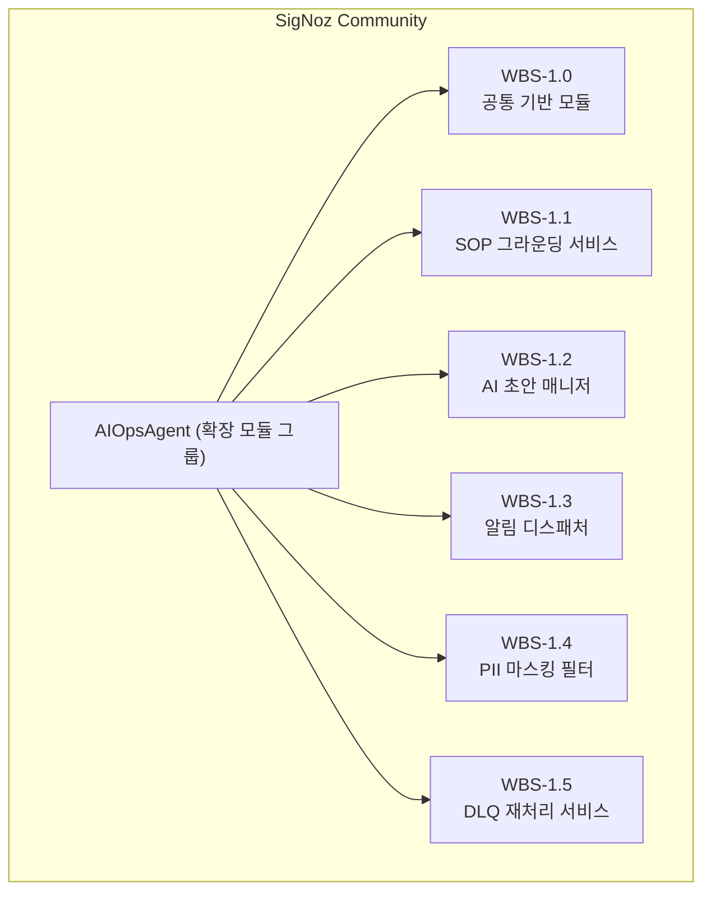

# DS-APM 작업 분해 (요약본 WBS(Work Breakdown Structure, 작업 분해 구조))

> **대상**: 팀장 · 매니저 · 의사결정자.
> **목적**: 무엇을 만들었나 · 비즈니스 가치 · 진행 상황 · 남은 일 — 4가지만 정리합니다.
> **읽는 시간**: 약 10분.

## 1. 개요 (요약)

**AIOpsAgent**는 SigNoz Community 빌드의 알림 처리 경로에 운영 자동화(SOP 그라운딩·AI 초안·DLQ 재처리) 단계를 추가하는 확장 모듈 그룹입니다. SigNoz Community 빌드(`cmd/community/`)의 alertmanager dispatcher 경로에 6개 컴포넌트를 삽입하는 방식으로 설계됩니다.

- **현 상태**: 착수 예정(planned) — 사전 PoC 검증 완료, 본격 착수 전.
- **6개 컴포넌트(구성 부품)로 분해 예정** — 공통 기반 모듈 (Foundation Core) / SOP 그라운딩 서비스 (SOP Grounding Service) / AI 초안 매니저 (AI Drafter Manager) / 알림 디스패처 (Notification Dispatcher) / PII 마스킹 필터 (PII Masking Filter) / DLQ 재처리 서비스 (DLQ Replay Service).
- **상세본 산출물(Deliverable) 4종 착수 후 순차 작성 예정** — Overview · Use Case · 기능명세서 · WBS.

## 2. 어떻게 나눴는가 (6 컴포넌트)

AIOpsAgent를 **하나의 큰 덩어리로 두지 않고 6개 부품으로 분해하였습니다**. PMI(Project Management Institute, 미국 PM 표준 기구) 표준 규칙인 100% 규칙(100% rule, MECE 원칙)에 따라 **이 6개를 합치면 AIOpsAgent 전체가 되며 누락도 중복도 없도록** 구성하였습니다. 각 부품의 책임 범위가 명확하여, 향후 한 부품을 교체하거나 강화할 때 다른 부품에 미치는 영향이 최소화됩니다.

| 컴포넌트(Component) | 한 줄 설명 | 상태 |
|---|---|---|
| WBS-1.0 공통 기반 모듈 (Foundation Core) | 모든 모듈이 공유하는 기반 (감사 기록·테넌트 격리·공통 타입) | 착수 예정(planned) |
| WBS-1.1 SOP 그라운딩 서비스 (SOP Grounding Service) | 운영 절차서(SOP, Standard Operating Procedure)를 저장하고 알람과 매칭 | 착수 예정(planned) |
| WBS-1.2 AI 초안 매니저 (AI Drafter Manager) | LLM(Large Language Model, 대규모 언어 모델)으로 조치 초안 생성, 실패 시 SOP 원문 대체(fallback) | 착수 예정(planned) |
| WBS-1.3 알림 디스패처 (Notification Dispatcher) | Slack/MS Teams/PagerDuty/Webhook/Email 5채널 동시 발송 | 착수 예정(planned) |
| WBS-1.4 PII 마스킹 필터 (PII Masking Filter) | 이메일·전화번호·토큰 등 페이로드에서 마스킹 | 시범 적용(MVP) |
| WBS-1.5 DLQ 재처리 서비스 (DLQ Replay Service) | 발송 실패 시 영속 보관, 중복 차단 후 재발송 | 진행 중(pending, HMAC 정책 미해결) |

---

## 3. 각 컴포넌트 상세

### 3.1 WBS-1.0 — 공통 기반 모듈 (Foundation Core)

- **산출물(Deliverable)**: AIOpsAgent 6개 모듈이 공통으로 사용하는 기반 타입(pilot 계약·관리형 markdown), 감사 기록 통로(audit sink), 다중 테넌트 격리 정책, community 진입점(`cmd/community/`) 와이어업.
- **비즈니스 가치**: **"누가 언제 무엇을 했는가"가 자동으로 기록**됩니다. 감사 및 비난 없는(blameless) 회고에 필요한 데이터가 처음부터 영속화됩니다. 다중 테넌트(여러 고객사·팀) 격리도 한 곳에서 일관되게 적용됩니다.
- **진행 단계**: 착수 예정(planned).
- **인수 기준(Acceptance Criteria) / 검증 방법(Verification)**: pilot 계약 직렬화 라운드트립, SOP/draft/dispatch 이벤트가 audit sink로 모두 기록되는지 확인합니다.
- **미해결 항목(Open Items)**: 테넌트 정책 단위 테스트 보강. 감사 sink의 원격 저장소(ClickHouse 등) 구현은 후속 단계로 이관합니다.

### 3.2 WBS-1.1 — SOP 그라운딩 서비스 구현 (절차서 저장·매칭)

- **산출물(Deliverable)**: SOP 저장소, SOP 등록·조회 API, alert 라벨(`alertname`·`runbook_url`)로 SOP를 자동 매칭하는 grounding(연결) 로직, 파일 영속화 구현.
- **비즈니스 가치**: 새벽 알람 수신 시 운영 담당자가 위키·드라이브·협업 도구(메신저) 메시지를 **2~5분씩 검색하지 않아도** 됩니다. SOP가 알람과 자동으로 묶여 도달합니다.
- **진행 단계**: 착수 예정(planned).
- **인수 기준(Acceptance Criteria) / 검증 방법(Verification)**: 알람 라벨로 SOP 조회 시 정확한 문서를 반환하는지, 등록→재기동→재로드 라운드트립이 보존되는지 확인합니다.
- **미해결 항목(Open Items)**: 없음 (M-1 범위 내 완료).

### 3.3 WBS-1.2 — AI 초안 매니저 모듈 (LLM 초안)

- **산출물(Deliverable)**: LLM(외부 AI Provider)으로 조치 초안을 생성하는 runbook drafter 모듈, AI 호출 추상화, 호출 이력·전략 영속화, 쿼터(quota) 제어(장애 시 통과(fail-open)). 발송 직전에 AI 초안을 합치는 dispatch hook.
- **비즈니스 가치**: SOP만 전달하는 것이 아니라, **"지금 이 상황에서 어떤 순서로 조치할 것인가"를 AI가 초안으로 작성**합니다. AI Provider가 일시 장애 상태여도(쿼터 소진·인증 실패) **SOP 원문이 그대로 전달**되어 운영자 대응이 중단되지 않습니다(장애 시 통과(fail-open)).
- **진행 단계**: 착수 예정(planned).
- **인수 기준(Acceptance Criteria) / 검증 방법(Verification)**: SOP-grounded 알람에 대해 초안 생성, LLM 실패 시 SOP 대체(fallback) 동작 확인 (UC-003).
- **미해결 항목(Open Items)**: 실제 Provider별 통합 테스트 (현재 mock 위주).

### 3.4 WBS-1.3 — 알림 디스패처 (Notification Dispatcher) 모듈 (5채널)

- **산출물(Deliverable)**: Slack · MS Teams · PagerDuty · Webhook · Email 5개 채널 adapter 구현, 채널 독립 dispatcher(발송기), 알람·SOP·AI 초안을 합치는 템플릿 모듈, 운영 담당자용 미리보기. 외부 HTTP 호출은 5채널 endpoint뿐입니다.
- **비즈니스 가치**: **한 번의 승인으로 5채널 동시 발송**됩니다. 채널마다 수동으로 복사·붙여넣기 할 필요가 없고, 누락·중복이 사라집니다. 채널이 실패하면 자동으로 DLQ(다음 컴포넌트)로 분기합니다.
- **진행 단계**: 착수 예정(planned).
- **인수 기준(Acceptance Criteria) / 검증 방법(Verification)**: SOP/AI 초안 본문이 5채널 각각의 포맷으로 정확히 전달되는지, 4xx/5xx 실패 시 DLQ로 분기하는지 확인 (UC-002).
- **미해결 항목(Open Items)**: 없음 (6번째 채널 추가는 향후 ADR(Architecture Decision Record) 작성 트리거 대상).

### 3.5 WBS-1.4 — PII 마스킹 필터 (PII Masking Filter) 모듈

- **산출물(Deliverable)**: incident 페이로드에서 이메일 주소·한국 휴대전화 번호·long secret(토큰/키 패턴) 3종을 마스킹하는 유틸리티 모듈. 5채널 발송 직전 dispatcher hot path에 삽입되어 일관 적용됩니다.
- **비즈니스 가치**: 알람 페이로드에 포함된 운영자 이메일·전화번호 등이 **외부 협업 도구(메신저)로 유출되지 않습니다**. 개인정보 보호 정책(PII(Personally Identifiable Information, 개인 식별 정보) 보호) 준수의 첫 단계입니다.
- **진행 단계**: 착수 예정(planned) (운영 환경 준비(production-ready) 단계까지 강화 계획).
- **인수 기준(Acceptance Criteria) / 검증 방법(Verification)**: 이메일/전화/long secret 마스킹, alert 식별자는 유지, 마스킹되지 않은 페이로드는 발송 차단되는지 확인합니다.
- **미해결 항목(Open Items)**:
  - 카테고리 추가 (주민등록번호·여권번호·카드번호 등).
  - **OTel Collector 단으로 이동 검토** — 업계 모범 사례(best practice)는 데이터 입구 단계에서 마스킹 처리하는 것입니다.
  - 오탐(false positive) / 미탐(false negative) 측정 지표 노출.

### 3.6 WBS-1.5 — DLQ 재처리 서비스 (DLQ Replay Service) 모듈

- **산출물(Deliverable)**: 채널 발송 실패 시 원본 페이로드를 영속 보관하는 DLQ(Dead Letter Queue, 미전송 사장 큐, JSONL 기반) 구현, 재전송 시 중복 차단용 idempotency ledger, 알림 디스패처와의 자동 연동.
- **비즈니스 가치**: **정보 손실 0**. Slack API가 일시 장애 상태여도 알람이 사라지지 않습니다. 운영 담당자가 수동 재전송(manual replay) 한 번을 수행하면 새 idempotency key로 안전하게 재발송됩니다. 동일 알람이 두 번 전송되지 않습니다.
- **진행 단계**: 착수 예정(planned, HMAC(Hash-based Message Authentication Code) 정책 결정 후 착수).
- **인수 기준(Acceptance Criteria) / 검증 방법(Verification)**: 채널 5xx/429 발생 시 DLQ enqueue, rotation 동작, 재전송(replay) 시 중복 차단 확인 (UC-002).
- **미해결 항목(Open Items)**:
  - **HMAC 정책 결정** — 재전송 시 페이로드 위변조 검증 정책 (팀장 의사결정 D-1 필요).
  - 운영 담당자용 수동 재전송(manual replay) UI/CLI 노출 범위.

---

## 4. 타임라인 (이력)

SigNoz 코드베이스 안에서 다음과 같이 시간 순으로 작업이 진행되었습니다. AIOpsAgent는 6개 모듈을 한 번에 만든 것이 아니라 **시간 순으로 P0~P5 6단계(Phase)에 걸쳐** 구현하였습니다. 각 단계는 1~4건의 작업을 묶은 단위입니다.

- **P0 Foundation (기반 진입)** — 가장 먼저 공통 기반 타입과 SigNoz community 진입점을 구성하였습니다. 이후 모든 모듈이 이 위에 적층됩니다.
- **P1 SOP Layer (절차서 저장)** — SOP 저장소·매칭·파일 영속화. 작업 4건. 알람과 SOP를 연결하는 경로가 확보되었습니다.
- **P2 AI Layer (AI 초안 매니저)** — LLM 호출, 전략 이력, 장애 시 통과(fail-open) 쿼터 제어. 작업 2건. SOP가 단순 첨부되는 것이 아니라 AI가 다듬어 초안화합니다.
- **P3 Notification (알림 디스패처)** — 5채널 adapter + 통합 dispatcher + 템플릿. 작업 1건으로 5채널 전체를 연결하였습니다.
- **P4 Safety (개인정보 마스킹)** — 페이로드 입구의 마스킹. 작업 1건으로 시범 적용(MVP)을 완료하였습니다.
- **P5 Reliability (DLQ + 재전송(replay))** — JSONL DLQ + idempotency ledger + dispatcher 와이어업. 작업 2건으로 정보 손실 0 보장이 완성되었습니다.

---

## 5. 다음 마일스톤(Milestone)

| 마일스톤(Milestone) | 시점 | 내용 |
|---|---|---|
| **M-1** | TBD (팀장 결정) | 착수 예정(planned) — AIOpsAgent 6개 모듈 구축 |
| **M-2** | TBD (팀장 결정) | 운영 환경 적용 준비(Production Readiness) — HMAC 정책 결정, DLQ 운영 UI/CLI 제공, 운영 담당자 검수 화면 식별 |
| **M-3** | TBD | 베타(Beta) 운영자 공개 — 다중 테넌트 격리 강화, 개인정보 마스킹(PII)의 OTel Collector 이전, idempotency cache Redis 이전 검토 |

추가 후보 (현재 미일정):
- **벡터 검색 도입** — 라벨 기반 매칭을 의미 기반 매칭으로 확장.
- **6번째 알림 채널 추가** — 신규 채널 추가 결정 시 트리거.

---

## 6. 제외 범위(Excluded Scope)

AIOpsAgent는 **무엇을 수행하지 않는지**도 명시합니다. 작업 범위 혼동을 방지하기 위함입니다.

- **SigNoz upstream(상류) 기능** — SigNoz 본래 기능(관측·alert 라우팅·UI 등) 자체. 본 작업 분해 대상은 AIOpsAgent 확장 모듈 6종으로 한정합니다.
- **Enterprise 모듈** — `ee/` 경로의 별도 라이선스 모듈은 본 작업 분해 대상이 아닙니다.
- **y2i 관련 기능** — 영구 비활성화 (메모리·운영 정책 결정).

---

## 7. 관련 산출물

| 산출물(Deliverable) | 용도 | 링크 |
|---|---|---|
| 한장 브리핑 | 가장 짧은 요약 (5분) | [brief.html](brief.html) |
| WBS 상세본 | 컴포넌트별 산출물(Deliverable) / 인수 기준(Acceptance) / 선행 작업(Dependencies) | [../04-wbs/index.md](../04-wbs/index.md) |
| Phase 시간선 (이력) | Phase별 작업 순서 분할 | [appendix-phases.md](../04-wbs/appendix-phases.md) |
| Use Case | 정상 흐름 + 실패 시나리오 2건 | [../02-usecase/index.md](../02-usecase/index.md) |
| 기능명세서 | 모듈별 인터페이스 + 인수 테스트 | [../03-functional-spec/index.md](../03-functional-spec/index.md) |

---

> 본 브리핑은 PMI 표준 WBS의 상세본을 비기술 청중용으로 압축한 것입니다.
> 컴포넌트별 상세 정보가 필요하면 `04-wbs/packages/` 아래 6개 파일을 참조하시면 됩니다.
