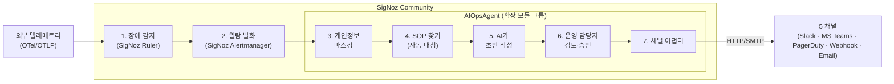

# DS-APM — 요약 브리핑

> **대상**: 팀장 · 매니저 · 의사결정자.
> **읽는 시간**: 약 20~30분.
> **필요한 사전지식**: 없음. 모르는 용어는 본문 안에서 풀이하고 §12 부록 용어집에서 다시 정리합니다.

## 개요

| 항목 | 요지 |
|---|---|
| **정체** | SigNoz Community 빌드의 알림 처리 경로에 운영 자동화 단계를 추가하는 확장 모듈 그룹 |
| **푸는 문제** | 운영 담당자가 새벽에 알람을 받고 SOP(Standard Operating Procedure, 운영 절차서) 찾고 협업 도구(메신저)로 전달하는 5~15분 노동을 30초로 단축 |
| **현 상태** | 착수 예정(planned) — 시제품(PoC) 사전 검증 완료, 본격 착수 전 |
| **남은 결정** | HMAC(Hash-based Message Authentication Code, 메시지 인증 코드) 정책 · 다중 테넌트 격리 강화 시점 · PII(Personally Identifiable Information, 개인 식별 정보) 처리 단계 이동 (§10 참조) |
| **현재 단계** | M-1 기반 완료 착수 예정 (2026-05-25 시작) |

**AIOpsAgent**는 SigNoz Community 빌드의 알림 처리 경로에 운영 자동화(SOP 그라운딩·AI 초안·DLQ 재처리) 단계를 추가하는 확장 모듈 그룹입니다.

---

## 1. 우리가 마주한 현실 (배경)

### 1.1 운영 담당자의 야간 알람 대응

새벽 3시. 결제 시스템에서 5xx 오류 비율이 임계치를 넘어 알람이 발화합니다. 운영 담당자가 받는 것은 단순한 "장애 발생" 한 줄. 그 다음부터는 다음 순서를 거칩니다.

1. **알람이 어떤 의미인지 분석** — 어떤 서비스, 어떤 지표, 임계치를 얼마나 벗어났는지 (1~3분)
2. **관련 SOP 문서를 찾기** — 위키·노션·구글드라이브·슬랙 메시지를 순회 (2~5분)
3. **협업 도구(메신저)에 상황 공유** — Slack 채널, MS Teams, PagerDuty escalation 등 수동 발송 (1분)
4. **SOP를 따라 조치** — 본격 대응 (5분~수십분)

**알람 → 실제 조치 시작까지 평균 5~15분**입니다. 새벽 시간대 휴먼 에러 비율은 정상 시간 대비 2~3배로 알려져 있습니다 (Google SRE Book Ch.12).

### 1.2 SOP 문서의 산재

운영 절차서(SOP)는 일반적으로 다음과 같은 문제를 안고 있습니다.

- 위키, 노션, 구글드라이브, 슬랙 메시지에 흩어져 있음
- 작성 시점이 오래되어 현행성(staleness) 검증이 어려움
- 알람과의 매핑이 명시적이지 않아 운영 담당자가 추론해야 함

### 1.3 메신저 전달의 수동성

같은 incident(장애 사건)를 Slack에 알리고, 일부는 MS Teams에, 별도 PagerDuty escalation까지 수행합니다. 수동으로 5개 채널을 일관성 있게 알리기는 어렵고, 누락·중복이 자주 발생합니다.

---

## 2. AIOpsAgent가 해결하는 방식

### 2.1 핵심 아이디어 한 줄

> SigNoz Alertmanager가 알람을 발화시키면 **AIOpsAgent**가 SOP를 자동 매칭하고 AI에게 초안 작성을 위임한 뒤, 운영 담당자에게 검토만 요청하고 승인되면 5채널 동시 자동 발송합니다.

### 2.2 7단계 처리 자동화 흐름

> 아래 다이어그램의 외부 HTTP 호출은 **들어올 때 OTLP(OpenTelemetry Protocol, 관측 표준) 텔레메트리, 나갈 때 5채널** 두 군데뿐입니다.

지원 채널 5종: **Slack · MS Teams · PagerDuty · Webhook · Email**.

### 2.3 운영 담당자 역할의 변화

| 단계 | 이전 (수동) | AIOpsAgent 적용 후 |
|---|---|---|
| 알람 인지 | 메시지 1줄 보고 추측 | 알람 + SOP + AI 초안이 한 번에 도착 |
| SOP 찾기 | 위키·드라이브 순회 (2~5분) | 자동 매칭 (5초 이내) |
| 메신저 공유 | 수동 5채널 | 자동 5채널 |
| 조치 시작 | 자료 모은 후 | 즉시 |

**핵심**: 운영 담당자의 핵심 책임(판단·승인)은 그대로 두고, 반복 노동만 제거합니다. AIOpsAgent가 운영 담당자를 대체하는 것이 아닙니다.

---

## 3. 시나리오로 보기

세 가지 대표 시나리오로 **AIOpsAgent**가 실제 어떻게 동작하는지 살펴봅니다.

### 3.1 시나리오 A — 정상 처리 (Golden Path)

**상황**: 오전 3시, 결제 API(Application Programming Interface)의 5xx 오류 비율이 5%를 초과합니다.

**흐름**:

1. SigNoz Ruler가 평가해 Alertmanager가 알람을 발화합니다 (`PaymentService5xxHigh`, severity=critical)
2. AIOpsAgent dispatcher hook(연결 지점)이 1초 안에 알람을 수신합니다
3. 페이로드에 포함된 운영 담당자 이메일·전화 등 개인정보 마스킹을 수행합니다
4. SOP 인덱스에서 "결제 5xx 대응" SOP를 자동 매칭합니다 (alert 라벨 기반)
5. AI가 SOP를 컨텍스트로 활용해 3단계 조치 초안을 생성합니다 — 게이트웨이 확인 → 최근 배포 확인 → 롤백
6. 운영 담당자가 휴대전화로 알람 + AI 초안을 수신하고 **"승인(approve)" 한 번**을 누릅니다
7. Slack 채널 + MS Teams 채널 + PagerDuty escalation으로 동시 전달됩니다

**소요 시간**: 약 30초 이내 (운영 담당자 검토 5초 가정)

### 3.2 시나리오 B — 메신저 발송 실패 → 자동 재시도

**상황**: 같은 알람이지만, 발송 시점에 Slack API가 일시 장애 상태입니다.

**흐름**:

1~6. 시나리오 A와 동일
7. Slack 발송 시도 → 5xx 응답
8. AIOpsAgent가 지수 백오프(exponential backoff)로 재시도합니다 (1초·2초·4초) 최대 3회
9. 모두 실패하면 **DLQ(Dead Letter Queue, 미전송 사장 큐)** 에 원본 페이로드 + 시도 이력을 보존합니다
10. 운영 담당자에게 "DLQ에 1건 적재됨" 보완 알림을 전달합니다
11. 운영 담당자가 Slack API 정상화 확인 후 수동 재발송(manual replay)을 한 번 누릅니다
12. 새 idempotency key(중복 처리 방지 식별자)로 재발송 → Slack 2xx

**핵심**: **무손실**. 발송 실패라고 알람이 누락되지 않습니다.

### 3.3 시나리오 C — AI 실패 → SOP 원문 fallback

**상황**: AI Provider의 API quota가 소진되어 401 응답이 반환됩니다.

**흐름**:

1~3. 시나리오 A와 동일
4. AI 호출 → 401 (auth fail, 인증 실패)
5. AIOpsAgent의 Quota Controller가 **장애 시 통과(fail-open) 모드**로 전환합니다
6. AI 초안 대신 **SOP 원문 그대로** 사용합니다
7. 운영 담당자에게 "AI 초안 없음, SOP 원문 사용" 표시와 함께 발송합니다
8. 별도로 SRE(Site Reliability Engineering) 채널에 "LLM(Large Language Model, 대규모 언어 모델) auth/quota failure" meta-alert를 발송합니다 (API key 갱신 요청)

**핵심**: AI 실패가 운영 담당자 대응의 정지를 만들지 않습니다. SOP는 그대로 전달됩니다.

---

## 4. 비즈니스 효과

### 4.1 정량 효과 (예상)

| 지표 | 이전 | AIOpsAgent 적용 후 |
|---|---|---|
| 알람 → 조치 시작 | 5~15분 | 30초~2분 |
| SOP 찾기 시간 | 2~5분 | 0초 (자동) |
| 메신저 발송 누락률 | ~5% (수동 누락) | 0% (자동) |
| 감사 트레일 완전성 | 부분적 | 100% (모든 발송 이력 영속 기록) |
| 새벽 휴먼 에러 | 주간 대비 2~3배 | 주간 수준 (자동화 영역만큼 감소) |

### 4.2 정성 효과

- 운영 담당자의 정신적 부담 감소 — 새벽 알람 시 "찾는 시간" 제거
- 당직 운영자(on-call) 순환 부담 평탄화 — 신규 운영 담당자도 처음부터 정형화된 흐름 수행 가능
- 감사·블레임리스(blameless) 회고 데이터 자동 축적 — 누가 언제 무엇을 승인했는지 명시
- 신규 운영 담당자 온보딩(onboarding, 초기 교육) 시간 단축 — SOP가 알람과 자동 매칭되므로 학습 부담 감소

---

## 5. 기술 스택 개요 (비기술)

| 구성 | 무엇 |
|---|---|
| 베이스 플랫폼 | **SigNoz Community** (오픈소스 관측 도구, MIT 라이선스). 자체 운영 비용 0 |
| 통합 방식 | SigNoz Community 빌드의 **Go 바이너리(`cmd/community/`) 안에 내장된 확장 모듈 그룹** — SigNoz Alertmanager 발송 경로에 AIOpsAgent 처리 단계를 삽입하는 방식 |
| 언어 | **Go** |
| 데이터 저장 | PostgreSQL (SOP, 감사 이력), JSONL 파일 (DLQ) |
| AI | 외부 **LLM Provider** (OpenAI · Anthropic · 자체 호스팅 등 모두 호환) |
| 메신저 | 5채널 (Slack, MS Teams, PagerDuty, Webhook, Email) 모두 표준 API |
| 배포 | Linux 컨테이너 (SigNoz와 동일 base image) |

### 5.1 SigNoz를 베이스로 선택한 이유

- **OpenTelemetry 표준 네이티브** — 관측 데이터의 미래 호환성 보장
- **MIT 라이선스** — 자사 코드 통합·재배포 자유
- **알람·메트릭·로그·트레이스 단일 플랫폼** — 통합 운영, 별도 솔루션 조합 비용 없음

### 5.2 통합 방식 결정 (ADR-001)

초기 시제품(PoC)은 Python 오케스트레이터(`ds_apm_poc`)와 SigNoz를 webhook으로 연결하는 구조였습니다. 두 런타임을 모두 배포·모니터링해야 했고, 연결 계층(bridge)이 재시도(retry)/DLQ/알림 발송/SOP 저장을 중복 구현하는 문제가 발생했습니다.

→ **결정 (2026-05-19, ADR-001)**: Python runtime 폐기. AIOpsAgent의 모든 처리 단계를 SigNoz Community Go 코드라인에 내장된 확장 모듈로 구현합니다. SigNoz Alertmanager의 발송 핵심 경로(dispatcher hot path)에 SOP 그라운딩·AI 초안·DLQ 단계를 삽입하는 방식입니다. 결과적으로 Go 바이너리 단일 운영, 배포·롤백 표면 절반 축소, Alertmanager 5채널 자산 재사용을 달성했습니다. **외부 HTTP 호출은 LLM API와 5채널 출구뿐입니다**.

---

## 6. 예정 구성 (착수 후 산출물)

6개 컴포넌트를 착수 후 순차적으로 구축할 예정입니다.

| 컴포넌트 | 책임 | 진행 단계 |
|---|---|---|
| **공통 기반 모듈 (Foundation Core)** | 공통 타입 + 감사 적재 계층(sink) + 테넌트(tenant) 정책 | 착수 예정(planned) |
| **SOP 그라운딩 서비스 (SOP Grounding Service)** | SOP 저장 + 알람-SOP 매칭 | 착수 예정(planned) |
| **AI 초안 매니저 (AI Drafter Manager)** | LLM 초안 생성 + 이력 관리 + quota(할당량) 제어 (장애 시 통과/fail-open) | 착수 예정(planned) |
| **알림 디스패처 (Notification Dispatcher)** | 5채널 발송 + AI 컨텍스트 병합 | 착수 예정(planned) |
| **PII 마스킹 필터 (PII Masking Filter)** | 입구 단계 PII 마스킹(redaction) | 착수 예정(planned) |
| **DLQ 재처리 서비스 (DLQ Replay Service)** | 발송 실패 영속화 + 중복 방지(idempotent) 재발송 | 착수 예정(planned, HMAC 정책 결정 필요) |

착수 후 **산출물 4종** (Overview · Use Case · 기능명세 · WBS)을 순차적으로 작성할 예정입니다. PDF 출력·HTML 공유가 가능하도록 설계됩니다.

### 6.1 검증 방식

자체 인수 테스트(Gherkin acceptance criteria, 인수 기준)로 변경 시 회귀를 차단합니다. 모듈별로 2~5개 시나리오를 코드로 명세하고 자동 실행합니다. 인수 테스트가 깨지면 PR(Pull Request, 코드 병합 요청)이 병합되지 않습니다.

---

## 7. 알려진 위험과 격차

착수 후 **production-ready(운영 환경 배포 가능) 수준까지 4가지 격차**를 순차적으로 해소할 예정입니다. 각각은 비즈니스 영향과 대응 방향이 다릅니다.

### 7.1 R-1 — HMAC 서명 정책 미정 (보안)

**무엇**: 메신저 재발송 시 페이로드 위변조를 검증할 HMAC 서명 정책이 아직 확정되지 않았습니다.

**비즈니스 영향**: 보안 감사 통과 시 지적 가능성이 있습니다. 운영 환경에서 페이로드 무결성 보장이 불완전합니다.

**대응**: M-4 단계에서 결정합니다. **§10 D-1 팀장 의사결정 필요**.

### 7.2 R-2 — 다중 테넌트 격리 (격리)

**무엇**: 한 인스턴스가 여러 고객사의 SOP·AI 전략을 격리해서 다룬다고 정의했지만, 격리 수준이 production-ready 기준에 미달합니다.

**비즈니스 영향**: 외부 고객사를 온보딩(onboarding, 신규 도입)할 때 격리 강화 작업이 추가로 필요합니다. **내부 단일 테넌트 운영에는 영향이 없습니다**.

**대응**: M-5에서 강화합니다. 외부 고객사 온보딩 일정에 맞춰 우선순위를 조정합니다.

### 7.3 R-3 — 개인정보 처리 위치 (보안)

**무엇**: 현재 PII 마스킹은 AIOpsAgent 입구에서 1회만 적용합니다. 업계 모범 사례(OpenTelemetry 가이드)는 **가능한 한 이른 단계**(OTel Collector 단계 처리)를 권장합니다.

**비즈니스 영향**: 마스킹 누락 가능성은 낮지만, 보안 정책 강화 시 OTel Collector 단으로 옮기는 작업이 필요합니다.

**대응**: M-5에서 검토합니다.

### 7.4 R-4 — 외부 LLM 의존 (안정성)

**무엇**: AI 초안 생성에 외부 LLM Provider API를 사용합니다. API 장애·quota 소진·인증 실패가 가능합니다.

**비즈니스 영향**: **이미 해결됐습니다**. 장애 시 통과(fail-open) 정책으로 LLM 실패 시 SOP 원문 그대로 발송합니다. 운영 담당자에게는 정보 손실이 없습니다 (시나리오 C 참조).

**대응**: 별도 조치는 불필요합니다. 단, 장애 시 통과(fail-open) vs 장애 시 차단(fail-closed) 정책은 보안 민감 테넌트별 선택 가능하도록 검토 가능합니다 (§10 D-4).

---

## 8. 3대 품질 목표 (정량)

운영 약속으로서의 정량 지표 3개입니다.

| 목표 | 의미 | 측정 기준 |
|---|---|---|
| **무손실** | 어떤 실패에서도 운영 담당자는 알람과 SOP를 받습니다. 무음 누락(silent drop) 없음. | 누락 건수 0 |
| **30초 안 발송** | 장애 발생 → 메신저 도달까지 평균 30초 이내 (운영 담당자 승인 시간 제외) | p95 지연시간(latency) ≤ 30초 |
| **실행 이력 감사** | 누가 언제 무엇을 했는지 모두 영속 기록 | 감사 누락률 0% |

---

## 9. 다음 단계 (마일스톤)

| 마일스톤 | 목표일 | 내용 |
|---|---|---|
| **M-1 기반 완료** | 2026-06-12 | 공통 기반 모듈(WBS-1.0) 구축 · 산출물 4종 합의 |
| **M-2 도메인 엔진 완료** | 2026-07-10 | SOP 그라운딩 + AI 초안 생성 동작(E2E) |
| **M-3 전달·안전 완료** | 2026-07-31 | 5채널 알림 발송 + 개인정보(PII) 마스킹 동작(E2E) |
| **M-4 신뢰성·Beta GA** | 2026-08-21 | DLQ 재처리 · HMAC 정책 결정 · DLQ 운영 UI/CLI · 운영자 검수 화면 식별 |
| **M-5 Production-readiness** | 2026-08-28 | 통합·안정화 · 다중 테넌트 격리 강화 · 개인정보 Collector 이동 결정 · HMAC 운영 검증 |

M-4·M-5를 진행하려면 다음 의사결정이 필요합니다.

---

## 10. 팀장 의사결정 요청 사항

| # | 사안 | 옵션 |
|---|---|---|
| **D-1** | HMAC 정책 | (a) M-4 시점 도입 / (b) 외부 고객사 온보딩 직전에 도입 / (c) 보안팀과 별도 검토 진행 |
| **D-2** | 다중 테넌트 격리 강화 시점 | (a) M-5에 포함 / (b) 외부 고객사 1호 확정 후 / (c) 내부 단일 테넌트만 운영 시 보류 |
| **D-3** | PII OTel Collector 이동 | (a) M-5에 포함 / (b) M-5와 병행 별도 트랙 / (c) M-5 이후로 후순위 |
| **D-4** | 장애 시 통과(fail-open) vs 장애 시 차단(fail-closed) 정책 | (a) 현재 fail-open 유지 / (b) 테넌트별 선택 가능하도록 옵션 추가 / (c) 보안 민감 테넌트는 fail-closed 기본 |

각 사안은 상세본 산출물 4종(특히 [기능명세서 §5.3 Security](../03-functional-spec/index.html))에 추적성(traceability) ID로 연결되어 있습니다. 결정 후 해당 ID의 status를 갱신하면 자동으로 반영됩니다.

---

## 11. 관련 산출물 (상세본 4종)

| 산출물 | 대상 독자 | 링크 |
|---|---|---|
| **Overview** | 신규 인력 / 외부 컨설턴트 / 감사 — 아키텍처와 시스템 경계 | [index.md](../01-overview/index.html) |
| **Use Case** | QA / 개발자 — 정상 흐름 + 실패 시나리오 2건 (Cockburn 표준) | [index.md](../02-usecase/index.html) |
| **기능명세서** | 개발자 — 각 모듈 인터페이스 + Gherkin 인수 테스트 | [index.md](../03-functional-spec/index.html) |
| **WBS** | PM / 일정 관리 — 작업 분해 + 마일스톤 + 의존도 | [index.md](../04-wbs/index.html) |

본 브리핑은 위 4종을 비기술 청중에 맞춰 요약한 것입니다. 상세 내용이 필요한 부분은 해당 산출물에서 확인하시면 됩니다.

---

## 12. 부록 — 용어 빠른 풀이

| 용어 | 비기술 풀이 |
|---|---|
| **alert** | 시스템이 임계치를 넘었을 때 자동 발화하는 알림 |
| **SOP** | Standard Operating Procedure. 운영 절차서 |
| **runbook** | 특정 알람에 대해 조치 단계를 정리한 문서 |
| **DLQ** | Dead Letter Queue. 발송 실패한 메시지를 보관하는 대기열 (미전송 사장 큐) |
| **fail-open** | 보호 메커니즘 실패 시 시스템 정지 대신 축소(degraded) 모드로 계속 동작 (장애 시 통과) |
| **idempotency key** | 같은 이벤트의 중복 처리를 막는 식별자 |
| **HMAC** | 메시지 무결성 검증용 서명 (위변조 방지) |
| **OTel (OpenTelemetry)** | 관측 데이터(metric/log/trace) 표준 |
| **PII** | Personally Identifiable Information. 개인 식별 정보 |
| **tenant** | 격리 단위 (고객사·팀·조직) |
| **PoC / MVP** | Proof of Concept (개념 증명) / Minimum Viable Product (최소 기능 제품). 시제품 |
| **production-ready** | 실제 운영 환경에 배포 가능한 수준 |
| **on-call** | 알람을 1차로 받아 대응하는 당직 운영자 |
| **escalation** | 더 높은 권한·전문성의 인력에게 사안 이관 |

상세 용어집 (31개 용어): [glossary.md](../_shared/glossary.html)

---

> 본 브리핑은 개발 디테일 없이도 의사결정에 필요한 정보만 담았습니다.
> 추가 문의는 상세본 4종 또는 본 문서 마지막의 용어집 링크를 참조하시기 바랍니다.
