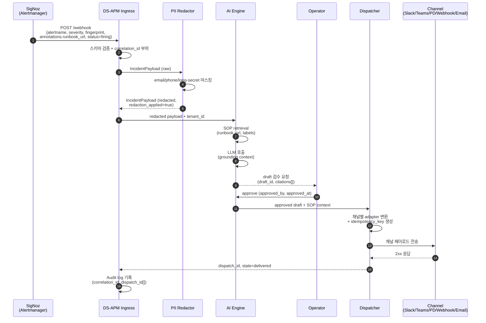

# DS-APM Overview

> **템플릿**: arc42 v9.0 (2025-07) — POC 단계 경량화 (12개 섹션 중 7개만 채움)
> **상태**: POC MVP 구현 완료 (11 commits / +12,632 LOC). HMAC 정책·multi-tenant 격리 강화·PII Collector 적용은 production-readiness 단계로 follow-up.
> **표기 컨벤션**: 요구사항 단어는 "~해야 한다" (shall). 영문 ID/스키마 키는 그대로.

## §1. Introduction & Goals

### §1.1 What DS-APM is

**DS-APM**은 SigNoz **community 빌드** 위에 얹은 *Incident → SOP runbook → Operator handoff* 확장 레이어다. SigNoz 자체는 OpenTelemetry-네이티브 관측 플랫폼(MIT)이고, DS-APM은 그 위에서 다음 7단계를 직렬 자동화한다.

1. **Incident 수신** — SigNoz Ruler가 발화한 alert를 Alertmanager webhook v4 스키마로 ingress.
2. **PII Redaction** — AI Engine 진입 전 100% 차단 (email / phone / 16자 이상 secret).
3. **SOP Grounding** — alert label `signoz_pilot_sop_id` 기반 explicit-label binding으로 SOP retrieval (vector retrieval은 v0.1 범위 밖).
4. **AI Runbook Drafting** — tenant 격리된 AI Strategy로 draft 생성 + history append (fail-open 정책 포함).
5. **운영자 검수** — `approval_status: pending → approved/rejected/expired`. SOP/AI annotation을 운영자가 검토.
6. **Notification Dispatch** — Slack / MS Teams v2 / PagerDuty / Webhook / Email 5채널로 fan-out.
7. **DLQ + Idempotent Replay** — 실패 dispatch를 JSONL DLQ에 영속화하고 ledger 기반 idempotent replay.

본 문서는 **fork 프레이밍을 쓰지 않는다**. DS-APM은 SigNoz의 fork가 아니라 SigNoz community 코드라인 위에 직접 흡수된 확장이며, Enterprise 모듈(`ee/`, `cmd/enterprise/`)은 본 산출물 범위 밖이다.

### §1.2 Top Quality Goals (Top 3)

| # | 품질 목표 | 정량 시나리오 |
|---|---|---|
| **QG-1** | **정보 손실 0** | LLM 실패·채널 실패 등 어떤 degraded mode에서도 운영자가 받는 알람에서 alert payload + SOP 본문이 누락되지 않아야 한다. silent drop 0건. |
| **QG-2** | **Dispatch p95 latency ≤ 30s** | Ingress webhook 수신 → 채널 2xx 응답까지 p95 30초 이하 (운영자 approve 시간 제외). AI hook 자체는 p95 ≤ 1s. |
| **QG-3** | **Audit completeness 100%** | dispatch / draft / SOP 접근 / fail-open 발동 1건당 audit row 1건 이상. 누락률 0%. blameless culture 유지를 위한 reproducibility 토대. |

### §1.3 Stakeholders

| 이해관계자 | 관심사 |
|---|---|
| **운영자 (Operator)** | AI runbook draft 검수, dispatch 결과 모니터링, DLQ entry replay. UC-001~003의 primary actor. PagerDuty IC + Ops Lead 역할 겸직. |
| **SRE** | fail-open 발동·redaction spike·DLQ depth 등 meta-alert 수신. UC-003의 자격증명 회전 escalation 대상. |
| **Platform Admin** | tenant policy 등록, AI strategy 활성화, audit sink 설정 (`pilot_audit_sink_jsonl`). |
| **Security** | PII redaction 정책·HMAC 정책(미해결)·tenant 격리(production-readiness 미달) 검토. |
| **SigNoz upstream maintainer** | 본 산출물 범위 밖이지만, internal API 변경 시 DS-APM도 영향 받는다. |

## §3. Context & Scope

### §3.1 비즈니스 컨텍스트

```mermaid
flowchart LR
    INC[Incident<br/>(서비스 장애·지표 임계 초과)]
    DSAPM[DS-APM<br/>(SOP grounding +<br/>AI runbook draft)]
    SOP[SOP Store<br/>(운영 절차서)]
    OP[Operator<br/>(on-call)]
    CH[Channel<br/>(Slack/Teams/PD/Webhook/Email)]

    INC --> DSAPM
    SOP -.grounding context.-> DSAPM
    DSAPM -->|draft 검수 요청| OP
    OP -->|approve| DSAPM
    DSAPM --> CH
    CH -->|운영자 후속 대응| OP
```

비즈니스 흐름: 관측 시스템이 incident을 감지하면, DS-APM이 사전 등록된 SOP를 grounding 컨텍스트로 사용해 AI runbook draft를 만든다. 운영자는 draft를 검수해 approve/reject하고, dispatch는 5채널로 fan-out된다. 정보 손실 0과 audit completeness 100%가 비즈니스 책임선의 핵심.

### §3.2 기술 컨텍스트

```mermaid
flowchart LR
    SIGCOL[SigNoz<br/>Collector/OTel]
    SIGRULE[SigNoz Ruler<br/>(rule eval + alert firing)]
    AMW[Alertmanager<br/>webhook v4]
    DSAPM[DS-APM<br/>(Ingress + AI Engine +<br/>Dispatcher + DLQ)]
    PIIR[PII Redactor]
    SOPST[SOP Store<br/>(SQL)]
    LLM[LLM Provider<br/>(SaaS or self-hosted)]
    CK[ClickHouse]
    RD[Redis<br/>(future ledger)]
    SLACK[Slack]
    TEAMS[MS Teams v2]
    PD[PagerDuty]
    WH[Webhook]
    EMAIL[Email/SMTP]

    SIGCOL --> SIGRULE
    SIGRULE --> AMW
    AMW -->|POST /webhook| DSAPM
    DSAPM --> PIIR
    DSAPM --> SOPST
    DSAPM --> LLM
    DSAPM -.metrics+logs.-> CK
    DSAPM -.future idempotency cache.-> RD
    DSAPM --> SLACK
    DSAPM --> TEAMS
    DSAPM --> PD
    DSAPM --> WH
    DSAPM --> EMAIL
```

| 인터페이스 | 방향 | 프로토콜 / 스키마 |
|---|---|---|
| SigNoz Ruler → Alertmanager webhook | inbound | Prometheus Alertmanager v4 (`alertname`, `status`, `fingerprint`, `labels`, `annotations.runbook_url`) |
| DS-APM → SOP Store | bidirectional | bun ORM, table `ds_sop_documents`, partition key = `org_id` |
| DS-APM → LLM Provider | outbound | HTTP (SaaS or self-hosted). 401/403/429 → fail-open (F3) |
| DS-APM → ClickHouse | outbound | SigNoz upstream observability 경로 그대로 (metrics, logs) |
| DS-APM → 5 채널 | outbound | Slack Incoming Webhook (Block Kit) / MS Teams v2 (Adaptive Card v1.4, `Action.OpenUrl`만) / PagerDuty Events API v2 (`dedup_key`) / Generic Webhook (JSON) / SMTP MIME |
| DS-APM → Audit JSONL sink | outbound | `var/audit/pilot-events.jsonl`, 50 MiB rotation |
| DS-APM → DLQ JSONL sink | outbound | `var/dlq/*.jsonl`, 50 MiB rotation |

**Scope 명시**:
- **In Scope**: F0~F8 모든 모듈 (Foundation, SOP, AI, Notification, PII, DLQ).
- **Out of Scope**: SigNoz upstream 기능 자체, Enterprise 모듈 (`ee/`, `cmd/enterprise/`), vector retrieval 기반 SOP grounding (현재 explicit-label binding만), Redis ledger (현재 파일 기반).

## §5. Building Block View

> POC 단계 경량화 (research-skills-a-methods.md §1.4): Lv1과 Lv2를 표·리스트로 표현. SVG/Mermaid building block은 HTML 빌드 단계에서 별도 렌더링.

### §5.1 Lv1 — System Context

DS-APM은 단일 black box로서 SigNoz 위에서 다음과 상호작용한다.

| External System | 역할 |
|---|---|
| SigNoz Ruler / Alertmanager | alert source (webhook v4) |
| LLM Provider | runbook draft 생성 |
| SOP Store (SQL) | 운영자 등록 SOP 영속화 |
| 5 채널 (Slack / Teams / PD / Webhook / Email) | dispatch sink |
| Operator (사람) | draft 검수, DLQ replay |
| SRE (사람) | meta-alert 수신, 자격증명 회전 |

### §5.2 Lv2 — Container (DS-APM 내부 6 컴포넌트)

DS-APM은 단일 Go 바이너리(`cmd/community/`)에서 다음 6 컴포넌트를 호스트한다. WBS Level 2 골격과 1:1 매핑된다.

| 컴포넌트 | 책임 | 주요 source path | 대응 Feature | 대응 WBS |
|---|---|---|---|---|
| **Foundation** | pilot contract, managed markdown, audit sink, tenant policy 기반 타입·검증 | `cmd/community/`, `pkg/types/ruletypes/pilot_contract.go` | F0, F4, F5 | WBS-1.0 |
| **SOP Engine** | SOP store (SQL bun ORM), explicit-label grounding, file persistence | `pkg/ruler/sopstore/`, `pkg/ruler/signozruler/sop_document_file_store.go` | F1 | WBS-1.1 |
| **AI Engine** | AI strategy 생성·history append, dispatch hook, quota controller (fail-open) | `pkg/types/ruletypes/ai_strategy*.go`, `pkg/ruler/signozruler/handler.go` | F2, F3 | WBS-1.2 |
| **Notification Dispatcher** | 5채널 adapter + dispatcher hot path, AI annotation 머지 | `pkg/alertmanager/alertmanagernotify/{slack,msteamsv2,pagerduty,webhook,email}/`, `pkg/alertmanager/alertmanagerserver/dispatcher.go` | F6 | WBS-1.3 |
| **PII Redactor** | incident payload redaction (email / phone / long secret) | `pkg/types/alertmanagertypes/incident_payload.go` | F7 | WBS-1.4 |
| **DLQ + Replay** | JSONL DLQ sink, idempotent replay ledger | `pkg/alertmanager/alertmanagernotify/dlq/{dlq.go,ledger.go}` | F8 | WBS-1.5 |

100% rule 검증: `WBS-1.0 ∪ ... ∪ WBS-1.5 = DS-APM 전체`. 자식 합 = 부모 100%, 중복·누락 없음. SigNoz upstream 자체 기능 / Enterprise 모듈 / y2i 관련 항목은 명시적 OUT OF SCOPE (`04-wbs/index.md` §Excluded Scope).

## §6. Runtime View

UC-001 Golden Path 정상 흐름(SigNoz alert → 채널 delivered). 상세는 [`UC-001`](../02-usecase/cases/UC-001-incident-to-channel.md) 참조.



Sad path 2종은 별도 UC로 분리: [`UC-002`](../02-usecase/cases/UC-002-channel-failure-dlq.md) (채널 4xx/5xx → DLQ → replay), [`UC-003`](../02-usecase/cases/UC-003-llm-auth-fail-open.md) (LLM 401/403/429 → fail-open → SOP raw fallback).

## §9. Architectural Decisions

- [**ADR-001** Python ds_apm_poc 폐기 → Go + SigNoz로 통합](adr/ADR-001-python-to-go.md) — **Accepted (2026-05-19)**. Python orchestrator + SigNoz bridge 구조에서 단일 Go 바이너리로 흡수. Alertmanager 5채널 dispatch 재사용 + OTel-native interface drift 종결.

### 추가 ADR 후보 (proposed, 미작성)

| 후보 ID | 주제 | 트리거 |
|---|---|---|
| ADR-002 | Channel adapter pattern — 5채널 어댑터를 SigNoz upstream `pkg/alertmanager/alertmanagernotify/` 디렉토리 패치로 흡수할지, 별도 adapter package로 분리할지 | 6번째 채널 추가 요청 시 |
| ADR-003 | JSONL DLQ over Redis Streams — file 기반 JSONL sink로 시작했으나 Redis Streams로 이전할지 결정 (F8 NF-5.3.1 HMAC 정책과 함께 결정) | DLQ depth가 운영 임계치 초과 시 |

## §10. Quality Requirements

### §10.1 Quality Tree

```
DS-APM Quality
├─ Performance
│  ├─ Ingress → Dispatch p95 ≤ 30s (QG-2)
│  ├─ AI hook 동기 호출 p95 ≤ 1s (NF-F6.1)
│  └─ Fail-open 결정 latency p95 ≤ 1s (UC-003)
├─ Reliability
│  ├─ DLQ persistence durability (dispatch 손실 0건)
│  ├─ Idempotency: (fingerprint, channel, round_no) 튜플 기준 중복 dispatch 0건
│  └─ Fail-open 정보 손실 0 (QG-1)
├─ Security
│  ├─ PII 100% redaction before AI Engine (QG-3 의존)
│  ├─ HMAC 서명 정책 (NF-5.3.1 — open)
│  └─ Cross-tenant SOP leakage 0건 (NF-F1.1)
└─ Maintainability
   ├─ Contract version 문자열 frozen (NF-F0.1)
   ├─ Component-oriented WBS Lv2 = `pkg/` 1:1 매핑
   └─ Audit completeness 100% (QG-3)
```

### §10.2 Quality Scenarios (정량)

| ID | Source | Stimulus | Environment | Artifact | Response | Response Measure |
|---|---|---|---|---|---|---|
| **QS-PERF-1** | SigNoz Alertmanager | firing alert webhook POST | 정상 운영 | Ingress + Dispatcher hot path | dispatch 2xx 수신까지 직렬 처리 | **p95 ≤ 30s** (운영자 approve 시간 제외) |
| **QS-PERF-2** | Dispatcher aggrGroup flush | AI hook Apply 호출 | 정상 운영 | AI Engine sync hook | merged annotations 반환 | **p95 ≤ 1s** (`DefaultGenerateTimeout`) |
| **QS-PERF-3** | LLM Provider 401/403/429 | quota classify | LLM degraded | Quota controller | fail-open 결정 + SOP raw fallback | **p95 ≤ 1s** to decision, **≤ 3s** to Dispatcher |
| **QS-REL-1** | Channel webhook 4xx/5xx | terminal failure | 정상 운영 | DLQ JSONL sink | entry append + ledger upsert | **dispatch 손실 0건**, 프로세스 crash 시 fsync 정책상 1초 이내 마지막 N개 허용 |
| **QS-REL-2** | Operator manual replay | DLQ entry 선택 | 정상 운영 | Replay ledger | dedup check + 재dispatch | **`(EventID)` 중복 dispatch 0건** (현재 구현, follow-up: `(fingerprint, channel, round_no)`) |
| **QS-SEC-1** | AI Engine ingress | LLM 호출 직전 payload 검사 | 정상 운영 | PII Redactor | email / phone / 16자 이상 secret 마스킹 | **redaction coverage 100%** before LLM |
| **QS-SEC-2** | Cross-tenant `SOPStore.Get` 호출 | tenant scope mismatch | 정상 운영 | SOP Store | `ErrSOPDocumentNotFound` 반환 (존재 누설 금지) | **0건 누설** (NF-F1.1) |
| **QS-MNT-1** | dispatch 1건 | audit sink write | 정상 운영 | `pilot_audit_sink_jsonl` | `correlation_id`, `dispatch_id`, `idempotency_key` 영속 기록 | **audit row 누락률 0%** |

## §11. Risks & Technical Debt

| # | 위험 / 부채 | 영향 | 완화 / 추적 |
|---|---|---|---|
| **R-1** | **Nested repo 운영 위험** — 운영 작업이 `workspace_archive/ds-apm/var/signoz`라는 nested 위치에서 일어남. 상위 repo `git status`만 보면 변경이 가려진다. | 변경 누락·롤백 누락. | 메모리 항목 "var/signoz는 우리 코드 (nested repo)" 정책으로 항상 nested `.git` 추가 확인. |
| **R-2** | **HMAC 정책 미해결 (NF-5.3.1)** | replay payload 무결성/위변조 방지 정책 미정. | F8 `open_items`로 영구 추적. ADR-003 결정 시 함께. |
| **R-3** | **Multi-tenant 격리가 production-ready 아님** | shared vector store + tenant_id filter 방식. README 명시 caveat. | tenant policy 단위 테스트 보강 (WBS-1.0 open item). dedicated vector store는 미구현 (UC-001 Sub-Variations). |
| **R-4** | **PII Collector 미적용** | 현재 PII redaction은 DS-APM ingress 진입 후 페이로드 단계 (research-skills-c-domain.md §9는 instrumentation layer를 권장). | OTel Collector Attribute / Filter / Redaction / Transform processor 도입은 follow-up. redaction rate metric을 meta-alert source로 활용 (F7). |
| **R-5** | **Frontend 변경 영역 미확정** | `frontend/src`, `frontend/public` 변경 파일·기능 식별 미완료. UC-001 단계 6 (운영자 검수 화면)의 정확한 매핑 미정. | traceability.md §6 open item. baseline §3 Open Item #1. |
| **R-6** | **SigNoz upstream 종속** (ADR-001 negative consequence) | internal API (`dispatch.Dispatcher`, `notify.Stage`) 변경 시 DS-APM 영향. | upstream merge cadence 모니터링. critical interface는 `pkg/types/ruletypes/`로 wrapping. |
| **R-7** | **Idempotency 키 단순화** — 현재 `EventID = alert.fingerprint`만. research §10.2 권장 `sha256(fingerprint || channel.id || round_no)` 미적용. | 동일 fingerprint가 여러 채널로 갈 때 한 채널이 idempotent 처리되면 다른 채널도 skip될 수 있음. | F8 `open_items` 추적. follow-up. |

## §12. Glossary

→ [`_shared/glossary.md`](../_shared/glossary.md) (총 **31개 용어**: alert / Alertmanager / AI strategy / AI strategy history / annotations.runbook_url / audit sink / channel adapter / correlation_id / dedup_key / dispatch round / DLQ / draft / fail-open / fingerprint / fork base commit / Idempotency Key / Incident / MVP / multi-tenant / Operator / OTel / PII / redaction / replay ledger / runbook / runbook draft / severity / SigNoz / SOP / SRE / tenant)

## Traceability
- Linked Use Cases: UC-001, UC-002, UC-003
- Linked Features: F0~F8 ([`../03-functional-spec/index.md`](../03-functional-spec/index.md))
- Linked WBS: WBS-1.0~1.5 ([`../04-wbs/index.md`](../04-wbs/index.md))
- 진실의 원천: [`../_shared/traceability.md`](../_shared/traceability.md)
