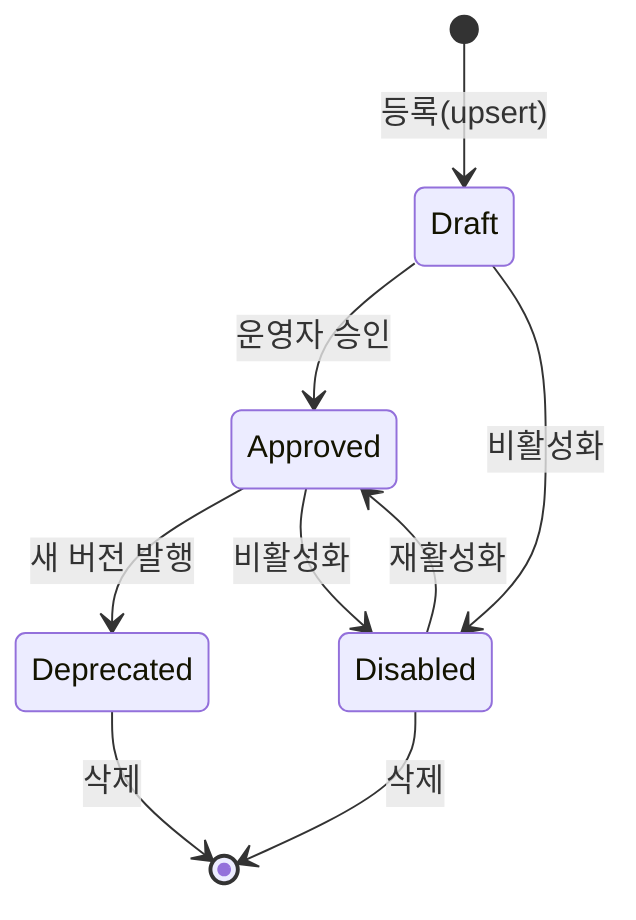

# CF-1 — SOP 자동 연계 (Grounding) + 테넌트 격리

> **고객 가치 (JTBD-1·3)**: 운영자는 알람마다 맞는 대응 절차서(SOP)를 *직접 찾지 않고* 자동으로 함께 받는다. 절차서가 붙으니 초·중급 인력도 그 가이드로 1차 대응을 시작할 수 있다.
> **상태**: implemented. 단 테넌트 격리는 label 기반(RLS 아님 — §9.2).

## CF-1.1 개요 (사용자 관점)

운영자는 평소 알람을 받지만, "이 알람에 뭘 해야 하는지"는 특정 PM/PL의 머릿속에 있었다. CF-1은 알람에 **미리 연결해 둔 SOP를 자동으로 매칭**해, 알람과 절차서를 한 번에 운영자에게 넘긴다. 관리자는 팀의 SOP를 등록해 두기만 하면 되고, 보안담당자는 한 팀이 다른 팀의 절차서에 접근하거나 그 존재를 알 수 없도록 격리를 보장받는다.

연계는 **알람에 박힌 SOP 식별자를 1차 키로 쓰는 명시적 매칭**이다(의미 기반 vector 검색은 도입 전 — §9.2). 테넌트(`project_id × environment`)가 일치하지 않으면 차단되고, 비활성·만료된 SOP는 적용되지 않는다.

## CF-1.2 기능 요구 (FR)

### FR-CF1.1 — 운영자는 알람에 연결된 SOP를 자동으로 함께 받는다
- **무엇을**: 알람에 SOP 식별자가 지정돼 있으면 해당 절차서를 자동 연계해 알림에 포함한다. 운영자는 어떤 SOP인지 직접 찾지 않는다.
- **Acceptance**:
  ```gherkin
  Given 운영자 팀(project_id=p-prod, environment=production)에 SOP "SOP-PAY-5xx" v01이 승인돼 있고
    And 알람에 그 SOP 식별자가 지정돼 있을 때
  When 알람이 처리되면
  Then 운영자는 "SOP-PAY-5xx" v01이 연계된 알림을 받는다
   And 연계 방식은 "명시적 식별자 매칭"으로 기록된다
  ```
- **구현 근거**: `sop_document.go: PreviewSOPDocumentBinding` — alert label `signoz_pilot_sop_id`로 explicit-label binding(`status=bound`, `resolution=explicit_label`). vector retrieval 미도입. · WBS-1.1

### FR-CF1.2 — 관리자는 등록한 SOP가 보관·매칭됨을 신뢰한다
- **무엇을**: 관리자가 등록한 SOP 본문을 시스템이 영속 보관하고, 버전·무결성을 보장하며, 알람 연계에 사용한다.
- **Acceptance**:
  ```gherkin
  Given 관리자가 SOP "SOP-PAY-5xx" v01을 마크다운 본문과 함께 등록하면
  When 같은 SOP를 다시 조회할 때
  Then 등록한 본문이 그대로(무결성 검증 통과) 반환된다
   And 최신 버전 조회 시 가장 최근 승인 버전이 반환된다
  ```
- **구현 근거**: `SOPStore`(sqlsopstore, bun ORM, 마이그레이션 078 `ds_sop_documents`, `(org_id, sop_id, version)` 키) — `Upsert/Get/GetLatest/List`. 무결성: `sha256:` checksum · 본문 256 KiB 상한 · markdown 형식 검증 · `safeDisplayURL`(http/https만, sensitive query 제거). ⚠️ `GetLatest`는 version 문자열 DESC 정렬이라 zero-pad(`v01`) 필요. · WBS-1.1

### FR-CF1.3 — 보안담당자는 팀 간 SOP 접근 격리를 보장받는다
- **무엇을**: 한 팀(테넌트)의 운영자는 다른 팀의 SOP에 접근할 수 없다. 매칭은 `project_id`와 `environment`가 모두 일치할 때만 허용한다(와일드카드 `*` 지원).
- **Acceptance**:
  ```gherkin
  Given SOP "SOP-PAY-5xx"의 허용 범위가 {project_id: p-prod, environment: production}이고
  When 다른 팀(project_id=p-other)의 알람이 그 SOP를 요청하면
  Then 연계는 "차단(forbidden)"되고
   And 운영자는 "요청한 테넌트 범위 밖의 SOP" 경고와 함께 원본 알람만 받는다
  ```
- **구현 근거**: `tenant_policy.go: PilotTenantScopeAllows`(정확 일치 또는 `*`), `SOPBindingStatusForbidden`, `SOPTenantPolicyDeniedWarning`. label 누락 시 `PilotTenantIsComplete=false`로 deny. · WBS-1.0

### FR-CF1.4 — 보안담당자는 다른 팀 SOP의 *존재 여부조차* 노출되지 않음을 보장받는다
- **무엇을**: 테넌트 범위 밖 SOP를 직접 조회해도, "그 SOP가 (다른 팀에) 존재하는지"를 추론할 수 없다 — 없는 것과 동일하게 응답한다.
- **Acceptance**:
  ```gherkin
  Given SOP "SOP-PAY-5xx"가 팀 p-prod에만 존재할 때
  When 팀 p-other가 그 SOP를 직접 조회하면
  Then "문서를 찾을 수 없음"으로 통일 응답되고
   And 다른 팀 존재 여부를 구분할 수 있는 어떤 신호도 노출되지 않는다
  ```
- **구현 근거**: cross-tenant `Get`은 `ErrSOPDocumentNotFound`로 통일(존재 누설 금지). → NF-5.3.4. · WBS-1.0

### FR-CF1.5 — 운영자는 비활성·만료 SOP가 적용되지 않음을 안다
- **무엇을**: SOP가 `disabled`이거나 오래된(staleness 90일 초과) 경우 연계하지 않고 원본 알람만 전달한다. 잘못된/낡은 절차서로 오대응을 유도하지 않는다.
- **Acceptance**:
  ```gherkin
  Given SOP "SOP-PAY-5xx"의 승인 상태가 "disabled"일 때
  When 일치하는 알람이 처리되면
  Then 연계 상태는 "disabled"로 보고되고 SOP 본문은 전달되지 않는다
   And 운영자는 원본 알람을 받는다 (silent drop 아님)
  ```
- **구현 근거**: `approvalStatus=disabled` → `SOPBindingStatusDisabled` + "sop document is disabled" 경고. staleness 90일 정책 → NF-5.5.3. · WBS-1.1

## CF-1.3 SOP 생명주기 (상태)



연계 결과 상태: `bound`(정상) / `missing`(식별자 없음 또는 미존재) / `forbidden`(테넌트 불일치) / `disabled`(비활성).

## CF-1.4 비기능 요건 (feature-specific)
- **NF-CF1.1** Cross-tenant lookup은 `ErrSOPDocumentNotFound`로 통일(존재 누설 금지). → NF-5.3.4
- **NF-CF1.2** SOP 본문 무결성: `sha256:` checksum + 256 KiB 상한 + markdown 형식 검증(HTML/PDF/ZIP magic 거부).
- **NF-CF1.3** `DisplayURL`은 http/https만 허용, sensitive query parameter 자동 제거(`safeDisplayURL`).
- **NF-CF1.4** 테넌트 매칭은 stateless·deterministic(같은 입력 → 같은 결과).

## CF-1.5 예외·복구 (운영자 관점 → 처리)

| 상황 | 운영자가 받는 것 |
|---|---|
| SOP 식별자 label 없음 | 원본 알람만 (`missing`, "sop_id label is not set") |
| Store에 SOP 없음 | 원본 알람만 (`missing`, "sop document was not found") |
| `project_id`/`environment` label 누락 | 원본 알람만 (`missing`, 테넌트 정책 경고) |
| 테넌트 범위 불일치 | 원본 알람만 (`forbidden`, "범위 밖 SOP" 경고) |
| SOP 비활성(disabled) | 원본 알람만 (`disabled` 경고) |
| 등록 시 본문 256 KiB 초과 / 비-markdown | 등록 거부(validation error) — 운영 중 알람엔 영향 없음 |

> 공통 원칙: 연계 실패는 **silent drop이 아니라 원본 알람 전달**(NF-5.5.1).

## CF-1.6 Open / Non-goal
- **RLS 없음** — `SOPStore`는 `orgID` 파티션만 강제, 테넌트 범위는 application-layer filter. (§9.2)
- **`project_id` spoofing 방어 없음** — alertmanager를 신뢰 가능한 source로 가정.
- **SOP delete 엔드포인트 미노출** — `SOPStore.Delete`는 존재하나 HTTP route 없음.
- **Vector retrieval 미도입** — explicit-label 매칭만. 의미 기반 연계는 로드맵.
- **`Environments` glob/regex 미지원** — plain string + `*`만.

## CF-1.7 Traceability
- JTBD: JTBD-1(상시 자동화), JTBD-3(상향평준화) · User Journey: UJ-1
- User Journey: UJ-1(골든패스, 단계 4) · UJ-3 전제(SOP fallback 원문) · Covered by WBS: WBS-1.1(SOP), WBS-1.0(tenant)
- 구 모듈: F1(SOP Grounding & Store), F4(Multi-tenant Scope)
- Commits: 
- → 상위: [`../index.md`](../index.md) §7.1 · 전략: [`source-strategy-brief.md`](../../_foundation/source-strategy-brief.md) §3(SOP 자동화)
