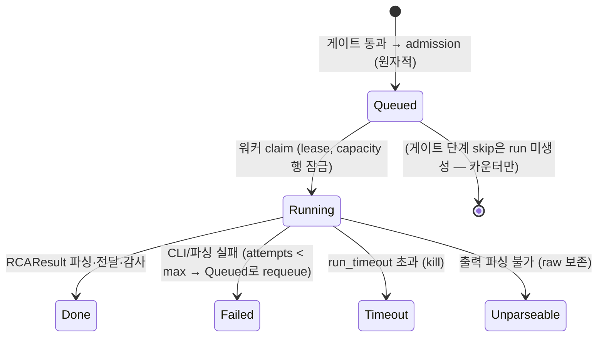
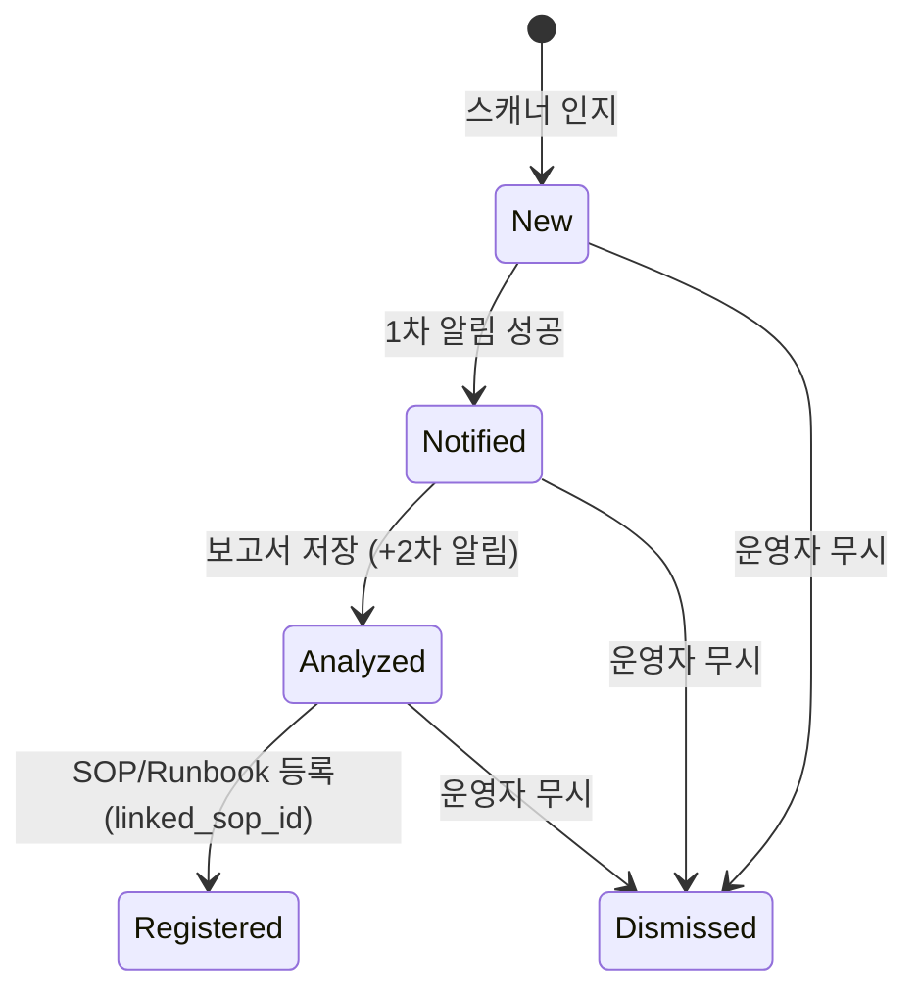

# CF-11 — AI 코드베이스 RCA (코드 근거 근본원인 분석)

> **고객 가치 (JTBD-1·2·4)**: 매칭되는 SOP가 없고(unbound) 이상(anomaly)이 감지된 알람은 따라야 할 사람이 작성한 Runbook이 없다. CF-11은 이 공백을 메운다 — **CLI 코딩 에이전트(claude/codex)를 read-only로 구동**해 해당 서비스의 소스 코드를 탐색하게 하고, **근본원인 가설 + 수정 *제안*** 을 만들어 운영자에게 검토용으로 전달한다. 수정은 **절대 자동 적용되지 않는다(HITL)**.
> **상태**: implemented-mvp (코어 TDD 완료 — [설계서](../../../superpowers/specs/2026-06-11-cf11-code-rca-design.md), Codex 4라운드 APPROVE). HTTP·FE·디스패치 seam은 통합 단계.

## CF-11.1 개요 (사용자 관점)

DS-APM은 알람이 뜨면 SOP를 자동 연계(CF-1)하고 AI 대응 가이드(CF-2)를 만든다. 그러나 **연계할 SOP가 없는(unbound)** 신종/희귀 장애는 가이드의 근거가 빈약하다. 특히 메트릭 이상 탐지(CF-7)가 평소와 다른 패턴을 알리는데 해당 현상의 Runbook이 없을 때, 운영자는 "코드의 어디가 문제인가"를 맨손으로 추적해야 한다.

CF-11은 이 케이스에 한정해 다음을 자동화한다.

1. **트리거(게이트)** — 디스패치 경로에서 *SOP 미연계(unbound) ∧ 이상(anomaly) ∧ 심각도 임계 이상 ∧ 서비스→저장소 매핑 존재* 일 때만 후보가 된다. 이상 신호가 없으면 **발화하지 않는다(fail-closed)**.
2. **비용·볼륨 제어 (최우선 설계 동인)** — 수백 건의 유사 오류가 각각 수 분짜리 에이전트 실행을 일으키면 토큰·프로세스가 폭주한다(본 배포는 quota 폭주 이력 보유 — y2i, 2026-04-26). 따라서 **원자적 DB admission**(dedup 슬라이딩 쿨다운·일일 예산·큐 깊이)과 **DB 기반 lease·동시성 캡**으로 실행 수를 강제 제한한 뒤에만 CLI를 구동한다.
3. **비동기 실행** — 게이트 통과 시 영속 `coderca_run`(status=queued)으로 적재하고 훅은 즉시 반환한다. 워커 풀이 claim → 서비스→저장소 해석 → 소스 fetch + 기준 커밋 고정 → CLI 에이전트(read-only) 코드 탐색 → 근본원인+수정 제안 파싱.
4. **전달 (HITL)** — 결과를 기존 핸드오프(CF-3)·이력·감사(CF-6) 경로로 운영자에게 전달한다. 제안된 수정은 **검토용**이며 어떤 저장소에도 적용되지 않는다.

**불변 원칙과의 관계**: CF-11은 *자동 조치*(CF-8 영역)가 아니다. 결과는 정보 제공·제안일 뿐이며, 에이전트는 격리된 일회용 checkout에서 **읽기 전용**으로만 동작한다. 알람 전달 경로는 CF-11의 성공/실패와 무관하게 보장된다(additive·non-blocking).

## CF-11.2 기능 요구 (FR)

### FR-CF11.1 — 운영자는 unbound∧anomaly 알람에 대해 코드 근거 RCA 보고서를 받는다
- **무엇을**: 매칭 SOP가 없고(unbound) 이상(anomaly)이며 심각도 임계 이상인 알람에 대해, 시스템이 CLI 코딩 에이전트로 해당 서비스 코드베이스를 탐색해 **근본원인 가설·수정 제안·신뢰도·한계**가 담긴 RCA 보고서를 생성하고 전달한다. 이상 신호가 없으면 발화하지 않는다.
- **Acceptance**:
  ```gherkin
  Given org/서비스의 CF-11 기능이 ON이고
    And 알람이 SOP 미연계(unbound) 상태이며
    And 알람에 이상(anomaly) 신호가 있고 심각도가 임계(기본 high|critical) 이상이며
    And 해당 서비스가 저장소에 매핑되어 있을 때
  When 디스패치 트리거가 게이트를 통과하면
  Then coderca_run이 적재되고(status=queued) 훅은 즉시 반환하며
   And 워커가 CLI 에이전트를 checkout 안에서 read-only로 구동해
   And 근본원인·수정 제안·신뢰도·기준 커밋이 담긴 RCAResult가 생성된다 (status=done)

  Given 동일 알람에 이상(anomaly) 신호가 없을 때
  When unbound·고심각도라도 트리거가 평가되면
  Then 실행은 생성되지 않는다 (skip=no_anomaly, fail-closed)
  ```
- **구현 근거**: 게이트 판정(`feature_off`/`no_anomaly`/`below_severity`/`no_repo_mapping` 등 `SkipReason`, [`coderca.go`](../../../../pkg/ruler/coderca/coderca.go)) → 비동기 오케스트레이션 [`engine/engine.go`](../../../../pkg/ruler/coderca/engine/engine.go) `ProcessNext`/`runOne` → 프롬프트 [`prompt.go`](../../../../pkg/ruler/coderca/prompt.go) `BuildPrompt` → CLI [`clirunner/`](../../../../pkg/ruler/coderca/clirunner/) → 결과 파서 [`rcaresult.go`](../../../../pkg/ruler/coderca/rcaresult.go). 디스패치 훅 진입점(`coderca.Trigger.Maybe`)·`AnomalySignal` 배선은 통합 seam(설계 §10·§11). · WBS-1.7

### FR-CF11.2 — 관리자는 저장소 연결·서비스 매핑·기능 on/off를 설정으로 통제한다
- **무엇을**: 관리자는 분석 대상 git 저장소와 `(org, 서비스명)→저장소[+subpath]` 매핑, org/서비스 단위 기능 on/off(기본 **OFF**, opt-in)와 비용 임계값을 설정한다. 자격증명은 secretbox로 암호화 저장되고 응답에 비노출된다. **암호화 키가 없으면 비공개 저장소 자격증명 저장·사용을 거부한다(fail-closed)** — 평문 저장 금지.
- **Acceptance**:
  ```gherkin
  Given 관리자가 저장소 설정을 저장할 때
  When 자격증명이 포함되면
  Then 자격증명은 ciphertext로 저장되고 조회 응답에는 평문이 반환되지 않는다

  Given 암호화 키(DS_APM_AI_CONFIG_ENCRYPTION_KEY)가 설정되지 않았을 때
  When 비공개 저장소 자격증명 저장을 시도하면
  Then 설정 오류가 반환되고 평문 자격증명은 저장되지 않는다 (공개·무자격 저장소만 허용)
  ```
- **구현 근거**: 도메인·스토어 [`codebaseconfigstore/`](../../../../pkg/ruler/coderca/codebaseconfigstore/)(`sqlcodebaseconfigstore`·`sqlcodebaseservicemapstore`), 테이블 `ds_codebase_repo`·`ds_codebase_service_map`·`ds_codebase_config`(마이그레이션 [`082_add_ds_codebase_config.go`](../../../../pkg/sqlmigration/082_add_ds_codebase_config.go)), secretbox(`aiconfigstore/secretbox` 재사용, fail-closed). HTTP 핸들러·설정 FE는 통합 seam(설계 §11). · WBS-1.7

### FR-CF11.3 — 운영 조직은 폭주가 비용·볼륨 폭발로 이어지지 않음을 보장받는다
- **무엇을**: 동일 오류 수백 건이 동시에 떠도 실행 수가 강제 제한된다. **원자적 DB admission**(슬라이딩 쿨다운 dedup·org 일일 예산·큐 깊이)과 **DB 기반 lease·동시성 캡**(잠금된 capacity 행 + fencing 토큰 + reaper 복구)으로, 토큰 introspection 없이 실행 횟수·동시성·중복을 묶는다.
- **Acceptance**:
  ```gherkin
  Given 한 dedup_key에 대해 N개의 admission이 동시에 시도될 때
  When 게이트가 평가되면
  Then 정확히 1건의 run만 적재된다 (나머지는 skip=deduped, hit_count 증가)

  Given org가 일일 실행 한도(max_runs_per_day, 기본 20)에 도달했을 때
  When 새 트리거가 들어오면
  Then 실행은 생성되지 않는다 (skip=budget_exhausted)

  Given 동시성 캡이 1이고 N개의 워커가 동시에 claim을 시도할 때
  When claim 트랜잭션이 실행되면
  Then max_concurrent_runs 이하만 running으로 전이된다 (잠금된 capacity 행)

  Given running 상태의 run이 lease 만료(crash 모사)되었을 때
  When reaper가 sweep하면
  Then 해당 run은 requeue되어 max_attempts 이내 재실행된다
  ```
- **구현 근거**: 원자적 admission·예산·큐·skip 카운터·lease/heartbeat/reaper [`runstore/`](../../../../pkg/ruler/coderca/runstore/)(`runstore.go`·`lease.go`·`skipstat.go`), 테이블 `coderca_run`·`coderca_admission`·`coderca_budget`·`coderca_capacity`·`coderca_skip_stat`. 폭주 시뮬레이션 exit-gate [`runstore/floodsim_test.go`](../../../../pkg/ruler/coderca/runstore/floodsim_test.go). · WBS-1.7

### FR-CF11.4 — 운영자는 수정이 자동 적용되지 않고 read-only 제안으로만 전달됨을 보장받는다
- **무엇을**: 에이전트는 격리된 일회용 checkout에서 **읽기 전용 도구만** 사용한다(codex `-s read-only -C`, claude allow/deny 도구 + `--max-budget-usd`). 산출물의 수정 제안은 검토용이며 어떤 저장소에도 적용되지 않는다. checkout이 에이전트의 유일한 쓰기 표면이며 실행 종료 시 제거된다.
- **Acceptance**:
  ```gherkin
  Given CLI 에이전트를 구동할 때
  When 명령을 조립하면
  Then read-only 플래그가 정확히 포함된다 (codex: -s read-only -C <checkout>; claude: --allowed-tools "Read,Grep,Glob" --disallowed-tools "Bash,Write,Edit,WebFetch,WebSearch" --max-budget-usd <cap>)
   And fake-binary 하니스에서 쓰기 시도는 거부된다

  Given RCAResult의 수정 제안(ProposedFix)이 생성되었을 때
  When 운영자에게 전달되면
  Then 제안은 검토용으로만 전달되고 저장소에 자동 적용되지 않는다 (HITL)
  ```
- **구현 근거**: read-only 호출 조립 [`clirunner/command.go`](../../../../pkg/ruler/coderca/clirunner/command.go) `BuildArgs`, 프로세스 그룹·`WaitDelay` 실행 [`clirunner/runner.go`](../../../../pkg/ruler/coderca/clirunner/runner.go)·`subproc_linux.go`, 결과의 `ProposedFix`(suggestion only) [`rcaresult.go`](../../../../pkg/ruler/coderca/rcaresult.go). · WBS-1.7

### FR-CF11.5 — 운영자는 분석이 수행된 기준 커밋(baseline)을 명시받는다
- **무엇을**: 분석은 트리거 시점에 고정된 **기준 커밋(baseline_commit)** 에 대해 수행되며, 이 커밋이 `coderca_run`에 기록되고 RCA 보고서에 **에코**된다. 프로덕션이 다른 커밋을 돌고 있어도 운영자가 어느 버전을 분석했는지 대조할 수 있다.
- **Acceptance**:
  ```gherkin
  Given 서비스 저장소가 fetch된 상태일 때
  When 트리거가 분석을 시작하면
  Then 대상 브랜치 HEAD가 baseline_commit으로 고정되어 coderca_run에 기록되고
   And 에이전트는 그 커밋의 일회용 checkout에서 분석하며
   And RCAResult에 분석한 기준 커밋이 명시(에코)된다

  Given 서비스가 저장소에 매핑되지 않았을 때
  When 트리거가 평가되면
  Then 실행은 생성되지 않는다 (skip=no_repo_mapping)
  ```
- **구현 근거**: 서비스→저장소 해석 [`reporesolver/`](../../../../pkg/ruler/coderca/reporesolver/)·[`resolver.go`](../../../../pkg/ruler/coderca/resolver.go), 순수 소스-상태 전이(기준 커밋 결정) [`sourcestate/`](../../../../pkg/ruler/coderca/sourcestate/), `RCAResult.BaselineCommit` [`rcaresult.go`](../../../../pkg/ruler/coderca/rcaresult.go). · WBS-1.7

### FR-CF11.6 — 운영자는 분석이 실패해도 알람 전달이 영향받지 않음을 보장받는다 (fail-open)
- **무엇을**: 디스패치 훅은 additive·non-blocking이며 분석은 비동기다. CLI 장애·타임아웃·비용 초과·파싱 실패 등 분석 단계의 어떤 실패도 알람 전달 경로를 지연·차단하지 않는다. 실패는 감사 기록되고 run 상태(`failed`/`timeout`/`unparseable`)로 표시된다.
- **Acceptance**:
  ```gherkin
  Given CF-11이 활성이고 디스패치 훅이 unbound 분기를 처리할 때
  When 트리거가 평가·적재되면
  Then 훅은 입력을 변경 없이 즉시 반환한다 (알람 전달 무영향)

  Given run이 run_timeout(기본 5분)을 초과할 때
  When 실행 중이면
  Then CLI는 종료되고 status=timeout으로 기록되며 lease·reaper가 슬롯을 회수한다

  Given CLI/파싱이 실패할 때
  When 워커가 처리하면
  Then status=failed|unparseable로 기록되고 감사 이벤트가 남으며 (auditor.Audit, best-effort)
   And 알람 전달 경로는 영향받지 않는다 (silent drop 0)
  ```
- **구현 근거**: 종료 상태 전이 [`engine/engine.go`](../../../../pkg/ruler/coderca/engine/engine.go) `runOne`(→ `RunStatusFailed`/`Timeout`/`Unparseable`), per-run 하드 ceiling(run_timeout·`--max-budget-usd`, 설계 §6.5), 감사 [`audit.go`](../../../../pkg/ruler/coderca/audit.go). 디스패치 훅 additive 보장은 unbound 분기 무변경(설계 §5.1) — 배선은 seam. · WBS-1.7

## CF-11.3 비기능 요건 (feature-specific)

- **NF-CF11.1** 비용·볼륨 제어가 **#1 설계 동인**. 모든 볼륨 강제는 원자적 DB 트랜잭션(유니크 제약, `RunInTxCtx`)에서만 — 인메모리 check-then-enqueue 금지(TOCTOU). (설계 §6)
- **NF-CF11.2** 동시성 캡은 **잠금된 `coderca_capacity` 행**의 조건부 UPDATE로 강제(bare count race 금지) + lease **fencing 토큰** + reaper 재조정. `SKIP LOCKED` 미사용(SQLite 미지원, capacity 게이트엔 부적합). (설계 §6.3)
- **NF-CF11.3** 자격증명은 secretbox(AES-256-GCM), **in-process only**, 디스크 평문·로그 비노출(`GIT_ASKPASS`+`GIT_TERMINAL_PROMPT=0`). 암호화 불가 시 비공개 repo fail-closed. (설계 §9)
- **NF-CF11.4** per-run 격리 checkout(`<base>/<org>/<repo>/<run_id>`)이 에이전트의 유일한 쓰기 표면, 종료(실패·타임아웃·kill 포함) 시 제거. CLI 고아 방지: 프로세스 그룹 kill + `Pdeathsig` + 부팅 시 orphan sweep. (설계 §6.5·§9)
- **NF-CF11.5** per-run 하드 ceiling — wall-clock `run_timeout`(기본 5분, ctx-cancel+`WaitDelay`) + claude `--max-budget-usd`(하드 $ 상한). (설계 §6.5)
- **NF-CF11.6** anomaly **fail-closed** — 신호 부재 시 미발화. legacy "unbound+severity" 동작은 기본 OFF 플래그(`allow_unbound_without_anomaly`) 뒤로만. (설계 §10)
- **NF-CF11.7** 전 테이블·checkout 디렉터리 org 단위 격리.
- **NF-CF11.8** LLM/CLI 호출 비용은 run-count·동시성·dedup로 묶음(토큰 introspection 불가 — CLI가 토큰 수를 신뢰성 있게 반환하지 않음). (설계 §2)

## CF-11.4 실행 모델 (상태)



`running` lease 만료 시 reaper가 requeue(`attempts ≥ max_attempts`면 failed). 종료는 fencing 토큰(`WHERE id=? AND lease_token=?`)으로 보장 — 재clain된 run의 원래 워커 쓰기 거부.

## CF-11.5 예외·복구 (운영자 관점 → 처리)

| 상황 | 처리 |
|---|---|
| 이상(anomaly) 신호 부재 | 미발화 (skip=no_anomaly, fail-closed) |
| 동일 오류 폭주 | dedup 슬라이딩 쿨다운(기본 6h) → 1건만 실행, 나머지 skip=deduped |
| org 일일 예산 초과 | skip=budget_exhausted (카운터만) |
| 큐 깊이 초과 | skip=queue_full |
| 서비스→저장소 미매핑 | skip=no_repo_mapping |
| 암호화 키 부재 + 비공개 repo | 설정 오류 (fail-closed, 평문 저장 금지) |
| run_timeout/비용 초과 | kill, status=timeout, lease·reaper 슬롯 회수 |
| CLI/파싱 실패 | status=failed|unparseable, 감사 기록, raw 보존, 알람 무영향 |
| 워커/레플리카 crash | lease 만료 → reaper requeue (≤ max_attempts) |

> 공통 원칙: CF-11의 어떤 실패도 **알람 전달 경로를 막지 않는다**(additive·non-blocking, NF-5.2.1 계열). 비용은 run-count·동시성·timeout·`--max-budget-usd`로 상한.

## CF-11.6 Open / Non-goal

- **통합 seam** — 디스패치 훅 트리거(`coderca.Trigger.Maybe`)·라우트 등록·서버 배선·FE 라우팅은 별도 새 파일/1줄 배선으로 통합 단계 처리(설계 §11). 코어는 구현·테스트 완료.
- **HTTP 핸들러 + 설정 FE** — M4(설계 §13), 후행.
- **EvidenceCollector(logs/traces)** — v1은 `NoopEvidenceCollector`. 입력은 labels/annotations + 파생 error signature. 로그·트레이스 수집기는 후행 additive 구현(설계 §7).
- **자동 조치 없음** — 수정은 *제안*만(HITL). 자동 적용·자동 라우팅은 CF-8 영역, 영구 Non-goal.
- **OS 샌드박스 래핑** — claude는 OS read-only 샌드박스가 없어 앱 레벨 도구 allow/deny + `--max-budget-usd` + 일회용 checkout으로 강제. bubblewrap/firejail 래핑은 hardening follow-up(설계 §9·§15).
- **CF-7 의존(이상 탐지)** — 트리거의 anomaly 조건은 CF-7. 현재는 명시적 anomaly 라벨/주석 기반(fail-closed); `ruleId`→rule-type 조회 enrichment는 동일 인터페이스 뒤 후행(설계 §10).

## CF-11.7 Traceability

- JTBD: JTBD-1(상시 자동화), JTBD-2(반자동 RCA), JTBD-4(HITL 안전) · User Journey: UJ-5(코드 RCA)
- Covered by WBS: WBS-1.7 · Epic: [Epic 11](../../03-epics/epic-11-code-rca.md) · Stories: 11.1~11.6
- 설계서: [2026-06-11-cf11-code-rca-design.md](../../../superpowers/specs/2026-06-11-cf11-code-rca-design.md) (Codex 4라운드 APPROVE)
- 모듈: F10 (AI codebase RCA — implemented-mvp) · 마이그레이션 **082** (`ds_codebase_repo`·`ds_codebase_service_map`·`ds_codebase_config`·`coderca_run`·`coderca_admission`·`coderca_budget`·`coderca_capacity`·`coderca_skip_stat`)
- → 상위: [`../index.md`](../index.md) §6·§7.2 · 트리거 소스: [CF-7 메트릭 이상 탐지](CF-7-anomaly.md) · 전략: [`source-strategy-brief.md`](../../_foundation/source-strategy-brief.md) 2단계

---

## 부록 A — 이연된 대안 설계 (스캐너 기반 미등록 예외 대응, jinhyeok 원안)

> ⚠️ **이것은 구현된 설계가 아니다.** 아래는 jinhyeok 브랜치가 **"CF-7 미등록 예외 대응"** 으로 작성했던 *대안 설계*다. 동일 문제(SOP 없는 신종 장애의 코드 근거 RCA)를 **다른 메커니즘**(주기 스캐너 → synthetic alert → 스택트레이스 분석 → SOP 자산화)으로 풀려는 접근이며, **코드로 구현되지 않았다**. 실제 구현은 위 본문(CLI 코딩 에이전트, coderca)이다.
>
> **보존 사유**: 향후 이 방향(텔레메트리 능동 스캔 + 스택트레이스 결정적 추출 + SOP 자산화)을 별도 역량으로 채택할 수 있어 **삭제하지 않고 보존**한다. 채택 시 신규 CF로 분리·정합 후 착수한다.
>
> **표기 주의**: 아래 FR-CF7.2~7.7·NF-CF7.x·F9(scanner)·"마이그레이션 081"은 **jinhyeok 원안 표기 그대로**이며, 현행 번호 체계에서는 **superseded** 됐다(현행 CF-7 = 메트릭 이상 탐지, FR-CF11.x = 구현된 코드 RCA, 실제 마이그레이션 082). 아래 ID를 라이브로 인용하지 말 것.

### A.0 원안 개요 (5단계 흐름)
1. **인지** — 스캐너가 텔레메트리(트레이스 예외·에러 로그)를 주기 스캔, 시그니처 정규화 후 기존 rule/SOP 미커버 **신규 예외 클러스터**를 인지.
2. **1차 알림 (즉시)** — 발견 즉시 기존 알림 경로(5채널·PII·DLQ·감사)로 "미등록 예외 발생" 전달.
3. **분석 (비동기)** — 스택트레이스에서 파일/라인 추출, 로컬 미러(git/svn)에서 소스 스니펫·blame·최근 커밋을 결정적으로 추출해 LLM으로 보고서 초안 생성.
4. **2차 알림** — 보고서 요약 + UI 링크를 동일 채널로 전달.
5. **자산화 (HITL)** — 운영자가 검토해 신규 SOP/Runbook **draft**로 등록. 승인은 기존 상태머신, 등록 후 재발은 CF-1 골든패스로 흡수.

### A.1 원안 FR (jinhyeok 표기 그대로)

**[원안] FR-CF7.2 — 운영자는 미등록 신규 예외 발생을 자동 인지·알림받는다**
- 무엇을: Alert Rule 미등록 예외가 텔레메트리에 출현하면 시그니처 정규화(예외 타입 + 최상위 앱 프레임 + 서비스)로 클러스터링해 신규 건만 인지·즉시 알림.
- Acceptance: 동일 시그니처 미보고 → status=new→notified, "미등록 예외 발생" 알림(PII·DLQ·감사 동일).
- 원안 구현 계획: `pkg/ruler/exceptionscanner/`(신규) — ClickHouse 주기 스캔(60초, lookback 5분), fingerprint 정규화, `ds_exception_signatures` 등록 후 `PutAlerts`로 synthetic alert(`ds_unregistered_exception=true`) 주입.

**[원안] FR-CF7.3 — 운영자는 코드베이스 근거가 포함된 원인 분석 보고서 초안을 받는다**
- 무엇을: 신규 예외에 대해 스택트레이스가 가리키는 소스 스니펫·blame·최근 변경 근거의 원인 추론(가설+신뢰도)·초기 대응 가이드 보고서 + 2차 알림.
- Acceptance: status=notified + 저장소 매핑 존재 → 분석 워커가 소스 스니펫·최근 커밋 포함 → 보고서 저장(status=analyzed) → 2차 알림.
- 원안 구현 계획: `pkg/ruler/codeanalyzer/`(신규) — DB 큐 소비, 언어별 스택트레이스 파서(Java/Go/Python/Node), 코드 컨텍스트(파일당 ±30라인, 총 32KB), `aigenerator` 재사용, `ds_exception_reports` 저장.

**[원안] FR-CF7.4 — 관리자는 저장소 연결과 소스 외부 전송을 설정으로 통제한다**
- 무엇을: git/svn 저장소(읽기전용)·서비스 매핑 등록 + 소스 LLM 전송 org 스위치. OFF면 코드 없이 로그·메타만 분석.
- 원안 구현 계획: `pkg/vcs/`(신규) — `ds_vcs_config`(org당 1행, repos JSON + secretbox 자격증명 + `include_code_context`), 로컬 미러(git `clone --mirror`/svn checkout, 주기 fetch 10분, `var/vcs/{org}/{repo}`).

**[원안] FR-CF7.5 — 운영자는 보고서를 신규 SOP/Runbook으로 등록(자산화)할 수 있다**
- 무엇을: 보고서 검토 후 신규/기존 SOP로 Runbook **draft** 등록. 승인 상태머신(draft→approved) 통과 전 무효력. 등록 후 재발은 CF-1 경로로 흡수.
- 원안 구현 계획: 기존 `RunbookDrafter` 출력 형식, SOP store·승인 상태머신 재사용, `linked_sop_id` 기록. Alert Rule 자동 생성은 범위 외.

**[원안] FR-CF7.6 — 운영자는 동일 예외의 반복 알림에 시달리지 않는다**
- 무엇을: 동일 시그니처는 재알림 억제 윈도우(24h) 내 count만 갱신. dismiss는 영구 차단. 주기당 신규 임계 초과 시 묶음 알림 1건.
- 원안 구현 계획: `ds_exception_signatures` 상태머신(`new→notified→analyzed→registered|dismissed`, `dismissed→new` 금지) + 억제 윈도우 + 폭주 축약.

**[원안] FR-CF7.7 — 운영자는 분석이 실패해도 발생 알림은 누락 없이 받는다 (fail-open)**
- 무엇을: 코드 컨텍스트 추출 실패·LLM 장애·미러 미설정 등 분석 실패가 1차 알림(발생 사실)에 무영향. 실패는 감사·시그니처 상태 표시.
- 원안 구현 계획: 1차 알림은 스캐너에서 동기·즉시(분석 독립), 분석은 best-effort 비동기. 파싱 실패→로그 기반 degrade, 미러 실패→"코드 컨텍스트 불가" degrade.

### A.2 원안 시그니처 생명주기



### A.3 원안 ↔ 구현(coderca) 차이 (채택 시 정합 포인트)

| 측면 | 원안 (스캐너, 미구현) | 구현 (coderca, CF-11) |
|---|---|---|
| 트리거 | 주기 스캐너가 텔레메트리 능동 스캔 | 디스패치 훅 게이트(unbound∧anomaly) |
| 1차 알림 | synthetic alert 주입(`PutAlerts`) | 별도 1차 알림 없음 — 기존 알람 위에 RCA 첨부 |
| 분석 입력 | 스택트레이스 파서 + 로컬 미러 코드 컨텍스트 | CLI 에이전트가 checkout을 read-only 탐색 |
| LLM 호출 | `aigenerator` provider(HTTP) | CLI 코딩 에이전트(claude/codex exec) |
| 산출물 | 보고서 + SOP/Runbook draft 자산화 | 근본원인 + 수정 *제안*(검토용) |
| 저장소 | `pkg/ruler/exceptionscanner`·`codeanalyzer`·`pkg/vcs` | `pkg/ruler/coderca/*` |
| 테이블/마이그레이션 | `ds_exception_signatures`·`ds_exception_reports`·`ds_vcs_config`(가칭 081) | `ds_codebase_*`·`coderca_*`(**082**) |
| 비용 제어 | 억제 윈도우 + 폭주 축약 | 원자적 admission + lease + dedup + budget + 동시성 캡(#1 동인) |

> 채택 시: 스캐너 능동 탐지(예외 클러스터링)는 coderca 트리거의 **대안 입력 소스**로, SOP 자산화(FR-CF7.5)는 coderca 산출물의 **후속 HITL 단계**로 결합 검토 가능. 원안 설계서: [2026-06-11-unknown-exception-response-design.md](../../../superpowers/specs/2026-06-11-unknown-exception-response-design.md).
