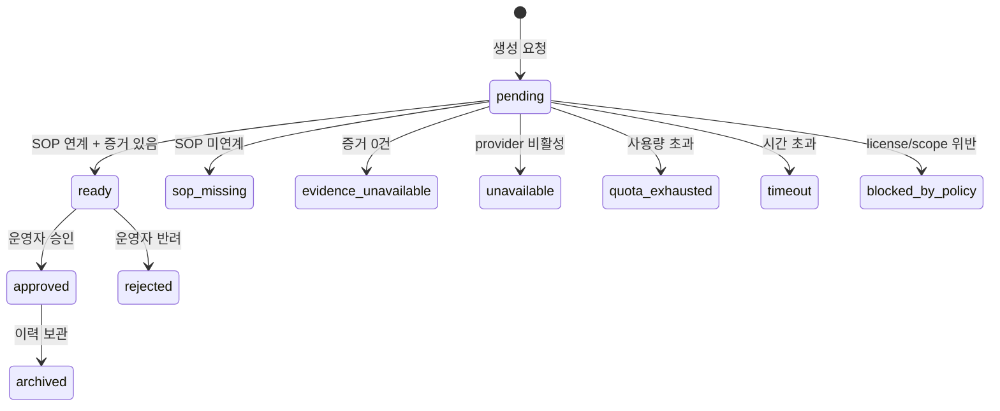

# CF-2 — AI 대응 가이드 + 안전 (HITL·fail-open)

> **고객 가치 (JTBD-2·3·4)**: 운영자는 인시던트 원인·대응 가이드를 로그·트랜잭션 직접 대조 없이 AI로부터 받는다. 초·중급 인력도 가이드로 1차 대응을 시작한다. 단 **AI가 틀려도 잘못된 자동조치로 장애가 커지지 않도록** 모든 조치는 사람 승인을 거치고, AI가 느리거나 죽어도 알람 전달은 막히지 않는다.
> **상태**: implemented. 반자동 가이드(가설·첫 조치) 수준 — 완전 RCA·자동 조치는 로드맵(CF-7·8).

## CF-2.1 개요 (사용자 관점)

인시던트가 나면 PM/PL이 직접 로그를 대조해 원인을 추정하던 일을, CF-2는 **연계된 SOP를 컨텍스트로 AI가 대응 가이드**(원인 가설 · 첫 조치 · 고객/벤더 안내 초안)를 만들어 대신한다. 가이드는 운영자 검수용 초안이며, "AI가 자동으로 조치했다"는 식의 주장은 금지된다(Human-in-the-loop). AI 경로가 실패·지연·예산 초과여도 알람 자체는 그대로 전달된다(fail-open). 같은 장애가 재발하면 과거 대응 이력을 참조할 수 있다.

## CF-2.2 기능 요구 (FR)

### FR-CF2.1 — 운영자는 SOP에 근거한 AI 대응 가이드를 받는다
- **무엇을**: 연계된 SOP + 알람 컨텍스트로 원인 가설, 첫 조치, 고객/벤더 안내 초안을 생성해 알림에 포함한다.
- **Acceptance**:
  ```gherkin
  Given 알람에 SOP가 연계돼 있고 증거(evidence)가 1건 이상 있을 때
  When AI 대응 가이드가 생성되면
  Then 운영자는 원인 가설·첫 조치·안내 초안이 포함된 가이드를 받는다
   And 가이드 상태는 "ready"로 표시된다
  ```
- **구현 근거**: `AIStrategyGenerator.Generate` → `AIStrategy`(Hypotheses/FirstActions/CustomerUpdateDraft/VendorRequestDraft, Confidence high/med/low). provider `local`(결정적)/`mock`/`llm`. `llm`은 claude(Anthropic)·codex(OpenAI) × api/cli 4조합. · `cb29d2a59` · WBS-1.2

### FR-CF2.2 — 초·중급 운영자는 전문가 없이 1차 대응을 시작할 수 있다
- **무엇을**: 가이드는 전문가 지식 없이도 따라 할 수 있는 구체 첫 조치를 담는다. SOP 미연계·증거 없음이면 부분 가이드라도 안전하게 제공한다.
- **Acceptance**:
  ```gherkin
  Given 알람에 SOP가 연계되지 않았을 때
  When AI 대응 가이드가 생성되면
  Then 상태는 "sop_missing"이고 "연결된 SOP 문서가 없어 기본 알림만 전송합니다" 안내가 포함된다
   And 운영자는 원본 알람을 그대로 받는다 (silent drop 아님)
  ```
- **구현 근거**: `Status` enum `ready|sop_missing|evidence_unavailable|unavailable|...`. sop_missing/evidence_unavailable 시 SOP 1단계 안내만 포함. · `cb29d2a59` · WBS-1.2

### FR-CF2.3 — 운영자는 AI가 자동 조치를 주장하지 않고 사람 승인이 필요함을 보장받는다 (HITL)
- **무엇을**: 모든 첫 조치는 "사람 승인 필요"로 표시되며, AI가 "자동으로 재시작했다"는 식의 실행 주장을 하면 거부된다. (전략 리스크 "AI 오탐" 대응 → SM-C2)
- **Acceptance**:
  ```gherkin
  Given 가이드의 가설/조치 텍스트에 "자동 재시작" 같은 자동실행 주장이 포함될 때
  When 가이드 유효성 검사가 실행되면
  Then 검사는 "must not claim automatic operational execution"으로 실패한다
   And 모든 첫 조치는 requiresHumanApproval=true 다
  ```
- **구현 근거**: `FirstAction.RequiresHumanApproval=true`(validator 강제), `ValidateAIStrategy`가 자동실행 주장 패턴(`자동 재시작`, `automatically restarted`, `재시작했습니다` 등) 거부. → NF-5.2.5 · `cb29d2a59` · WBS-1.2

### FR-CF2.4 — 운영자는 AI가 느리거나 실패해도 알람을 지연·누락 없이 받는다 (fail-open)
- **무엇을**: AI 가이드 생성이 1초를 넘기거나 실패해도 알람 전달 자체는 막지 않는다. AI는 보조, 알람은 항상 전달.
- **Acceptance**:
  ```gherkin
  Given AI 가이드 생성기가 타임아웃(1초)보다 오래 걸릴 때
  When 알람이 dispatch 경로를 지나면
  Then 운영자는 (AI 가이드 없이) 원본 알람을 지연 없이 받는다
   And 경고 로그만 남고 dispatch는 계속된다
  ```
- **구현 근거**: `dispatchhook.Hook.Apply`는 **절대 error를 반환하지 않음**(`map[string]string` 단일 반환). `DefaultGenerateTimeout=1s`. 실패 시 입력 annotations 그대로 반환. → NF-5.1.2, NF-5.2.1 · `a6757136e` · WBS-1.2

### FR-CF2.5 — 관리자는 AI 사용량/예산 초과에도 알람 전달이 막히지 않게 제어한다
- **무엇을**: quota·timeout·license·provider-enabled 4종 제어 위반 시 가이드는 안전하게 degrade하되 알람 전달은 유지하고, 사용량은 감사 가능하게 기록한다.
- **Acceptance**:
  ```gherkin
  Given AI 사용량 제어가 QuotaLimit=10, QuotaUsed=10 일 때
  When 가이드가 생성되면
  Then 상태는 "quota_exhausted"이고 "AI strategy quota is exhausted..." 제약이 표시된다
   And 사용량 감사 필드(limit/used/remaining=0)가 기록된다
   And 알람 전달은 계속된다
  ```
- **구현 근거**: `AIStrategyControls`(ProviderEnabled/LicenseAllowed/QuotaLimit/TimeoutBudget) → status `quota_exhausted|timeout|blocked_by_policy|unavailable`. `StoreAware`는 per-org `AIConfig` 미설정·복호화 실패·잘못된 provider 시 `envFallback`로 우회. Audit에 quota limit/used/remaining 기록. → NF-5.4.3 · `a6757136e` · WBS-1.2

### FR-CF2.6 — 운영자는 동일 장애 재발 시 과거 대응 이력을 참조할 수 있다
- **무엇을**: 검수가 끝난 가이드를 장애별로 보관해(최신 1건), 동일 incident/fingerprint 재발 시 조회 가능하게 한다.
- **Acceptance**:
  ```gherkin
  Given 같은 incident_id로 가이드가 이미 한 번 보관됐을 때
  When 같은 incident가 재발해 이력을 조회하면
  Then 가장 최근 대응 가이드 1건이 반환된다
  ```
- **구현 근거**: `AIStrategyHistoryStore.Upsert/Lookup`(best-effort), key `incident\x00<id>` 또는 `fingerprint\x00<fp>`. 영속: `ds_ai_strategy_history`(PK `org_id,incident_id`; unique `org_id,alert_fingerprint`) — 장애별 최신 1건 덮어쓰기. upsert 실패는 WarnLog만, dispatch 계속. · `cb29d2a59` · WBS-1.2

## CF-2.3 가이드 상태 전이



## CF-2.4 비기능 요건 (feature-specific)
- **NF-CF2.1** Dispatch hook generator timeout ≤ 1초(`DefaultGenerateTimeout`) — hot path 무중단. → NF-5.1.2
- **NF-CF2.2** 모든 `FirstAction.RequiresHumanApproval=true` (validator 강제).
- **NF-CF2.3** `audit.redactionApplied=true`여야 가이드 출력 사용 가능 (PII 통과 보장, CF-4 연계).
- **NF-CF2.4** `StrategyID` 미지정 시 `sha256(incidentID‖fingerprint‖sopID‖sopVersion)` 앞 16hex — 동일 입력 동일 ID.
- **NF-CF2.5** History record의 incidentID/strategyID/status/confidence/generatedAt은 embedded Strategy와 일치(validator 강제).

## CF-2.5 예외·복구 (운영자 관점 → 처리)

| 상황 | 운영자가 받는 것 |
|---|---|
| LLM 5xx / 타임아웃 | 원본 알람 (`timeout`, 경고) |
| 사용량(quota) 초과 | 원본 알람 (`quota_exhausted`, fail-open) |
| license 불허 | 원본 알람 (`blocked_by_policy`) |
| provider 비활성 | 원본 알람 (`unavailable`) |
| SOP 미연계 | SOP 안내만 (`sop_missing`) |
| 증거 0건 | SOP 1단계 안내 (`evidence_unavailable`) |
| 자동실행 주장 검출 | 가이드 거부(validator) — 운영자엔 안전한 가이드만 전달 |
| 이력 보관 실패 | 알림 정상 전달 (WarnLog만) |

## CF-2.6 Open / Non-goal
- **완전 RCA 아님** — 원인 가설·첫 조치 수준의 반자동 가이드. 근본 원인 자동 규명은 로드맵.
- **AI 이상 탐지 아님** — 기준선 학습 기반 사전 경고는 CF-7(로드맵).
- **자동 조치(Auto-Remediation) 아님** — 오히려 HITL 강제. 승인 기반 자동 조치는 CF-8(로드맵).

## CF-2.7 Traceability
- JTBD: 2(반자동 RCA), 3(상향평준화), 4(안전) · User Journey: UJ-1, UJ-3
- User Journey: UJ-1(단계 5), UJ-3(degraded path) · WBS: WBS-1.2
- 구 모듈: F2(AI Runbook Drafting), F3(AI Quota Controls)
- Commits: `cb29d2a59`, `a6757136e`
- → 상위: [`../index.md`](../index.md) §7.1 · 전략: [`source-strategy-brief.md`](../../_foundation/source-strategy-brief.md) §3(반자동 RCA), §6(AI 오탐 리스크)
