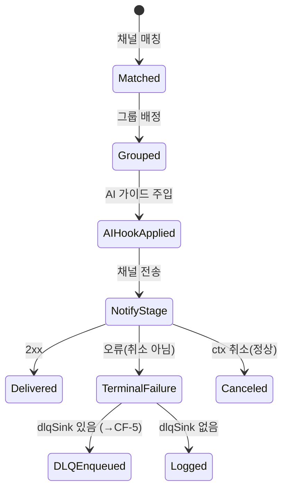

# CF-3 — 멀티채널 핸드오프 (5채널)

> **고객 가치 (JTBD-1·3)**: 운영자는 SOP·AI 가이드가 합쳐진 알림을 *평소 쓰는 채널*(Slack·Teams·PagerDuty·Webhook·Email)에서 그대로 받는다. 한 채널이 실패해도 다른 채널·후속 처리는 멈추지 않는다.
> **상태**: implemented. AI/SOP 보강은 5채널 — `opsgenie`는 보강 없는 6번째(각주).

## CF-3.1 개요 (사용자 관점)

CF-3은 SigNoz의 알림 발송 경로(Alertmanager dispatcher)를 감싸, 발송 직전에 SOP·AI 가이드를 알림에 주입한다. 운영자는 채널을 바꾸지 않고도 SOP 링크·AI 요약·첫 조치가 포함된 알림을 받는다. 관리자는 알림에 표시할 항목을 템플릿으로 정의한다. 발송은 best-effort — 한 채널 실패가 dispatcher 전체나 다른 채널을 멈추지 않으며, 최종 실패 건은 CF-5(DLQ)로 넘어간다.

## CF-3.2 기능 요구 (FR)

### FR-CF3.1 — 운영자는 SOP·AI 가이드가 포함된 알림을 평소 채널로 받는다
- **무엇을**: SOP/AI annotation을 5개 채널의 네이티브 포맷으로 변환해 전송한다.
- **Acceptance**:
  ```gherkin
  Given 알람이 receiver "ops-slack"으로 매칭되고 AI 가이드(ai_headline 포함)가 생성됐을 때
  When 알림 그룹이 발송되면
  Then 운영자는 ai_headline·SOP 링크가 포함된 Slack 알림을 받는다
   And 채널별 포맷(Slack Block Kit / Teams Adaptive Card / PagerDuty Events v2 / Webhook JSON / Email MIME)으로 변환된다
  ```
- **구현 근거**: `Dispatcher`가 `dispatch.Dispatcher` wrapping, `aggrGroup` flush 시 `applyAIHook`로 annotations 머지(입력 불변·새 map 반환). 채널 adapter 5종 + `alertmanagertemplate`. canonical→채널 매핑(severity→header/FactSet/payload.severity, sop_url→button/Action.OpenUrl/custom_details.runbook_url, ai_headline→section/TextBlock/payload.summary 등). · WBS-1.3

### FR-CF3.2 — 관리자는 알림 표시 항목을 템플릿으로 정의한다
- **무엇을**: 알림에 들어갈 항목을 `$incident.{...}` 변수로 템플릿화하고, 잘못된 변수는 사전에 알려준다.
- **Acceptance**:
  ```gherkin
  Given 관리자가 템플릿에 "$incident.foo_bar" 같은 미지원 변수를 넣었을 때
  When 템플릿 미리보기를 실행하면
  Then 미지원 변수 "incident_foo_bar"가 (정렬되어) 보고된다
  ```
- **구현 근거**: `knownIncidentTemplateFields` 22종(tenant/impact/sop/ai 그룹), `PreviewNotificationTemplate`, `MissingIncidentTemplateVariables`(prefix-qualified·정렬). · WBS-1.3

### FR-CF3.3 — 운영자는 한 채널 실패가 다른 채널·후속을 멈추지 않음을 보장받는다
- **무엇을**: 한 채널 전송 실패는 dispatcher를 중단시키지 않고, 최종 실패 건은 DLQ로 보존된다(→CF-5). 정상 종료(config reload/shutdown)는 실패로 보지 않는다.
- **Acceptance**:
  ```gherkin
  Given notify 단계가 (취소가 아닌) 오류를 반환할 때
  When 알림 그룹이 발송되면
  Then 그 실패 건은 채널명과 함께 DLQ에 보존되고
   And dispatcher는 다음 알람 처리를 계속한다
  ```
- **구현 근거**: `recordTerminalFailure` → `dlqSink.Write`(best-effort). `ctx.Canceled`는 `DebugContext`(정상 경로), terminal error만 DLQ. `aiHook==nil`이면 hook 건너뜀(AIOpsAgent 미설치 동작). → NF-5.2.4 · WBS-1.3

## CF-3.3 발송 상태 전이



## CF-3.4 비기능 요건 (feature-specific)
- **NF-CF3.1** AI hook 적용은 hot path에서 동기, ≤ 1초. → NF-5.1.2
- **NF-CF3.2** Maintenance ticker 30초 주기로 빈 aggregation group GC.
- **NF-CF3.3** Renotify interval은 per-rule `NotificationConfig.Renotify`에서.
- **NF-CF3.4** 미지원 템플릿 변수는 prefix-qualified 이름으로 정렬 보고.
- **NF-CF3.5** 채널 dispatch 실패는 dispatcher를 중단시키지 않는다(log + 선택적 DLQ). → NF-5.2.4

## CF-3.5 예외·복구 (운영자 관점 → 처리)

| 상황 | 처리 |
|---|---|
| 채널 매칭 실패 | 로그 + 다음 알람 계속 |
| aggregation group 한도 초과 | metric + 로그, 신규 group 차단 |
| `aiHook == nil` | hook 건너뜀(보강 없는 알림 전달) |
| AI hook 내부 실패 | annotations 그대로(→CF-2 fail-open) |
| ctx Canceled | debug 로그(정상 종료) |
| terminal error | DLQ enqueue(→CF-5) |
| DLQ marshal 실패 | empty payload entry + 경고 |

## CF-3.6 Open / Non-goal
- **opsgenie 6번째 채널** — AI/SOP 보강 없음. "5채널"은 보강 채널 기준.
- **MS Teams `Action.Submit` 미지원** — incoming webhook 제약상 `Action.OpenUrl`만.
- **Slack interactive approve / Teams 인앱 승인** — 미구현(follow-up). 운영자 검수 화면 변경 영역 미식별.

## CF-3.7 Traceability
- JTBD: 1(상시 자동화), 3(상향평준화) · User Journey: UJ-1, UJ-2
- User Journey: UJ-1(단계 8), UJ-2(실패 분기) · WBS: WBS-1.3
- 구 모듈: F6(Notification Dispatch)
- Commits: 
- → 상위: [`../index.md`](../index.md) §7.1 · 전략: [`source-strategy-brief.md`](../../_foundation/source-strategy-brief.md) §3(메신저 연동)
