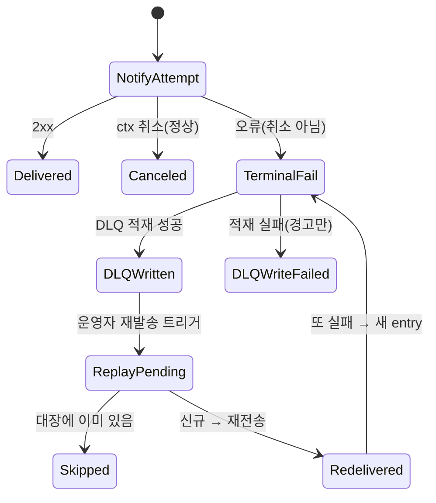

# CF-5 — 무유실·멱등 재처리 (DLQ + Replay)

> **고객 가치 (JTBD-4)**: 운영자는 채널 전송이 최종 실패한 알림이 *유실되지 않고 보관*됨을, 그리고 재발송 시 같은 알림이 *중복으로 두 번 가지 않음*을 보장받는다. (전략 §6 "자동조치 실패 → rollback" 정신의 알림 안전판)
> **상태**: implemented-mvp. HMAC·기본 배선·replay API는 open(§9.3).

## CF-5.1 개요 (사용자 관점)

채널이 5xx를 계속 뱉거나 네트워크가 끊기면 알림이 사라질 수 있다. CF-5는 **최종 실패 건을 DLQ(실패 큐)에 보존**하고, 운영자가 재발송할 때 **이미 보낸 건은 건너뛰어 중복을 막는다**(멱등). 프로세스가 재시작돼도 일관성이 유지된다. DLQ 적재는 best-effort라 알람 처리 자체를 막지 않는다.

## CF-5.2 기능 요구 (FR)

### FR-CF5.1 — 운영자는 최종 실패 알림이 유실 없이 보관됨을 보장받는다
- **무엇을**: terminal 전송 실패(2xx 아님 + 정상 취소 아님)를 채널별로 DLQ에 보존한다. 정상 종료(취소)는 보존하지 않는다.
- **Acceptance**:
  ```gherkin
  Given receiver "ops-slack"에 대해 notify 단계가 (취소가 아닌) 오류를 반환할 때
  When 실패가 기록되면
  Then DLQ에 channel "ops-slack", event_id=알람 fingerprint, reason=오류 문자열 entry가 1건 남는다
  ```
  ```gherkin
  Given notify 단계가 context 취소(정상 종료)를 반환할 때
  When 그룹이 flush되면
  Then DLQ에는 아무 entry도 쌓이지 않는다
  ```
- **구현 근거**: `JSONLDeadLetterSink.Write`(`Entry{EventID,Channel,Payload,FailedAt,Reason}`, 50 MiB rotation). `recordTerminalFailure`에서 호출. ctx Canceled → skip. marshal 실패 시 empty payload + 경고. → NF-5.4.1 · `ade174bb8`, `91b9ff5db` · WBS-1.5

### FR-CF5.2 — 운영자는 재발송 시 같은 알림이 중복으로 가지 않음을 보장받는다
- **무엇을**: 재발송 시 이미 처리한 event는 건너뛴다. 프로세스 재시작 후에도 일관성을 유지한다(crash mid-batch 멱등).
- **Acceptance**:
  ```gherkin
  Given replay 관리대장에 event_id "abc123"이 이미 있을 때
  When 그 event 재발송을 시도하면
  Then 재발송은 건너뛰어지고(대장에 줄 추가 없음)
  When 새 event "xyz789" 재발송을 시도하면
  Then 재발송되고 대장 끝에 "xyz789"가 기록되며, 대장을 다시 열어도 보존된다
  ```
- **구현 근거**: `ReplayLedger.MarkIfNew`(append-only EventID set, open 시 파일 스캔으로 in-memory 재구성, 1 MiB scanner). `true`일 때만 재전송. empty EventID → false. → NF-5.4.2 · `ade174bb8` · WBS-1.5

### FR-CF5.3 *(open)* — 보안담당자는 재발송 페이로드 위변조 방지(HMAC)를 요구한다
- **무엇을**: 재발송 payload의 무결성·위변조 방지를 위한 HMAC 서명/검증. **정책 미정 — 미해결인 한 production-ready 선언 불가.**
- **Acceptance**: *(미정 — HMAC 정책 확정 후 작성)*
- **구현 근거**: 미구현. → NF-5.3.1, `open_items`.

## CF-5.3 DLQ·재발송 상태 전이



## CF-5.4 비기능 요건 (feature-specific)
- **NF-CF5.1** DLQ persistence는 best-effort — hot path 무중단. → NF-5.4.1
- **NF-CF5.2** Default rotation 50 MiB(`DefaultJSONLDeadLetterMaxSizeBytes`), audit sink와 동일 컨벤션.
- **NF-CF5.3** 빈 파일은 rotate 안 함(zero-byte sibling 방지).
- **NF-CF5.4** `MarkIfNew`는 멱등 + durable(재호출 false, restart 후 일관).
- **NF-CF5.5** Sink·Ledger 모두 `sync.Mutex` 보호; scanner 1 MiB/line(silent truncate 방지).

## CF-5.5 예외·복구

| 상황 | 처리 |
|---|---|
| ctx Canceled | 정상 종료, DLQ 적재 안 함 |
| `dlqSink == nil` | DLQ 비활성, terminal failure는 로그만 |
| marshal 실패 | empty payload entry + 경고 |
| `Write` 실패 | 경고만, dispatcher 계속 |
| ledger 파일 corruption | `NewReplayLedger` error |
| ledger write 실패 | `MarkIfNew=false`(재전송 skip, safe default) |
| empty EventID | `MarkIfNew=false`(저장·재전송 안 함) |

## CF-5.6 Open / Non-goal
- **HMAC 정책 미정** (NF-5.3.1, FR-CF5.3) — replay 서명/검증 미결.
- **DLQ 기본 배선 nil** — `dispatcher.go`에 적재 로직은 있으나 `server.go`의 sink 주입이 기본 `nil`(미연결).
- **Idempotency 키** — 현재 `EventID = fingerprint`만. 권장 `sha256(fingerprint‖channel‖round)` (한 채널 멱등 시 다른 채널도 skip되는 현 한계).
- **Replay API/UI** — operator-facing replay는 범위 밖. ledger·sink만 제공.

## CF-5.7 Traceability
- JTBD: 4(안전·무유실) · User Journey: UJ-2 · NFR: NF-5.4.1·2, NF-5.3.1(open)
- User Journey: UJ-2(단계 5~7) · WBS: WBS-1.5
- 구 모듈: F8(DLQ + Replay)
- Commits: `ade174bb8`, `91b9ff5db`
- → 상위: [`../index.md`](../index.md) §7.1 · 전략: [`source-strategy-brief.md`](../../_foundation/source-strategy-brief.md) §6(자동조치 실패→rollback)
