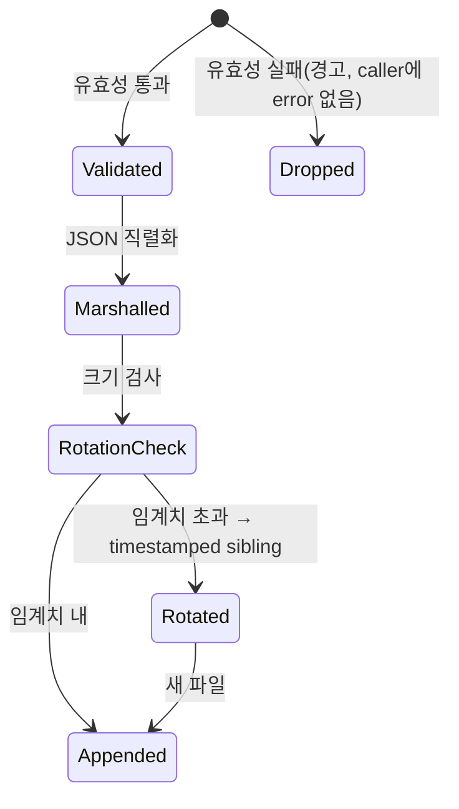

# CF-6 — 정책·감사 기반 (Foundation·Audit)

> **고객 가치 (JTBD-6)**: 운영을 개인 경험이 아닌 **플랫폼에 내재화**하기 위한 기반 — 관리자는 팀별 SOP·AI·감사 정책을 설정으로 관리하고, 감사담당자는 SOP 접근·AI 호출·전달 1건마다 기록이 남되 그 기록 실패가 서비스를 멈추지 않음을 보장받는다.
> **상태**: implemented. SOP source kind는 `managed_markdown`만(나머지 미구현).

## CF-6.1 개요 (사용자 관점)

CF-6은 다른 모든 기능(CF-1~5)이 공유하는 **계약·진입점·감사 기록 통로**다. 관리자는 팀(테넌트)별로 SOP·AI·감사 정책을 설정 계약으로 관리하고, 감사담당자는 "누가 어떤 SOP를 봤고 AI를 호출했고 무엇을 전달했는지"를 재현(reproducibility) 목적의 감사 로그로 확보한다. 감사 기록은 best-effort — 기록 통로가 막혀도 서비스 부팅·운영은 계속된다(가용성 우선).

## CF-6.2 기능 요구 (FR)

### FR-CF6.1 — 관리자는 팀별 SOP·AI·감사 정책을 설정으로 관리한다
- **무엇을**: SOP source·health·audit·service-account·configuration 5종 계약으로 팀별 정책(활성 source, 허용 capability, audit mode 등)을 정의한다.
- **Acceptance**:
  ```gherkin
  Given 관리자가 팀 설정(PilotConfiguration)에 활성 SOP source와 audit mode를 지정할 때
  When 설정 계약이 검증되면
  Then 자격증명 노출 필드(secretRefVisible 등)는 항상 false이고
   And 잘못된 값(secret-like 노출 등)은 거부된다
  ```
- **구현 근거**: `pilot_contract.go` — `PilotConfiguration` 외 5종 구조체 + validator(`errors.Join`). source kind enum 중 `managed_markdown`만 v0.1 구현. 테넌트 정책은 `tenant_policy.go`(CF-1), AI 설정은 `ds_ai_config`(CF-2). · `026863650` · WBS-1.0

### FR-CF6.2 — 감사담당자는 행위 1건마다 감사 기록이 남음을 보장받는다
- **무엇을**: SOP 검색·preview·fetch, evidence 수집, AI 요청/결과 등 행위를 8종 event × 5종 outcome으로 JSONL에 기록한다. 보안 불변식(자격증명 비노출)을 강제한다.
- **Acceptance**:
  ```gherkin
  Given EventType "sop.fetch", Outcome "allowed"인 유효한 감사 이벤트가 발생할 때
  When 기록되면
  Then JSONL 파일에 한 줄(JSON + 개행)로 append되고 eventType="sop.fetch"다
  ```
  ```gherkin
  Given Outcome "denied"인데 Reason이 비어 있을 때
  When 유효성 검사가 실행되면
  Then "reason: field is required"로 실패한다
  ```
- **구현 근거**: `PilotAuditEventSink` + `PilotAuditEventJSONLSink`(50 MiB rotation). event 8종(`sop.search|preview|fetch|health_check|evidence.collect_request|collect_result|ai.summary_request|summary_result`) × outcome 5종(`allowed|denied|redacted|failed|deferred`). 불변식: `secretRefVisible=false`·`browserCredentialsUsed=false`·`serviceAccountProfile` non-empty. → NF-5.4.3 · `8a55208ef` · WBS-1.0

### FR-CF6.3 — 감사담당자는 감사 기록 실패가 서비스를 막지 않음을 보장받는다
- **무엇을**: 감사 sink 초기화·기록 실패가 서버 부팅이나 원 operation을 중단시키지 않는다(fail-open). 유효성 실패 이벤트는 조용히 drop(caller에 error 전파 안 함).
- **Acceptance**:
  ```gherkin
  Given 감사 로그 디렉터리가 읽기 전용일 때
  When community 진입점이 JSONL sink를 초기화하면
  Then 경고만 남기고 NopPilotAuditEventSink로 진행하며 서버는 커맨드 등록을 계속한다
  ```
- **구현 근거**: `cmd/community/main.go` — sink 초기화 실패 시 `zap.Warn` 후 `NopPilotAuditEventSink` fallback. validation 실패는 `Warn` 후 `nil` 반환(drop). → NF-5.2.3 · `026863650`, `8a55208ef` · WBS-1.0

## CF-6.3 감사 기록 상태 전이



## CF-6.4 비기능 요건 (feature-specific)
- **NF-CF6.1** Sink는 thread-safe(`sync.Mutex`).
- **NF-CF6.2** Rotation은 빈 파일을 rotate하지 않음. Default 50 MiB.
- **NF-CF6.3** 모든 audit event는 JSON 직렬화 가능(binary payload 금지).
- **NF-CF6.4** 모든 browser-visible secret 노출 플래그는 항상 false. → NF-5.3.3
- **NF-CF6.5** Contract version 문자열은 자동 변경 금지(downstream desync 방지).

## CF-6.5 예외·복구

| 상황 | 처리 |
|---|---|
| 유효성 실패 | 경고 + `nil` 반환(caller block 금지) |
| `path==""` 또는 `maxSize<=0` | `NewPilotAuditEventJSONLSink` error |
| `os.MkdirAll`/stat 실패 | error 전파 |
| rotation `os.Rename` 실패 | error 전파(파일 유지) |
| write 실패(디스크 full) | error 전파(caller best-effort 무시 가능) |
| sink 미등록 | `NopPilotAuditEventSink`(no-op) |

## CF-6.6 Open / Non-goal
- **SOP source kind** — `managed_markdown`만 구현(`url_registry`·`git_markdown`·`confluence`·`notion`·`sharepoint`·`custom_connector` 미구현).
- **마이그레이션 세트 정정** — 078(`ds_sop_documents`+`ds_ai_strategy_history`), **079**(`ds_ai_config`), **080**(ai oauth token 컬럼 추가). baseline·component-source-map이 078만 언급 → 079·080 추가 정정 필요(Step C).
- **Audit log 용도 제한** — reproducibility 전용, 개인 책임 추궁 금지(NF-5.5.2).

## CF-6.7 Traceability
- JTBD: 6(플랫폼 내재화) · User Journey: UJ-1 · NFR: NF-5.2.3, NF-5.4.3, NF-5.3.3
- User Journey: UJ-1(단계 10), UJ-2, UJ-3 · WBS: WBS-1.0
- 구 모듈: F0(Foundation), F5(Audit)
- Commits: `026863650`, `8a55208ef`
- → 상위: [`../index.md`](../index.md) §7.1 · 전략: [`source-strategy-brief.md`](../../_foundation/source-strategy-brief.md) §2(자산화), §3(SigNoz 통합)
