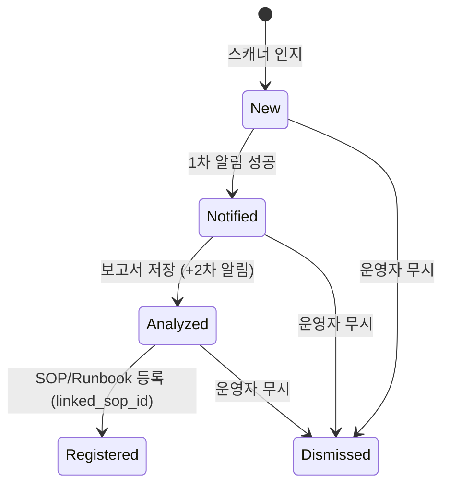

# CF-7 — 미등록 예외 대응 (이상 탐지 1차)

> **고객 가치 (JTBD-1·2·4·5)**: 운영자는 Alert Rule에 등록되지 않은 예외가 발생해도 시스템이 자동 인지·분석해 알려주므로, *모르는 장애를 놓치지 않는다*. 분석은 코드베이스(git/svn) 근거를 포함하여 로그만으로는 어려운 원인 추론의 정확도를 높이고, 검토된 결과는 신규 SOP/Runbook으로 자산화된다.
> **상태**: planned (설계 확정 — [설계서](../../../superpowers/specs/2026-06-11-unknown-exception-response-design.md)). 메트릭 기준선 학습(FR-CF7.1)은 후속.

## CF-7.1 개요 (사용자 관점)

현재 DS-APM은 Alert Rule에 등록된 현상만 대응한다(CF-1 grounding은 `sop_id` 라벨 명시 매칭). 등록되지 않은 예외(unexpected exception)는 인지조차 되지 않는다. CF-7 1차는 이 사각을 다음 흐름으로 메운다.

1. **인지** — 스캐너가 텔레메트리(트레이스 예외·에러 로그)를 주기 스캔, 시그니처 정규화 후 기존 rule/SOP가 커버하지 않는 **신규 예외 클러스터**를 인지한다.
2. **1차 알림 (즉시)** — 발견 즉시 기존 알림 경로(5채널·PII·DLQ·감사)로 "미등록 예외 발생"을 전달한다.
3. **분석 (비동기)** — 스택트레이스에서 파일/라인을 추출, 로컬 미러(git/svn)에서 소스 스니펫·blame·최근 커밋을 결정적으로 추출해 LLM으로 원인 분석 보고서 초안을 생성한다.
4. **2차 알림** — 보고서 요약 + UI 링크를 동일 채널로 전달한다.
5. **자산화 (HITL)** — 운영자가 보고서를 검토해 신규 SOP/Runbook **draft**로 등록한다. 승인은 기존 상태머신을 그대로 따르고, 등록 후 재발은 CF-1 골든패스(UJ-1)로 흡수된다.

**불변 원칙과의 관계**: 본 기능은 *기존 SOP로의 자동 라우팅*(§9.1 영구 Non-goal)이 아니라 **신규 예외의 발견과 등록 제안**이다. SOP 연계는 운영자 승인 후 explicit `sop_id` 라벨로만 발생한다. 시스템은 어떤 조치도 실행하지 않는다(HITL).

## CF-7.2 기능 요구 (FR)

### FR-CF7.2 — 운영자는 미등록 신규 예외 발생을 자동 인지·알림받는다
- **무엇을**: Alert Rule에 등록되지 않은 예외가 텔레메트리에 출현하면, 시스템이 시그니처 정규화(예외 타입 + 최상위 앱 프레임 + 서비스)로 클러스터링해 신규 건만 인지하고 즉시 알림을 전송한다.
- **Acceptance**:
  ```gherkin
  Given 서비스 "payment"에 Alert Rule이 커버하지 않는 예외 "NullPointerException @ PayService.charge"가 발생하고
    And 동일 시그니처가 과거에 보고된 적이 없을 때
  When 스캐너 주기가 도래하면
  Then 신규 시그니처가 등록되고 (status=new→notified)
   And 운영자는 "미등록 예외 발생" 알림을 기존 채널로 받는다
   And 알림은 PII 마스킹·DLQ·감사 경로를 동일하게 거친다
  ```
- **구현 계획**: `pkg/ruler/exceptionscanner/`(신규) — ClickHouse 예외·에러로그 주기 스캔(기본 60초, lookback 5분), fingerprint 정규화(메시지 가변부 제거), `ds_exception_signatures` 등록 후 기존 `PutAlerts`(alertmanager provider)로 synthetic alert(라벨 `ds_unregistered_exception=true`) 주입. · WBS-1.6

### FR-CF7.3 — 운영자는 코드베이스 근거가 포함된 원인 분석 보고서 초안을 받는다
- **무엇을**: 신규 예외에 대해 스택트레이스가 가리키는 소스 스니펫·blame·최근 변경 이력을 근거로 한 원인 추론(가설+신뢰도)·초기 대응 가이드가 담긴 보고서 초안을 받고, 완성 시 2차 알림(요약+링크)을 받는다.
- **Acceptance**:
  ```gherkin
  Given 신규 시그니처가 1차 알림된 상태이고 (status=notified)
    And 해당 서비스의 저장소가 VCS 설정에 매핑되어 있을 때
  When 분석 워커가 해당 시그니처를 처리하면
  Then 스택트레이스의 파일/라인에 해당하는 소스 스니펫과 최근 커밋이 분석 입력에 포함되고
   And 원인 추론·근거 커밋·초기 대응 가이드가 담긴 보고서 초안이 저장되며 (status=analyzed)
   And 운영자는 보고서 요약과 링크가 담긴 2차 알림을 받는다
  ```
- **구현 계획**: `pkg/ruler/codeanalyzer/`(신규) — DB 큐(status 폴링) 소비, 언어별 스택트레이스 파서(Java/Go/Python/Node), 코드 컨텍스트 추출(파일당 ±30라인, 총 32KB 상한), 기존 `aigenerator` provider 재사용(quota·이력·감사 동일 적용), `ds_exception_reports` 저장. · WBS-1.6

### FR-CF7.4 — 관리자는 저장소 연결과 소스 외부 전송을 설정으로 통제한다
- **무엇을**: 관리자는 분석에 사용할 git/svn 저장소(읽기전용)와 서비스명 매핑을 등록하고, 소스코드의 LLM 전송 허용 여부를 org 단위 스위치로 통제한다. 스위치 OFF면 코드 없이 로그·메타만으로 분석한다.
- **Acceptance**:
  ```gherkin
  Given 관리자가 org의 코드 컨텍스트 포함 스위치를 OFF로 설정했을 때
  When 분석 워커가 신규 예외를 처리하면
  Then LLM 요청에 소스코드 스니펫이 포함되지 않고
   And 보고서에는 "로그 기반 분석(코드 컨텍스트 제외)"이 명시된다
  ```
- **구현 계획**: `pkg/vcs/`(신규) — `ds_vcs_config`(org당 1행, repos JSON + secretbox 자격증명 + `include_code_context`), 로컬 미러(git `clone --mirror`/svn checkout, 주기 fetch 기본 10분, `var/vcs/{org}/{repo}`), 자격증명은 응답 마스킹(write-only). · WBS-1.6

### FR-CF7.5 — 운영자는 보고서를 신규 SOP/Runbook으로 등록(자산화)할 수 있다
- **무엇을**: 운영자는 보고서를 검토한 뒤 신규 SOP 생성 또는 기존 SOP 선택으로 Runbook 초안을 등록한다. 등록물은 **draft 상태**로만 생성되며 기존 승인 상태머신(draft→approved)을 통과하기 전에는 효력이 없다. 등록 후 같은 예외 재발은 등록된 SOP 경로(CF-1)로 대응된다.
- **Acceptance**:
  ```gherkin
  Given 분석 보고서가 생성된 시그니처가 있을 때 (status=analyzed)
  When 운영자가 "SOP/Runbook으로 등록"을 실행하면
  Then Runbook 초안이 draft 상태로 SOP에 임베드되고 (자동 승인 없음)
   And 시그니처에 해당 sop_id가 연결되며 (status=registered)
   And 이후 동일 시그니처는 신규 예외로 재알림되지 않는다
  ```
- **구현 계획**: 기존 `RunbookDrafter` 출력 형식으로 변환, SOP store(`sqlsopstore`)·승인 상태머신([runbook.go](../../../../pkg/types/ruletypes/runbook.go)) 재사용, `linked_sop_id` 기록. frontend는 기존 `RunbookDraftFromError`·`RunbookForm` 패턴 확장. Alert Rule 자동 생성은 범위 외(open_items). · WBS-1.6

### FR-CF7.6 — 운영자는 동일 예외의 반복 알림에 시달리지 않는다
- **무엇을**: 동일 시그니처는 재알림 억제 윈도우(기본 24h) 내 재발 시 알림 없이 발생 횟수만 갱신된다. 운영자가 무시(dismiss) 처리한 시그니처는 영구히 재알림되지 않는다. 주기당 신규 시그니처가 임계(N건)를 넘으면 묶음 알림 1건으로 축약된다.
- **Acceptance**:
  ```gherkin
  Given 시그니처 "NPE @ PayService.charge"가 1시간 전 알림된 상태일 때
  When 동일 시그니처의 예외가 다시 발생하면
  Then 새 알림은 전송되지 않고 count·last_seen만 갱신된다

  Given 운영자가 시그니처를 무시(dismiss) 처리했을 때
  When 동일 시그니처가 재발하면
  Then 알림·분석 모두 수행되지 않는다 (count만 갱신)
  ```
- **구현 계획**: `ds_exception_signatures` 상태머신(`new→notified→analyzed→registered|dismissed`, `dismissed→new` 직접 전이 금지) + 억제 윈도우 + 폭주 축약. · WBS-1.6

### FR-CF7.7 — 운영자는 분석이 실패해도 발생 알림은 누락 없이 받는다 (fail-open)
- **무엇을**: 코드 컨텍스트 추출 실패·LLM 장애·미러 미설정 등 분석 단계의 어떤 실패도 1차 알림(발생 사실)에 영향을 주지 않는다. 분석 실패는 감사 기록되고 시그니처 상태에 표시되며, 운영자는 최소한 "미등록 예외 발생" 정보를 항상 받는다.
- **Acceptance**:
  ```gherkin
  Given 신규 시그니처가 발견되었고 LLM provider가 장애 상태일 때
  When 스캐너와 분석 워커가 동작하면
  Then 1차 알림은 정상 전달되고
   And 분석 실패가 감사 기록되며
   And 2차 알림 부재가 silent drop으로 간주되지 않는다 (1차로 정보 손실 0)
  ```
- **구현 계획**: 1차 알림은 스캐너에서 동기·즉시(분석과 독립), 분석은 best-effort 비동기. 스택트레이스 파싱 실패 시 로그 기반 degrade, 미러 실패 시 "코드 컨텍스트 불가" degrade. → NF-5.2.1 계열. · WBS-1.6

## CF-7.3 시그니처 생명주기 (상태)



`Dismissed→New` 직접 전이 금지 — 재발 시 count·last_seen만 갱신. `Registered` 이후 재발은 CF-1 경로(UJ-1)로 흡수.

## CF-7.4 비기능 요건 (feature-specific)

- **NF-CF7.1** 1차 알림은 분석 파이프라인과 독립 — 분석 전 단계 실패가 1차 알림을 지연·차단하지 않는다. (→ NF-5.2.1, SM-C1)
- **NF-CF7.2** 코드 컨텍스트 총량 상한 32KB(파일당 ±30라인) — 프롬프트 폭주 방지.
- **NF-CF7.3** 소스 전송은 org 스위치 `include_code_context=true`일 때만. 자격증명은 secretbox 암호화 + 응답 비노출. (→ NF-5.3.3)
- **NF-CF7.4** 전 테이블·스캐너·워커·미러 디렉터리 org 단위 격리. 타 org 시그니처 존재 비노출. (→ NF-5.3.4)
- **NF-CF7.5** 예외 샘플·알림·보고서 저장 전 PII 마스킹(CF-4) 적용.
- **NF-CF7.6** 스캐너 ClickHouse 조회는 lookback 윈도우(기본 5분) + LIMIT — 관측 저장소 부하 상한.
- **NF-CF7.7** LLM 호출은 기존 quota·사용량 이력·감사(CF-2·6) 경유 — 별도 우회 경로 금지.

## CF-7.5 예외·복구 (운영자 관점 → 처리)

| 상황 | 운영자가 받는 것 |
|---|---|
| 스택트레이스 파싱 실패 | 1차 알림 + 로그 기반 분석 보고서 (코드 근거 없음 명시) |
| VCS 미러 미설정/실패 | 1차 알림 + "코드 컨텍스트 불가" 보고서 (degrade) |
| LLM 장애/quota 초과 | 1차 알림 (2차 없음, 감사 기록 + 시그니처 상태 표시) |
| 코드전송 스위치 OFF | 1차 알림 + 로그 기반 보고서 ("코드 컨텍스트 제외" 명시) |
| 주기당 신규 폭주 (N건 초과) | 묶음 알림 1건 (개별 시그니처는 UI에서 조회) |
| 1차 알림 채널 실패 | 기존 DLQ 보존·재발송 (CF-5) |

> 공통 원칙: 어떤 분기에서도 **발생 사실(1차 알림)은 전달**된다 (NF-5.5.1, silent drop 0).

## CF-7.6 Open / Non-goal

- **메트릭 기준선 이상 탐지(FR-CF7.1)** — 본 1차 범위 아님. 후속에서 스캐너 확장 또는 별도 detector로 통합 검토.
- **Alert Rule 자동 생성** — 등록 시 rule 초안 제안은 CF-8 경계 확인 후 결정.
- **자동 조치** — 없음. 보고서·가이드는 정보 제공만 (CF-8 영역).
- **기존 SOP 자동 라우팅** — 영구 Non-goal(§9.1) 유지. 등록 제안 + 운영자 승인만.
- **에이전트형 코드 탐색(LLM tool-use)** — 1차는 결정적 추출만. 분석 실패/저신뢰 케이스 한정 옵셔널 도입은 후속 검토.

## CF-7.7 Traceability

- JTBD: JTBD-1(상시 자동화), JTBD-2(반자동 RCA), JTBD-4(HITL 안전), JTBD-5(자산화) · User Journey: UJ-5
- Covered by WBS: WBS-1.6 · Epic: [Epic 7](../../03-epics/epic-7-unknown-exception.md) · Stories: 7.2~7.7
- 설계서: [2026-06-11-unknown-exception-response-design.md](../../../superpowers/specs/2026-06-11-unknown-exception-response-design.md)
- 신규 모듈: F9 (exception response — planned) · 마이그레이션 081 예정 (`ds_exception_signatures`·`ds_exception_reports`·`ds_vcs_config`)
- → 상위: [`../index.md`](../index.md) §6·§7.2 · 전략: [`source-strategy-brief.md`](../../_foundation/source-strategy-brief.md) 2단계(이상 탐지)
