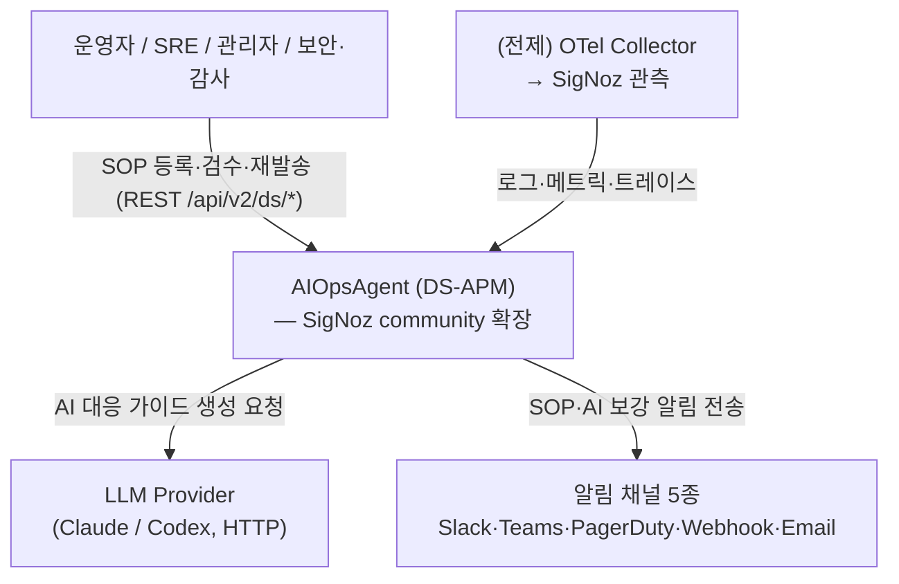
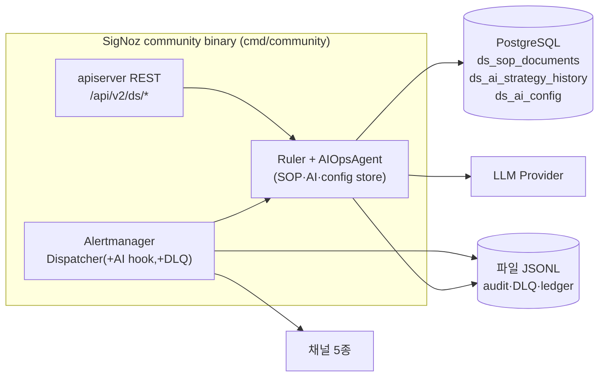
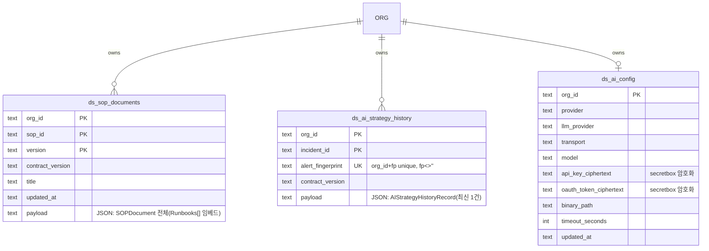

# DS-APM 아키텍처 (Architecture)

> BMAD Solutioning 단계 산출물 — 기능명세(PRD, [`../01-prd/`](../01-prd/index.md))가 *무엇을*, 본 문서가 *어떻게(구조·데이터·인터페이스)*, 작업분해([`../03-epics/`](../03-epics/index.md))가 *어떤 작업으로* 를 정의한다.
> 본 문서는 **as-built**(현재 코드 기준). 코드 매핑은 [`../_shared/component-source-map.md`](../_shared/component-source-map.md).

## §1. 목적·범위

AIOpsAgent는 SigNoz community 빌드의 단일 binary(`cmd/community`) 안에, *알람 → SOP 연계 → AI 대응 가이드 → 핸드오프 → 무유실 재처리* 레이어를 끼워 넣은 **확장 컴포넌트 그룹**이다(fork 아님).

- **In Scope**: AIOpsAgent 컴포넌트(SOP·AI·디스패처·PII·DLQ·기반)의 구조·데이터·인터페이스.
- **Out of Scope(전제)**: SigNoz upstream 자체(Ruler·Query Service·ClickHouse·OTel 수집·UI 대시보드), Enterprise 모듈(`ee/`).

## §2. C4 모델

### §2.1 System Context (Level 1)

### §2.2 Container (Level 2)

| 컨테이너 | 역할 | 우리 변경 |
|---|---|---|
| **SigNoz community binary** (`cmd/community`) | Ruler(알람 평가)·Alertmanager(디스패치)·apiserver(REST)·Query Service | 🟡 진입점·라우트·디스패처 확장 |
| **PostgreSQL** (bun ORM) | SOP·AI 이력·AI 설정 영속 | 🟢 테이블 3종 추가(078·079·080) |
| **ClickHouse** | 관측 데이터(로그·트레이스) | ⚪ upstream 그대로 |
| **파일시스템** (`var/`) | 감사·DLQ·재발송 대장 JSONL | 🟢 신규 |
| **LLM Provider** (외부) | 대응 가이드 생성 | 🟢 연동 어댑터 |
| **알림 채널 5종** (외부) | 운영자 핸드오프 | 🟡 SOP/AI 보강 |

### §2.3 Component (Level 3) — AIOpsAgent 내부

| 컴포넌트 | 코드 | 커버 CF / 작업패키지 |
|---|---|---|
| 공통 기반 (계약·테넌트·감사) | `pkg/types/ruletypes/pilot_*`, `tenant_policy`, `cmd/community` | CF-6·CF-1테넌트 / WBS-1.0 |
| SOP 그라운딩·저장 | `pkg/ruler/sopstore/`, `ruletypes/sop_document` | CF-1 / WBS-1.1 |
| AI 초안·사용량·이력 | `pkg/ruler/aigenerator/`, `dispatchhook/`, `aihistorystore/`, `aiconfigstore/` | CF-2 / WBS-1.2 |
| 알림 디스패처 | `pkg/alertmanager/alertmanagerserver/dispatcher.go`, `alertmanagernotify/{5채널}` | CF-3 / WBS-1.3 |
| PII 마스킹 | `pkg/types/alertmanagertypes/incident_payload.go` | CF-4 / WBS-1.4 |
| DLQ·재발송 | `pkg/alertmanager/alertmanagernotify/dlq/` | CF-5 / WBS-1.5 |

**핫패스 통합** (`alertmanagerserver`): `Server.New(...)`이 옵션 `aiHook *dispatchhook.Hook`을 받아 `NewDispatcher(...)`(server.go:316)에 전달한다. 디스패처는 그룹 flush 시 `applyAIHook`(SOP 연계→AI 가이드→annotations 머지)을 호출하고, terminal 실패를 `recordTerminalFailure`로 `dlq.Sink`에 적재한다. **`aiHook`·`dlqSink`는 nil 허용**(미설치 시 SigNoz 기본 동작) — 현재 community 기본 배선은 ruler 팩토리 말미 인자가 `nil`이라 **DLQ sink 미연결**(§7 Open).

## §3. 데이터 모델 (ERD)

### §3.1 영속 엔티티 (PostgreSQL)

| 테이블 | PK | 핵심 인덱스 | 비고 |
|---|---|---|---|
| `ds_sop_documents` | (org_id, sop_id, version) | idx(org_id, sop_id) | 마이그레이션 078 |
| `ds_ai_strategy_history` | (org_id, incident_id) | unique(org_id, alert_fingerprint) where fp≠'' | 078 · 장애별 최신 1건 |
| `ds_ai_config` | (org_id) | — | 079 + 080(oauth 컬럼) · 자격증명 암호화 |

### §3.2 파일 스토어 (비-DB, JSONL)
| 파일 | 용도 | 컴포넌트 |
|---|---|---|
| `var/audit/pilot-events.jsonl` | 감사 이벤트(8종×5 outcome), 50 MiB rotation | CF-6 |
| `var/dlq/*.jsonl` | 실패 알림 DLQ entry, 50 MiB rotation | CF-5 |
| replay ledger | 멱등 재발송 EventID set | CF-5 |

### §3.3 설계 패턴
- **얇은 인덱스 컬럼 + `payload`(JSON 전체 도메인)** — 조회 컬럼만 평탄화, 도메인 객체는 JSON. 스키마 진화 흡수.
- **org 파티션** — 모든 read/write가 `org_id`로 격리. cross-tenant는 `ErrSOPDocumentNotFound`로 통일(존재 누설 금지).
- **FK 없음** — 테이블 간 관계는 org_id 공유뿐, 조인 없음.
- **자격증명 암호화** — `ds_ai_config`의 api_key/oauth는 `secretbox` ciphertext, contract 응답에 평문 비노출.

### §3.4 마이그레이션
078(`ds_sop_documents`·`ds_ai_strategy_history`) · 079(`ds_ai_config`) · 080(ai oauth_token 컬럼 추가).

## §4. 인터페이스

### §4.1 REST API (apiserver, `pkg/apiserver/signozapiserver/ruler.go`)
| 엔드포인트 | 메서드 | 기능 | CF |
|---|---|---|---|
| `/api/v2/rules/notification_template/preview` | POST | 알림 템플릿 미리보기 | CF-3 |
| `/api/v2/rules/sop/preview` · `/sop/pilot/managed_markdown/fetch` | POST | SOP·관리형 markdown 미리보기/fetch | CF-1·6 |
| `/api/v2/ds/sop/sources` · `/{id}/health` | GET | SOP source 카탈로그·헬스 | CF-6 |
| `/api/v2/ds/sop/documents` | POST·GET | SOP 등록·목록 | CF-1 |
| `/api/v2/ds/sop/documents/{sopId}` · `/versions/{version}` | GET | SOP 조회·버전 fetch | CF-1 |
| `/api/v2/ds/sop/bindings/preview` | GET | 그라운딩 미리보기 | CF-1 |
| `/api/v2/ds/ai/strategy/preview` | GET | AI 전략 미리보기 | CF-2 |
| `/api/v2/ds/ai/strategy/history/latest` | GET | 전략 이력 최신 | CF-2 |

> ⚠️ SOP **DELETE 엔드포인트 미노출** — 등록/조회만(코드 확인, drift 일치). AI 설정(config) 엔드포인트는 `ai_config_handler.go` 별도.

### §4.2 외부·내부 통합
| 인터페이스 | 방향 | 프로토콜·비고 |
|---|---|---|
| LLM Provider | outbound | HTTP/JSON. 401·403·429·5xx 표준 → fail-open(CF-2) |
| 알림 채널 5종 | outbound | Slack Block Kit · Teams Adaptive Card(OpenUrl만) · PagerDuty Events v2 · Webhook JSON · Email MIME. TLS 1.2+ |
| PostgreSQL | ↔ | bun ORM |
| Alertmanager dispatch hot path | 내부 | `applyAIHook`(동기 ≤1초) + `recordTerminalFailure`→DLQ |

## §5. 기술 스택·제약
- **Go 단일 binary** `cmd/community`. SigNoz upstream 내부 API 직접 사용(wrapping 허용).
- **Enterprise 모듈(`ee/`, `cmd/enterprise/`) 불변**.
- **가용성 우선(fail-open)** — AI·채널·감사·DLQ 실패가 알람 전달/부팅을 막지 않는다.
- y2i 영구 비활성.

## §6. 횡단 관심사 (Crosscutting)
| 관심사 | 메커니즘 | CF |
|---|---|---|
| Fail-open | hook error 미반환·1초 timeout·envFallback·Nop sink | CF-2·6 |
| Human-in-the-loop | `requiresHumanApproval=true`·자동실행 주장 거부 | CF-2 |
| PII 비노출 | ingress 단일 지점 redaction | CF-4 |
| 테넌트 격리 | label 기반 scope(RLS 아님) | CF-1 |
| 감사 | 행위 1건당 JSONL 1줄(best-effort) | CF-6 |

## §7. Open / 후행 (Solutioning 미결)
- **DLQ 기본 배선 nil** — `server.go` 디스패처에 dlqSink 미주입(ruler 팩토리 말미 `nil, nil`).
- **HMAC 서명** — replay payload 위변조 방지 정책 미정(NF-5.3.1, FR-CF5.5).
- **Multi-tenant RLS** — 현재 application-layer label filter. DB row-level security·JWT tenant claim 미도입.
- **PII OTel Collector 단** — 가장 이른 redaction(`transform`/`redaction`/`filter`) 미적용.
- **Vector retrieval grounding** — explicit-label만. 의미 기반 미도입.
- **C4 다이어그램 정식 SVG** — 현 flowchart/erDiagram(mermaid), HTML 뷰 시 정교화.

## §8. Traceability
- 컴포넌트 ↔ CF ↔ 작업패키지: [`../_shared/traceability.md`](../_shared/traceability.md) §2 · 코드 매핑: [`../_shared/component-source-map.md`](../_shared/component-source-map.md)
- 기능(무엇을): [`../01-prd/index.md`](../01-prd/index.md) · 작업(어떤 작업): [`../03-epics/index.md`](../03-epics/index.md) · 일정: [`../05-wbs/index.md`](../05-wbs/index.md)
- 전략 출처: [`../_foundation/source-strategy-brief.md`](../_foundation/source-strategy-brief.md) · 변경 표면: [`../_foundation/baseline.md`](../_foundation/baseline.md)
