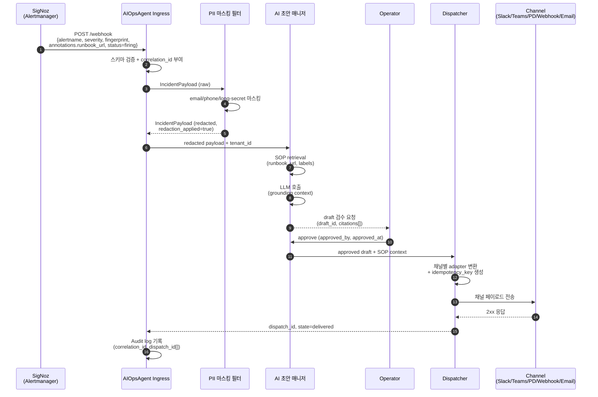
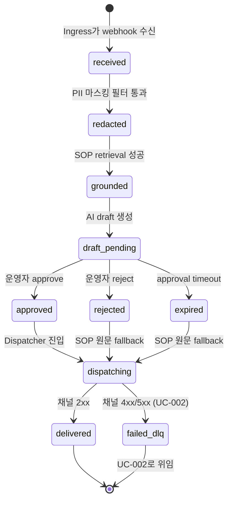

# UC-001 — Incident에서 채널 전달까지 (Golden Path)

> **상태**: 착수 예정 (착수보고 기준)
> SigNoz가 Alertmanager-compatible webhook으로 firing alert를 전달하면, AIOpsAgent가 PII redaction → SOP grounding → AI runbook drafting → 운영자 승인 → 채널 dispatch까지 직렬 처리하도록 설계된 정상 흐름.

## 메타
- **Level**: User-goal (Sea)
- **Scope**: DS-APM System
- **Primary Actor**: 운영자 (Operator)
- **Supporting Actors**: SigNoz, AIOpsAgent Ingress, PII 마스킹 필터 (PII Masking Filter), AI 초안 매니저, 알림 디스패처, 채널 5종(Slack / MS Teams v2 / PagerDuty / Webhook / Email)

## Trigger
SigNoz Ruler가 평가한 알람이 `for` hold 시간을 초과하여 firing 상태로 전이되고, Alertmanager가 `PaymentService5xxHigh` (severity=critical, status=firing) 알람을 AIOpsAgent webhook 엔드포인트로 POST해야 한다.

## Preconditions
- SigNoz Ruler에서 대상 alert rule이 활성화돼 있어야 한다.
- 알람 페이로드는 Prometheus Alertmanager v4 스키마(`alertname`, `severity`, `status`, `startsAt`, `labels`, `annotations.runbook_url`, `fingerprint`, `generatorURL`)를 만족해야 한다.
- 대응 SOP 1건 이상이 SOP store(`sop_document_file_store`)에 인덱싱·published 상태여야 하며 `staleness_days ≤ 90`이어야 한다.
- 대상 테넌트의 AI Strategy가 활성화돼 있고, quota controller가 정상 모드여야 한다.
- Dispatch 대상 채널 1개 이상이 등록·healthy 상태여야 한다 (Slack / MS Teams v2 / PagerDuty / Webhook / Email 중).
- 운영자 1인 이상이 on-call rotation에 등재돼 있어야 한다.

## Success Guarantee (정상 종료 보장)
- 알람은 운영자가 승인한 AI runbook draft와 함께 등록된 모든 healthy 채널에 전달돼야 한다.
- 모든 dispatch 시도는 `idempotency_key = sha256(alert.fingerprint || channel.id || dispatch.round_no)`로 식별되며, 동일 키로의 중복 dispatch는 발생하지 않아야 한다.
- Audit log(`F5`)에 `correlation_id`, `alert.fingerprint`, `tenant_id`, `draft_id`, `approved_by`, `dispatch_id` 전부가 영속 기록돼야 한다.
- AI Engine에 도달하기 전에 페이로드의 PII(이메일, 전화, 16자 이상 secret)는 100% redact돼야 한다.

## Minimal Guarantee (실패 시 최소 보장)
- 어느 단계에서 실패하든 알람 수신 사실 자체와 `correlation_id`는 Audit log에 남아야 한다.
- PII가 redact되지 않은 페이로드는 절대 AI Engine·외부 채널로 송신되지 않아야 한다.
- 채널 dispatch가 실패하면 UC-002(DLQ 흐름)로 분기하여 원본 페이로드와 시도 이력이 보존돼야 한다.
- LLM 호출이 실패하면 UC-003(fail-open)로 분기하여 SOP 원문이 그대로 운영자에게 도달해야 한다.

## Main Success Scenario
1. SigNoz Alertmanager가 firing 페이로드를 AIOpsAgent Ingress webhook으로 POST해야 한다 (`status=firing`, `alertname`, `severity`, `fingerprint`, `annotations.runbook_url` 포함).
2. AIOpsAgent Ingress는 페이로드를 검증하고 `correlation_id`를 부여한 뒤 `alertmanagertypes.IncidentPayload`로 정규화해야 한다.
3. PII 마스킹 필터(F7)가 이메일·전화·16자 이상 secret 패턴을 마스킹하고 `redaction_applied=true`와 categories를 페이로드에 stamping해야 한다.
4. Multi-tenant Scope(F4)가 `tenant_id`를 결정하고 해당 테넌트의 SOP/AI strategy만 노출하도록 컨텍스트를 제한해야 한다.
5. AI 초안 매니저(F1·F2)가 `annotations.runbook_url` 및 alert labels를 키로 SOP store에서 1건 이상의 runbook을 retrieve하고, 그 본문을 grounding context로 LLM에 전달하여 draft를 생성한다 (`draft_id`, `citations[]`, `model.{name,version,temperature}`, `prompt_template_id` 기록).
6. AI Strategy History(F2)에 draft 메타가 append되고, 운영자에게 검수 요청 알림이 발송돼야 한다 (`approval_status=pending`).
7. 운영자가 draft를 검토하고 approve해야 한다 (`approval_status=approved`, `approved_by`, `approved_at` 기록).
8. 알림 디스패처(F6)가 승인된 draft + SOP context를 채널별 adapter(Slack Block Kit / MS Teams Adaptive Card v1.4 / PagerDuty Events API v2 / Webhook JSON / Email MIME)로 변환하여 전송해야 한다.
9. 각 채널이 2xx를 응답하면 dispatch state가 `delivered`로 전이돼야 한다.
10. Audit sink(F5)가 `correlation_id`, `dispatch_id[]`, `idempotency_key[]`, `last_status_code`를 영속 기록하여 traceability matrix를 닫아야 한다.

## Extensions

- **2a. 페이로드 스키마 위반** (`alertname` 또는 `fingerprint` 누락)
  - 2a1. Ingress는 400 Bad Request 응답하고 페이로드를 처리하지 않아야 한다.
  - 2a2. 메트릭 `ds_apm_ingress_schema_reject_total`을 증가시키고 운영자에 meta-alert를 발송해야 한다.

- **3a. PII 마스킹 필터 패턴 매칭 실패** (regex panic 또는 timeout)
  - 3a1. PII 마스킹 필터는 fail-closed로 동작하여 페이로드를 quarantine queue로 보내고 AI 초안 매니저 호출을 차단해야 한다.
  - 3a2. 운영자에 "PII redaction failure" alert를 raw alert와 함께 전달해야 한다 (원본 페이로드 노출 금지).

- **3b. Redaction rate spike** (분당 임계치 초과)
  - 3b1. Audit sink가 meta-alert를 발행하고 SRE에 통지한다 — 새 코드 경로에서 PII가 새고 있을 가능성.

- **4a. Tenant policy 미발견 또는 비활성**
  - 4a1. Ingress는 422 Unprocessable Entity를 응답하고 알람을 drop하지 않은 채 quarantine해야 한다.
  - 4a2. SRE에 "tenant policy not found" alert를 발송한다.

- **5a. SOP retrieval 0건** (`runbook_url` 미해석 또는 SOP staleness > 90일)
  - 5a1. Draft 생성을 보류하고 운영자에 raw alert + "SOP 없음" 표시를 전달해야 한다.
  - 5a2. 본 흐름은 UC-001의 degraded 종료로 간주하며 UC-003과 별개로 처리한다.

- **5b. LLM Provider 401/403/429** → **UC-003** 분기
  - 5b1. AI Engine은 Quota controller의 fail-open 결정을 따라야 한다.
  - 5b2. Draft 대신 SOP 원문이 단계 8의 입력이 된다.

- **5c. LLM Provider 5xx (일시적)**
  - 5c1. Exponential backoff로 최대 3회 재시도해야 한다 (fail-open 발동 안 함).
  - 5c2. 3회 모두 실패 시 UC-003 fail-open으로 전이한다.

- **7a. 운영자가 draft reject**
  - 7a1. `approval_status=rejected`, `rejection_reason` 기록.
  - 7a2. SOP 원문을 fallback으로 dispatch하거나 운영자가 수동 편집 후 재승인하는 sub-flow로 들어간다.

- **7b. Approval timeout** (SEV-1: 5min, SEV-2: 15min 초과)
  - 7b1. Draft는 `approval_status=expired`로 마킹.
  - 7b2. SOP 원문 fallback dispatch로 전이.

- **8a. 채널 4xx/5xx 응답** → **UC-002** 분기
  - 8a1. 4xx(non-429)는 즉시 DLQ enqueue.
  - 8a2. 5xx 또는 429는 exponential backoff + jitter로 재시도 후 모두 실패 시 DLQ enqueue.

- **8b. 채널 일부만 실패** (멀티 채널 fan-out)
  - 8b1. 실패 채널만 UC-002로 분기, 성공 채널은 `delivered`로 종결.

## Sub-Variations
- **채널 종류**: Slack(Incoming Webhook + Block Kit) / MS Teams v2(Adaptive Card v1.4, `Action.OpenUrl`만 지원) / PagerDuty(Events API v2, `dedup_key`=`idempotency_key`) / Generic Webhook(JSON POST) / Email(SMTP MIME). 페이로드 매핑은 F6 명세 §Channel Adapter 참조.
- **Severity**: SEV-1~SEV-5. SEV-2 이상은 PagerDuty paging + Slack/Teams broadcast 동시 발송. SEV-3 이하는 ticket-queue 채널만.
- **알람 타입**: metric / log / trace / exception / anomaly (SigNoz 5종). 본 UC는 타입 무관 동일 흐름.
- **테넌트 격리 모드**: shared vector store + tenant_id filter (착수 후 기본 구현 예정) vs. dedicated vector store (추후 확장).
- **운영자 승인 채널**: SigNoz UI in-app (착수 후 기본 구현 예정) vs. Slack interactive button (추후 확장 — Teams는 `Action.Submit` 제약으로 영구 미지원).

## Non-functional
- **Latency**: Ingress webhook 수신 → 채널 2xx 응답까지 p95 ≤ 30s (운영자 approve 시간 제외, AI draft 단계까지 p95 ≤ 8s).
- **PII redaction coverage**: AI Engine 호출 직전 페이로드 기준 100% (email/phone/long-secret 카테고리).
- **Idempotency**: `(alert.fingerprint, channel.id, dispatch.round_no)` 튜플 기준 중복 dispatch 0건. TTL은 최대 retry window의 2배 이상.
- **Audit completeness**: dispatch 1건당 audit row 1건 이상, 누락률 0%.
- **Tenant isolation**: cross-tenant SOP leakage 0건 (테스트로 검증).
- **Availability**: Ingress 99.9% (single-region MVP 기준), DLQ 영속화로 dispatch 손실 0건 목표.

## Diagrams

### 시퀀스 다이어그램 — Alert → Channel 직렬 흐름

### 상태 머신 — Alert Lifecycle

## Related Information
- **Priority**: P1
- **Frequency**: 운영 환경에서 일 평균 SEV-1~SEV-3 알람 수에 비례 (TBD — 운영 메트릭 확정 후 갱신)
- **Open Issues**: HMAC 정책 follow-up (F8 dispatch 서명, traceability §6 참조)

## Traceability
- **Implements features**: F0 (공통 기반 모듈), F1 (SOP 그라운딩 서비스), F2 (AI 초안 매니저), F4 (Multi-tenant Scope), F5 (Audit), F6 (알림 디스패처), F7 (PII 마스킹 필터)
- **Related WBS**: WBS-1.0 (Foundation), WBS-1.1 (SOP), WBS-1.2 (AI), WBS-1.3 (Notification), WBS-1.4 (PII)
- **Linked sad-path UCs**: UC-002 (단계 8 채널 실패), UC-003 (단계 5 LLM auth/quota 실패)
