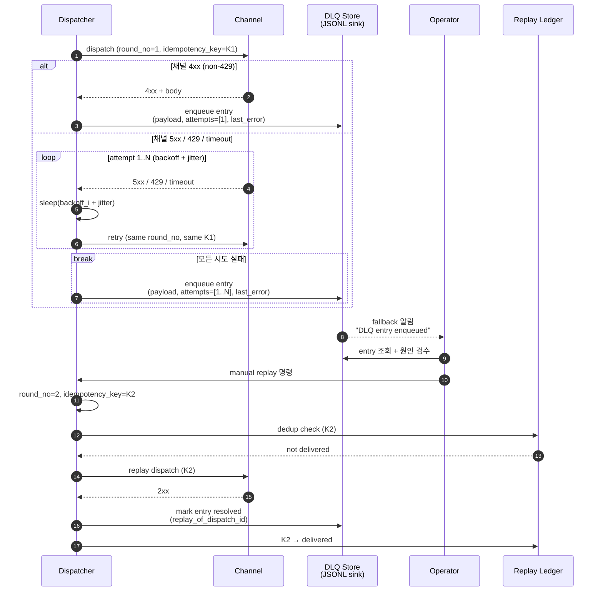
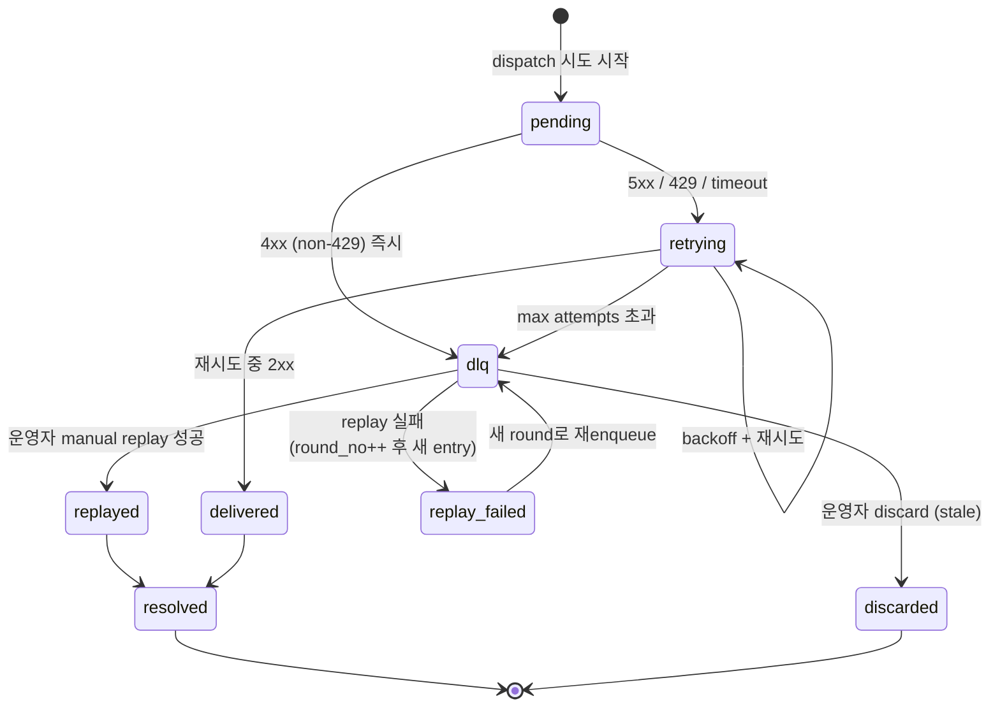

# UC-002 — 채널 전달 실패 → DLQ → Replay

> **상태**: 착수 예정 (착수보고 기준)
> 메신저/페이저 webhook이 4xx/5xx로 응답할 때 retry → DLQ → 운영자 manual replay 흐름으로 설계. UC-001 단계 8의 Extension `8a`로부터 진입하도록 설계된다.

## 메타
- **Level**: User-goal (Sea)
- **Scope**: DS-APM System
- **Primary Actor**: 운영자 (Operator)
- **Supporting Actors**: Dispatcher, 채널(Slack / MS Teams v2 / PagerDuty / Webhook / Email 중 1+), DLQ store(JSONL sink), Audit sink

## Trigger
UC-001 단계 8에서 Dispatcher가 채널 webhook을 호출했을 때, 채널이 4xx (non-429) 즉시 실패 또는 5xx/429 일시적 실패를 응답해야 한다 (HTTP 응답 코드 + 본문 또는 transport timeout).

## Preconditions
- UC-001의 단계 1~7이 통과돼 있어야 한다 (PII redaction, SOP grounding, draft 승인 완료).
- `idempotency_key = sha256(alert.fingerprint || channel.id || dispatch.round_no)`가 dispatch 시도 전에 생성·기록돼 있어야 한다.
- DLQ JSONL sink가 쓰기 가능 상태(디스크 가용·rotation 정상)여야 한다.
- Replay ledger가 활성화돼 있어야 한다 (idempotent replay 보장 위한 dedup store).
- 운영자가 DLQ entry를 조회·replay 가능한 인터페이스(UI 또는 CLI)에 접근 권한이 있어야 한다.

## Success Guarantee
- 실패한 dispatch 1건은 원본 페이로드 + 모든 시도 timestamp + 응답 코드 + 에러 메시지를 포함한 DLQ entry 1건으로 영속화돼야 한다.
- 운영자의 manual replay는 새 `dispatch.round_no`로 새 `idempotency_key`를 생성하여, 채널 측에서 중복 알람으로 보이지 않거나(PagerDuty `dedup_key` 병합) 명시적 round_no 차이로 식별 가능해야 한다.
- Replay 성공 시 DLQ entry는 `resolved`로 마킹되며 audit log에 `replay_of_dispatch_id`가 기록돼야 한다.

## Minimal Guarantee
- 모든 재시도가 실패하더라도 원본 페이로드와 시도 이력은 손실 없이 DLQ에 보존돼야 한다 (dispatch 손실 0건).
- 운영자에는 최소 1회 fallback 알림이 발송돼 DLQ에 entry가 쌓인 사실을 인지할 수 있어야 한다.
- 중복 dispatch는 동일 `idempotency_key`로 2회 이상 발생하지 않아야 한다 (replay ledger가 차단).

## Main Success Scenario
1. Dispatcher가 채널 webhook을 호출하고 4xx (non-429) 또는 5xx/429 응답 또는 transport timeout을 수신해야 한다.
2. Dispatcher는 응답을 분류한다 — 4xx(non-429)는 즉시 DLQ 분기, 5xx/429/timeout은 재시도 분기로 보낸다.
3. 재시도 분기에서는 exponential backoff + jitter로 최대 N회(채널별 정책) 재시도해야 한다 (`attempt_no` 증가, `last_attempt_at`/`last_status_code`/`last_error` 기록).
4. 재시도 N회가 모두 실패하면 Dispatcher는 DLQ JSONL sink에 entry를 append해야 한다 (`payload_rendered`, attempts 배열, `idempotency_key`, `state=dlq`, `dlq_enqueued_at`).
5. Dispatcher는 운영자에게 fallback 알림을 발송해야 한다 ("DLQ entry enqueued: {alert.fingerprint}, channel={channel.id}").
6. 운영자는 DLQ 인터페이스에서 entry를 조회하고 원본 페이로드·시도 이력·에러를 검수해야 한다.
7. 운영자가 채널 측 정상화를 확인한 뒤 manual replay 명령을 발행해야 한다.
8. Dispatcher는 `dispatch.round_no`를 +1 증가시켜 새 `idempotency_key`를 생성하고, replay ledger에 dedup 체크 후 채널로 재전송해야 한다.
9. 채널이 2xx를 응답하면 DLQ entry는 `resolved`로 마킹되고, audit log에 `replay_of_dispatch_id`가 기록돼야 한다.
10. UC는 성공 종료된다.

## Extensions

- **1a. 채널 응답이 429 (Rate Limited)**
  - 1a1. `Retry-After` 헤더 존재 시 그 값을 backoff base로 사용해야 한다.
  - 1a2. 그 외는 5xx와 동일 정책(exponential backoff + jitter).

- **2a. 4xx 응답이 401/403** (인증/권한)
  - 2a1. 즉시 DLQ enqueue (재시도해도 동일 결과).
  - 2a2. SRE에 "channel auth failure" meta-alert를 발송해야 한다 (채널 자격증명 회전 필요).

- **3a. Transport timeout 또는 connection refused**
  - 3a1. 5xx와 동일 재시도 정책 적용.
  - 3a2. `last_status_code=0`, `last_error=<transport reason>` 기록.

- **3b. 재시도 도중 채널이 2xx 응답**
  - 3b1. dispatch state를 `delivered`로 전이, DLQ enqueue 하지 않는다.
  - 3b2. UC-001 단계 9로 복귀.

- **4a. DLQ sink 쓰기 실패** (디스크 가득 / 권한 오류)
  - 4a1. Dispatcher는 in-memory backlog로 entry를 버퍼링하고 SRE에 critical meta-alert 발송.
  - 4a2. Audit log에 "DLQ sink unavailable" 기록.

- **6a. DLQ entry가 stale** (e.g., 알람 자체가 자동 resolved)
  - 6a1. 운영자는 entry를 manual discard할 수 있어야 한다 (`state=discarded`, `discard_reason` 기록).
  - 6a2. UC는 discard로 종료.

- **7a. Replay에서도 실패**
  - 7a1. `round_no`를 추가로 증가시켜 다시 DLQ에 새 entry로 append해야 한다 (기존 entry는 `state=replay_failed`).
  - 7a2. 운영자에 escalation 알림 발송 (반복 실패 N회 초과 시 SEV-2 meta-alert).

- **8a. Replay ledger 중복 차단** (동일 idempotency_key가 이미 delivered 상태)
  - 8a1. Replay는 no-op로 처리하고 운영자에 "이미 전달됨" 응답해야 한다.

- **8b. 운영자가 bulk replay 요청** (여러 DLQ entry 동시)
  - 8b1. Dispatcher는 entry별로 round_no 독립 증가 후 순차/병렬 replay해야 한다.
  - 8b2. 결과를 entry별로 보고 (성공/실패/no-op).

## Sub-Variations
- **채널별 retry 정책**:
  - Slack: max 3회, base 1s
  - MS Teams v2: max 3회, base 2s (incoming webhook은 throttling 엄격)
  - PagerDuty: max 5회, `dedup_key` 활용 — 채널 측 자체 병합
  - Generic Webhook: max 3회, base 1s
  - Email (SMTP): max 2회, base 5s (SMTP queue가 별도 retry 보유)
- **DLQ 저장 백엔드**: JSONL 파일 sink (착수 후 기본 구현 예정) / Redis Streams (추후 확장) / Kafka topic (추후 확장).
- **Replay 트리거**: UI 버튼 / CLI 명령 (착수 후 기본 구현 예정) / 자동 스케줄 replay (추후 확장).
- **HMAC 서명**: replay 시 페이로드 서명 정책 미해결 (open item, traceability §6).

## Non-functional
- **DLQ 영속성**: JSONL sink with size-based rotation, fsync 정책 채택. 프로세스 crash 시 1초 이내 마지막 N개 entry 손실 허용 (MVP).
- **Replay idempotency**: ledger TTL > 채널별 최대 retry window × 2.
- **Operator MTTR**: DLQ entry enqueue → replay 시작까지 운영자 인지·결정 시간 별도 (UC 범위 외), Dispatcher 측 replay round-trip은 p95 ≤ 10s.
- **DLQ depth alert**: depth > 임계치 시 meta-alert 발행 (SRE).
- **Audit completeness**: replay 1회당 audit row 1건 (`replay_of_dispatch_id` 포함).

## Diagrams

### 시퀀스 다이어그램 — Failure → DLQ → Replay

### 상태 머신 — DLQ Entry Lifecycle

## Related Information
- **Priority**: P1
- **Frequency**: 채널 SLA에 의존 (PagerDuty 99.9%, Slack/Teams 99.x). 일 평균 dispatch 대비 DLQ 비율을 메트릭으로 추적해야 한다.
- **Open Issues**: HMAC 정책 미해결 (traceability §6) — replay 페이로드 서명·검증 정책 확정 필요.

## Traceability
- **Implements features**: F6 (알림 디스패처), F8 (DLQ 재처리 서비스)
- **Related WBS**: WBS-1.3 (Notification), WBS-1.5 (DLQ)
- **Parent UC**: UC-001 (단계 8 Extension `8a`/`8b`로 진입)
- **Audit**: F5 (Audit) — dispatch·replay 양쪽 모두 기록
