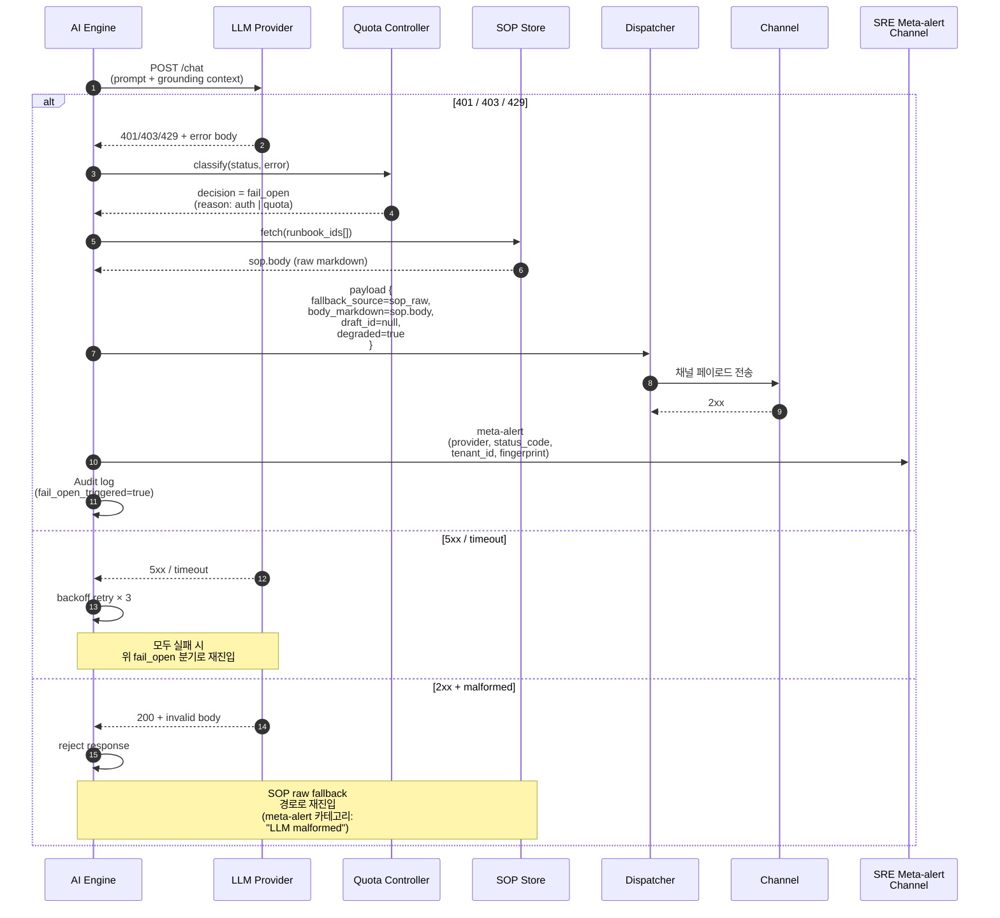

# UC-003 — LLM 인증 실패 → quota fail-open → SOP 원문 fallback

> **상태**: 착수 예정 (착수보고 기준)
> LLM Provider가 401/403/429를 응답할 때 AI quota controller가 fail-open으로 동작하여, AI 가공 없이 SOP 원문을 그대로 알림 디스패처에 넘겨 운영자에게 도달시키도록 설계된 흐름. UC-001 단계 5의 Extension `5b`로부터 진입하도록 설계된다.

## 메타
- **Level**: User-goal (Sea)
- **Scope**: DS-APM System
- **Primary Actor**: 시스템 (AIOpsAgent Quota Controller — 자동 결정)
- **Supporting Actors**: AI 초안 매니저, LLM Provider, 알림 디스패처, Operator (degraded mode 알림 수신자), SRE (meta-alert 수신자)

## Trigger
UC-001 단계 5에서 AI Engine이 LLM Provider에 draft 생성을 요청했을 때, LLM Provider가 401 Unauthorized / 403 Forbidden / 429 Too Many Requests 중 하나를 응답해야 한다 (API key 만료, 정책 거부, quota 초과 등).

## Preconditions
- UC-001 단계 1~4가 통과돼 있어야 한다 (PII redaction 완료, SOP retrieval 성공으로 `runbook_ids[]` ≥ 1).
- AI Quota controller(F3)가 fail-open 정책으로 설정돼 있어야 한다.
- SOP 원문이 dispatch-ready 포맷(Markdown body + citations)으로 SOP store에서 즉시 fetch 가능해야 한다.
- SRE meta-alert 채널이 별도로 등록·healthy 상태여야 한다 (degraded mode 알림용).

## Success Guarantee (정상 종료 보장)
- 알람은 AI draft 없이 SOP 원문 그대로 채널에 전달돼야 한다 (`draft_id` 대신 `fallback_source=sop_raw`로 마킹).
- SRE 채널에 "LLM auth/quota failure → fail-open activated" meta-alert가 별도로 발송돼야 한다 (provider HTTP status, error body, 영향받은 tenant_id 포함).
- Audit log에 fail-open 발동 사실, 트리거 status code, fallback 모드가 영속 기록돼야 한다 (`fail_open_triggered=true`, `llm_status_code`, `degraded_mode=sop_raw`).
- AI Strategy History(F2)에는 `draft_id=null`, `degraded=true` 기록이 append돼야 한다.

## Minimal Guarantee (실패 시에도 보장)
- 운영자는 최소한 raw alert + SOP 원문 + 원본 `annotations.runbook_url` 링크를 수신해야 한다 (정보 손실 0).
- LLM provider 실패는 절대 운영자에게 침묵 실패(silent drop)로 나타나지 않아야 한다 — fallback 또는 meta-alert 중 하나는 반드시 발화.
- Fail-open 발동 자체가 실패하더라도 raw alert는 UC-001의 일반 dispatch 경로로 전달돼야 한다.

## Main Success Scenario
1. AI 초안 매니저가 LLM Provider에 prompt + grounding context를 POST 요청해야 한다 (UC-001 단계 5의 LLM 호출 부분).
2. LLM Provider가 401 / 403 / 429 응답을 반환해야 한다 (`status_code`, `error.code`, `error.message` 포함).
3. AI Quota 컨트롤러(F3)가 응답을 분류한다 — 401/403은 auth failure, 429는 quota exhaustion으로 매핑하고 fail-open 모드 진입을 결정해야 한다.
4. AI 초안 매니저는 LLM 호출을 중단하고, SOP store에서 단계 4 retrieval 결과(`runbook_ids[]`)에 해당하는 원문을 fetch하여 draft 자리에 그대로 채워야 한다 (`body_markdown=sop.body`, `fallback_source=sop_raw`, `citations[]`는 retrieval 결과 그대로 유지).
5. AI Strategy History(F2)에 degraded entry를 append하고, 알림 디스패처(F6)에 SOP 원문 페이로드를 넘겨 UC-001 단계 8~10에 해당하는 dispatch를 수행해야 한다 (운영자 승인 단계 6~7은 정책에 따라 자동 통과하거나 별도 channel에서 사후 알림으로 처리).
6. 별도 SRE 채널로 "LLM auth/quota failure" meta-alert를 발송해야 한다 (provider, status_code, tenant_id, fingerprint, 발생 시각, 영향 알람 수).
7. Audit sink(F5)가 `fail_open_triggered=true`, `llm_status_code`, `degraded_mode=sop_raw`, `correlation_id`를 영속 기록해야 한다.

## Extensions

- **2a. LLM 응답이 5xx 또는 transport timeout**
  - 2a1. Quota controller는 fail-open을 발동하지 않고 exponential backoff로 최대 3회 재시도해야 한다.
  - 2a2. 3회 모두 실패하면 fail-open으로 전이 (본 UC의 단계 4부터 재진입).

- **2b. LLM 응답이 200이지만 본문이 비어있거나 schema 위반**
  - 2b1. AI Engine은 응답을 reject하고 fail-open과 동일하게 SOP 원문 fallback으로 전이.
  - 2b2. Meta-alert 카테고리는 "LLM malformed response"로 별도 분류.

- **3a. Quota controller가 fail-closed 정책으로 설정된 경우** (운영 정책 변경 시)
  - 3a1. Fail-open 발동하지 않고 알람을 dispatch 보류 상태로 둔다.
  - 3a2. 운영자에 "AI degraded — manual intervention required" 알림 발송.
  - 3a3. 본 UC는 이 분기에서 종료 (fail-closed는 별도 정책 UC로 분리 검토).

- **4a. SOP retrieval 결과가 이미 stale** (단계 4에서 통과했으나 fetch 시점에 stale)
  - 4a1. AI Engine은 raw alert만 dispatch에 넘긴다 (`fallback_source=raw_alert`).
  - 4a2. 운영자에 "SOP stale, raw alert only" 표시.

- **4b. SOP store fetch 자체 실패** (스토리지 장애)
  - 4b1. Raw alert만 dispatch에 넘기고 SRE에 critical meta-alert 발송.
  - 4b2. UC-001의 단계 10(audit) 까지는 수행해야 한다.

- **5a. Dispatcher가 채널 4xx/5xx 응답** → **UC-002** 분기
  - 5a1. SOP 원문 페이로드도 일반 dispatch와 동일하게 DLQ enqueue 대상.

- **6a. SRE 메타 알림 채널 자체가 실패**
  - 6a1. Dispatcher는 정규 운영자 채널에 meta-alert를 fan-out하여 silent failure를 방지해야 한다.
  - 6a2. Audit log에 "meta-alert delivery degraded" 기록.

- **7a. Fail-open 발동 빈도가 임계치 초과** (분당 N회)
  - 7a1. SRE에 "fail-open storm" critical meta-alert 발송 — LLM provider 광역 장애 또는 자격증명 일괄 만료 가능성.
  - 7a2. 운영자/플랫폼 팀에 자격증명 회전·provider 상태 확인 요청 escalation.

## Sub-Variations
- **LLM Provider 종류**: 자체 호스팅 모델 / 외부 SaaS (OpenAI, Anthropic, Bedrock 등) — status code 매핑 동일하나 retry header(`x-ratelimit-reset`) 활용 여부 차이.
- **Fail-open 모드 산출물**:
  - `sop_raw` (착수 후 기본 구현 예정): SOP 본문 그대로
  - `sop_summary` (미구현): SOP 첫 N 문자 / TL;DR 섹션만
  - `raw_alert_only`: SOP 자체도 없을 때
- **Meta-alert 채널 분리**: 별도 Slack 채널(#ds-apm-alerts) / 별도 PagerDuty service / 둘 다 fan-out.
- **운영자 승인 단계의 처리**: degraded mode에서는 (a) 승인 생략 자동 dispatch, (b) 짧은 timeout(예: 60s)으로 승인 요청 후 timeout 시 자동 dispatch — 운영 정책으로 선택.

## Non-functional
- **Fail-open 결정 latency**: LLM 응답 수신 → fallback 결정까지 p95 ≤ 1s.
- **Fail-open → Dispatcher 전달 latency**: p95 ≤ 3s (SOP fetch 포함).
- **Meta-alert delivery**: fail-open 발동 후 SRE 채널 도달까지 p95 ≤ 10s.
- **Information loss tolerance**: 0 — 운영자가 받는 알람에서 alert payload와 SOP 본문 모두 누락 없어야 한다.
- **정책 명시**: degraded라도 정보 전달 우선. AI draft 부정확함보다 침묵 실패(silent drop)가 더 나쁘다.
- **Audit completeness**: fail-open 1회당 audit row 1건, `fail_open_triggered=true` flag로 grep 가능.

## Diagrams

### 시퀀스 다이어그램 — LLM Fail-open → SOP Raw Fallback

## Related Information
- **Priority**: P2
- **Frequency**: LLM provider 가용성·quota 정책에 의존. 자격증명 회전 주기·trial quota 소진 시점에 spike 가능.
- **Open Issues**: fail-open vs fail-closed 정책 재검토 가능성 (보안 민감 테넌트에서 fail-closed 요구 가능성 검토 필요).

## Traceability
- **Implements features**: F2 (AI 초안 매니저 — history degraded entry), F3 (AI Quota 컨트롤러 — fail-open 결정)
- **Related WBS**: WBS-1.2 (AI)
- **Parent UC**: UC-001 (단계 5 Extension `5b`로 진입)
- **Sibling sad-path**: UC-002 (degraded dispatch가 채널 실패 시 UC-002로 재분기 가능)
- **Audit**: F5 (Audit) — `fail_open_triggered=true` flag로 영속 기록
