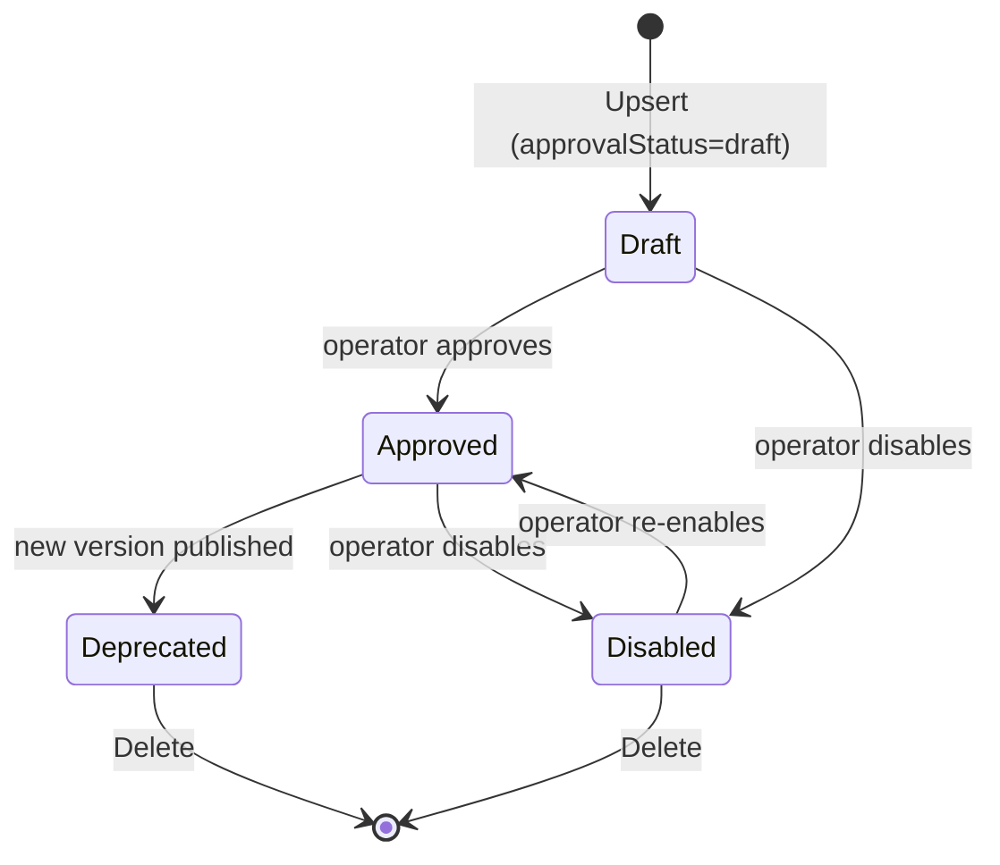

# F1 — SOP Grounding & Store

> **상태**: 착수 예정 (착수보고 기준)
> SigNoz alert 라벨을 사전 등록된 SOP 문서에 매칭(grounding)하고, SOP를 SQL 백엔드에 영속화하는 모듈.

## F1.1 개요

본 모듈은 incident이 발생했을 때 "어떤 SOP를 적용할지"를 결정하는 **Grounding 로직**과, SOP 본문을 영속화하는 **Store 로직**으로 구성된다.

Grounding은 alert label `signoz_pilot_sop_id`를 1차 키로 사용하는 **explicit-label binding**이다. (Vector retrieval은 아직 도입 전 — v0.1은 명시적 라벨 기반.) Tenant scope (`project_id` × `environment`)가 일치하지 않으면 차단되며, `approval_status` 가 `disabled`이면 disabled 상태로 반환된다.

Store는 `SOPStore` 인터페이스를 통해 추상화되며, 현재 구현은 PostgreSQL 위 bun ORM 기반 `sqlsopstore`다. 모든 read/write는 `orgID`로 partition된다 — cross-tenant lookup은 `ErrSOPDocumentNotFound`로 통일되어 반환되므로 호출자는 "다른 tenant에 존재하는지" 추론할 수 없다.

## F1.2 인터페이스

```go
// pkg/types/ruletypes/sop_store.go
type SOPStore interface {
    Upsert(ctx context.Context, orgID string, doc SOPDocument) error
    Get(ctx context.Context, orgID, sopID, version string) (SOPDocument, error)
    GetLatest(ctx context.Context, orgID, sopID string) (SOPDocument, error)
    List(ctx context.Context, orgID string) ([]SOPDocument, error)
    Delete(ctx context.Context, orgID, sopID, version string) error
    UpsertRunbook(ctx context.Context, orgID, sopID, version string, rb Runbook) error
    DeleteRunbook(ctx context.Context, orgID, sopID, version, runbookID string) error
}

var ErrSOPDocumentNotFound = errors.New("sop document not found")
```

Grounding 진입점 (`pkg/types/ruletypes/sop_document.go`):

```go
func PreviewSOPDocumentBinding(
    docs []SOPDocument,
    req SOPBindingPreviewRequest,
) (SOPBindingPreviewResponse, error)
```

## F1.3 데이터 모델

```go
type SOPDocument struct {
    ContractVersion string                    // "ds.sop_document.v1"
    SOPID           string
    Title           string
    Version         string
    Checksum        string                    // "sha256:<hex>"
    Source          SOPDocumentSource         // {Type, SourceID}
    BodyMarkdown    string                    // 최대 256 KiB
    DisplayURL      string                    // optional, safeDisplayURL 검사
    OwnerTeam       string
    ApprovalStatus  string                    // draft|approved|deprecated|disabled
    TenantScope     PilotTenantScope          // {ProjectIDs[], Environments[]}, "*" 허용
    Tags            []string
    Runbooks        []Runbook
    UpdatedAt       string
    SecurityContext PilotAuditSecurityContext
}

type SOPBindingPreviewResponse struct {
    ContractVersion string   // "ds.sop_binding.v1"
    Status          string   // bound|missing|disabled|forbidden
    Resolution      string   // explicit_label|no_match
    SOPID, Version, Title, SourceID string
    Warnings        []string
}
```

SQL backing table (`sqlsopstore.NewSOPStore`): 마이그레이션 078의 `ds_sop_documents`. Bun ORM 기반 `StorableSOPDocument` row가 `(org_id, sop_id, version)` 복합 키로 upsert된다.

> **주의** — `SOPStore.GetLatest`는 version DESC 문자열 정렬이다. caller는 `v01`, `v02` 같이 zero-pad된 lexicographically-sortable version을 사용해야 한다 (`v10 < v2`).

## F1.4 상태 전이



Binding 결과 상태: `bound` (정상) / `missing` (sop_id label 없음 또는 store에 없음) / `forbidden` (tenant scope mismatch) / `disabled` (approvalStatus=disabled).

## F1.5 예외 및 복구

| 경로 | 처리 |
|---|---|
| `sop_id` label 누락 | `status=missing`, `resolution=no_match`, 경고 `"sop_id label is not set"` |
| Store에 SOP 없음 | `status=missing`, `resolution=explicit_label`, 경고 `"sop document was not found"` |
| `project_id` 또는 `environment` label 누락 | `status=missing`, 경고 `SOPTenantPolicyMissingLabelsWarning` |
| Tenant scope mismatch | `status=forbidden`, 경고 `SOPTenantPolicyDeniedWarning` |
| `approvalStatus=disabled` | `status=disabled`, 경고 `"sop document is disabled"` |
| Cross-tenant `Get` | `ErrSOPDocumentNotFound` (다른 tenant 존재 여부 누설 금지) |
| BodyMarkdown > 256 KiB | validation error |
| BodyMarkdown이 markdown처럼 보이지 않음 (HTML/PDF/ZIP magic) | validation error |

## F1.6 비기능 요건 (NFR)

- **NF-F1.1** Cross-tenant lookup은 반드시 `ErrSOPDocumentNotFound`로 통일되어야 한다 (존재 누설 금지).
- **NF-F1.2** `UpsertRunbook`은 read-modify-write를 단일 transaction 안에서 수행해야 한다 (concurrent caller의 interleave 방지).
- **NF-F1.3** SOPDocument checksum은 `sha256:<hex>` 포맷이어야 한다.
- **NF-F1.4** `DisplayURL`은 `http`/`https`만 허용되며 sensitive query parameter는 자동 제거되어야 한다 (`safeDisplayURL`).

## F1.7 Acceptance Criteria (Gherkin)

```gherkin
Feature: SOP grounding by explicit label
  Background:
    Given a SOPStore containing document "SOP-PAY-5xx" version "v01" approved for project "p-prod"

  Scenario: Bound to explicit label
    Given an alert with labels project_id="p-prod", environment="production", signoz_pilot_sop_id="SOP-PAY-5xx"
    When PreviewSOPDocumentBinding runs
    Then the response status is "bound"
    And the resolution is "explicit_label"
    And the bound version is "v01"

  Scenario: Cross-tenant lookup is opaque
    Given an alert with labels project_id="p-other", environment="production", signoz_pilot_sop_id="SOP-PAY-5xx"
    When PreviewSOPDocumentBinding runs
    Then the response status is "forbidden"
    And the warning contains "sop document is outside requested tenant scope"

  Scenario: Disabled SOP is reported but not delivered
    Given the SOP "SOP-PAY-5xx" has approvalStatus "disabled"
    When PreviewSOPDocumentBinding runs against a matching alert
    Then the response status is "disabled"
    And the warning contains "sop document is disabled"
```

## F1.8 Traceability
- Implements UC: UC-001 (단계 4), UC-003 (전제)
- Covered by WBS: WBS-1.1
- Source: `pkg/ruler/sopstore/sqlsopstore/sop.go`, `pkg/types/ruletypes/sop_document.go`
- Commits: `72944ecac`, `c7f4fd330`
