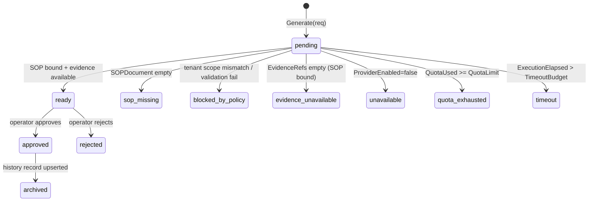

# F2 — AI Runbook Drafting (with history)

> **상태**: 착수 예정 (착수보고 기준)
> bound된 SOP를 컨텍스트로 LLM이 incident 대응 strategy + runbook draft를 생성하고, 결과를 `ai_strategy_history`에 기록한다.

## F2.1 개요

본 모듈은 두 개의 별도 컴포넌트로 구성된다.

1. **AIStrategyGenerator** — alert label + bound SOP를 입력으로 받아 `AIStrategy` (가설 / 첫 조치 / customer update draft / vendor request draft)를 출력. `local` (deterministic, 외부 호출 없음) / `mock` (fixture 기반 데모) / `llm` (Claude / Codex × API / CLI 4조합) provider 지원.
2. **RunbookDrafter** — SOP + 에러 예시를 입력으로 받아 `Runbook` draft를 출력. LLM 또는 mock 구현.

운영자 검수가 끝나면 `AIStrategyHistoryStore`에 record를 best-effort upsert해서 동일 incident 재발 시 lookup이 가능하도록 한다. **모든 strategy output은 `requiresHumanApproval=true` 이며 자동 실행 주장(`자동 재시작`, `automatically restarted` 등) 패턴은 validator가 차단한다.**

## F2.2 인터페이스

```go
// pkg/types/ruletypes
type AIStrategyGenerator interface {
    Generate(ctx context.Context, req AIStrategyRequest) (AIStrategy, error)
}

type RunbookDrafter interface {
    Draft(ctx context.Context, req RunbookDraftRequest) (Runbook, error)
}

type AIStrategyHistoryStore interface {
    Upsert(ctx context.Context, orgID string, record AIStrategyHistoryRecord) error
    Lookup(ctx context.Context, orgID string, req AIStrategyHistoryLookupRequest) (AIStrategyHistoryRecord, bool, error)
}

// pkg/ruler/aigenerator/aigenerator.go
func New(cfg Config) (ruletypes.AIStrategyGenerator, error)
func NewRunbookDrafter(cfg Config) ruletypes.RunbookDrafter
```

Provider 선택: `cfg.Provider ∈ {"", "local", "mock", "llm"}`. `llm`일 때 `LLMProvider ∈ {claude, codex}` × `LLMTransport ∈ {api, cli}` 4조합.

## F2.3 데이터 모델

```go
type AIStrategyRequest struct {
    StrategyID       string
    IncidentID       string
    AlertFingerprint string
    Language         string                // default "ko-KR"
    Labels           map[string]string
    Annotations      map[string]string
    SOPDocument      SOPDocument
    EvidenceRefs     []AIEvidenceRef
    PromptVersion    string                // default "ds-ir-ko-v1"
    Model            string
    Controls         AIStrategyControls    // quota / timeout budget
    GeneratedAt      string
}

type AIStrategy struct {
    ContractVersion     string          // "ds.ai_strategy.v1"
    StrategyID          string
    IncidentID          string
    AlertFingerprint    string
    Status              string          // ready|unavailable|timeout|blocked_by_policy
                                        // |quota_exhausted|sop_missing
                                        // |evidence_unavailable|low_confidence
    Language            string
    SOPID, SOPVersion   string
    Headline            string
    Hypotheses          []AIHypothesis
    FirstActions        []AIFirstAction // 모두 RequiresHumanApproval=true
    CustomerUpdateDraft string
    VendorRequestDraft  string
    Confidence          string          // high|medium|low
    EvidenceRefs        []AIEvidenceRef
    Limitations         []string
    Audit               AIStrategyAudit // promptVersion, model, generatedAt,
                                        // quota*, timeout*, redactionApplied
}

type AIStrategyHistoryRecord struct {
    ContractVersion  string  // "ds.ai_strategy_history.v1"
    IncidentID       string
    AlertFingerprint string
    StrategyID, Status, SOPID, SOPVersion, Confidence, GeneratedAt string
    Strategy         AIStrategy
}
```

History lookup key: `incident\x00<incidentID>` 또는 `fingerprint\x00<alertFingerprint>` 중 하나 이상 필수.

## F2.4 상태 전이



## F2.5 예외 및 복구

| 경로 | 처리 |
|---|---|
| LLM provider 5xx / timeout | `Status=timeout`, `Limitations=["AI strategy generation exceeded the configured timeout budget."]` |
| Quota 초과 (`QuotaUsed >= QuotaLimit`) | `Status=quota_exhausted`, fail-open (F3 참조) |
| License 불허 (`LicenseAllowed=false`) | `Status=blocked_by_policy`, `Limitations=["AI strategy generation is not licensed for this tenant."]` |
| Provider disabled (`ProviderEnabled=false`) | `Status=unavailable`, `Limitations=["AI provider is disabled by tenant or deployment controls."]` |
| SOP 미바인딩 | `Status=sop_missing`, headline "연결된 SOP 문서가 없어 기본 알림만 전송합니다." |
| Evidence 0건 | `Status=evidence_unavailable`, SOP 1단계 안내만 포함 |
| 자동 실행 주장 패턴 검출 (`자동 재시작`, `automatically restarted`, `재시작했습니다` 등) | validator가 거부 |
| History upsert 실패 | dispatch hook에서 `WarnContext`만 남기고 dispatch는 계속 진행 |

## F2.6 비기능 요건 (NFR)

- **NF-F2.1** Dispatch hook 호출 시 generator timeout은 기본 1초 (`DefaultGenerateTimeout`). dispatcher hot path를 절대 막지 않아야 한다.
- **NF-F2.2** 모든 `FirstAction.RequiresHumanApproval`은 `true`여야 한다 (validator가 강제).
- **NF-F2.3** `audit.redactionApplied`는 반드시 `true`여야 strategy 출력이 사용될 수 있다.
- **NF-F2.4** `StrategyID`가 비어 있으면 `deterministicAIStrategyID()`가 `sha256(incidentID || fingerprint || sopID || sopVersion)`의 앞 16 hex로 생성 — 동일 입력은 동일 ID.
- **NF-F2.5** History record의 `IncidentID`, `StrategyID`, `Status`, `Confidence`, `GeneratedAt`은 embedded `Strategy`와 정확히 일치해야 한다 (validator가 강제).

## F2.7 Acceptance Criteria (Gherkin)

```gherkin
Feature: AI runbook drafting with SOP grounding
  Background:
    Given the AIStrategyGenerator is configured with provider "local"
    And a SOPDocument "SOP-PAY-5xx" is bound to the request

  Scenario: Ready strategy with evidence
    Given the request carries at least one evidence ref
    And the tenant labels match the SOP scope
    When Generate is called
    Then the strategy status is "ready"
    And every first action has RequiresHumanApproval set to true
    And the audit.redactionApplied flag is true

  Scenario: SOP missing yields fallback notice
    Given the request SOPDocument is empty
    When Generate is called
    Then the strategy status is "sop_missing"
    And the headline mentions "연결된 SOP 문서가 없어"

  Scenario: Automatic-operation claim is rejected
    Given a hypothesis text containing "자동 재시작"
    When ValidateAIStrategy is called
    Then validation fails with "must not claim automatic operational execution"

  Scenario: History record requires matching strategy fields
    Given an AIStrategyHistoryRecord whose Strategy.IncidentID differs from the record IncidentID
    When ValidateAIStrategyHistoryRecord is called
    Then validation fails mentioning "strategy.incidentId: must match"
```

## F2.8 Traceability
- Implements UC: UC-001 (단계 5), UC-003 (degraded path)
- Covered by WBS: WBS-1.2
- Source: `pkg/ruler/aigenerator/`, `pkg/ruler/runbookdrafter/llmrunbookdrafter/`, `pkg/types/ruletypes/ai_strategy*.go`
- Commits: `cb29d2a59`
