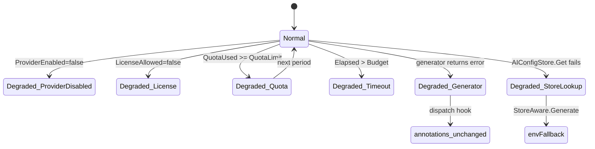

# F3 — AI Quota Controls (fail-open)

> **상태**: 구현 완료
> LLM provider disabled / license 불허 / quota 초과 / timeout 초과 시 fail-open 정책으로 SOP 원문 fallback. 알람 전달 자체는 절대 막지 않는다.

## F3.1 개요

DS-APM의 운영 원칙은 **"AI는 보조, 알람은 항상 전달"**. 본 모듈은 AI 경로가 실패해도 dispatcher가 멈추지 않도록 다음 두 가지를 책임진다.

1. **StoreAware generator** — per-org `AIConfig`를 cache + lookup. 미설정·암호화 실패·잘못된 provider 선택 시 `envFallback` (서버 부팅 시 env로 구성된 generator)로 자동 fallback.
2. **Dispatch hook의 fail-graceful 정책** — hook은 `error`를 절대 반환하지 않는다. SOP list 실패 / unbound / generator timeout / history upsert 실패 모두 입력 annotations 그대로 반환. dispatcher는 알람 전달을 계속 진행한다.

추가로 strategy 자체에 quota / timeout / license / provider-enabled 4종 control이 박혀 있고, 위반 시 `Status=quota_exhausted|timeout|blocked_by_policy|unavailable` 중 하나로 안전하게 degrade된다 (F2.5 참조).

## F3.2 인터페이스

```go
// pkg/ruler/aigenerator/storeaware.go
type StoreAware struct { /* cache + store + envFallback */ }

func NewStoreAware(
    store ruletypes.AIConfigStore,
    cipher *secretbox.Cipher,
    envFallback ruletypes.AIStrategyGenerator,
) *StoreAware

func (s *StoreAware) Generate(ctx context.Context, req ruletypes.AIStrategyRequest) (ruletypes.AIStrategy, error)
func (s *StoreAware) GeneratorFor(cfg ruletypes.AIConfig) (ruletypes.AIStrategyGenerator, error)
func (s *StoreAware) Invalidate(orgID string)

// pkg/ruler/aigenerator/dispatchhook/hook.go
type Hook struct { /* sopStore + aiHistoryStore + generator + timeout */ }
const DefaultGenerateTimeout = time.Second

func (h *Hook) Apply(
    ctx context.Context, orgID, incidentID, alertFingerprint string,
    labels, annotations map[string]string,
) map[string]string  // 절대 error 반환하지 않음
```

## F3.3 데이터 모델

```go
type AIStrategyControls struct {
    ProviderEnabled        *bool   // nil → 검사 안 함
    LicenseAllowed         *bool
    QuotaLimit             int64   // 0 → 검사 안 함
    QuotaUsed              int64
    TimeoutBudgetMillis    int64   // 0 → 검사 안 함
    ExecutionElapsedMillis int64
}

type AIStrategyAudit struct {
    PromptVersion          string
    Model                  string
    GeneratedAt            string
    RedactionApplied       bool
    QuotaLimit             *int64  // 사용 시 strategy.Audit에 기록
    QuotaUsed              *int64
    QuotaRemaining         *int64
    TimeoutBudgetMillis    *int64
    ExecutionElapsedMillis *int64
}
```

Limitation 문구 (constant):

| Constant | 값 |
|---|---|
| `AIProviderDisabledLimitation` | "AI provider is disabled by tenant or deployment controls." |
| `AILicenseUnavailableLimitation` | "AI strategy generation is not licensed for this tenant." |
| `AIQuotaExhaustedLimitation` | "AI strategy quota is exhausted for this period." |
| `AITimeoutBudgetExceededLimitation` | "AI strategy generation exceeded the configured timeout budget." |

## F3.4 상태 전이



## F3.5 예외 및 복구

| 경로 | 처리 |
|---|---|
| Per-org `AIConfig` 미설정 | `StoreAware.Generate` → `envFallback.Generate` |
| `cipher.DecryptFunc()` 실패 | `envFallback.Generate` (cached gen 미생성) |
| UI에서 mock provider 선택 | `buildFromAIConfig` 명시적 error → `envFallback.Generate` |
| `aigenerator.New()` factory error | `dispatchhook` 미설치 (server boot 시), runtime 영향 없음 |
| `sopStore.List` 실패 | hook이 input annotations 그대로 반환 + WarnLog |
| Binding이 `bound`가 아님 | 입력 annotations 그대로 반환 (조용히) |
| `generator.Generate` 1초 timeout | 입력 annotations 그대로 반환 + WarnLog |
| `aiHistoryStore.Upsert` 실패 | dispatch는 계속, WarnLog만 |

핵심 원칙: **dispatcher hot path에서 어떤 실패도 알람 전달을 막지 않는다.**

## F3.6 비기능 요건 (NFR)

- **NF-F3.1** Dispatch hook의 generator timeout은 `DefaultGenerateTimeout = 1s` 이하. dispatcher latency budget 보호.
- **NF-F3.2** Hook은 절대 `error`를 반환하지 않는다 (`map[string]string` 단일 반환값).
- **NF-F3.3** `StoreAware`는 per-org generator를 `RWMutex` 보호된 map으로 캐시한다. PUT to config endpoint 시 `Invalidate(orgID)` 호출 필수.
- **NF-F3.4** Fail-open 판정 후에도 `strategy.Audit.QuotaLimit`/`QuotaUsed`/`QuotaRemaining` 필드는 기록되어 감사 가능해야 한다.

## F3.7 Acceptance Criteria (Gherkin)

```gherkin
Feature: AI quota controls fail open
  Scenario: Quota exhaustion does not block dispatch
    Given AIStrategyRequest with Controls.QuotaLimit=10 and QuotaUsed=10
    When GenerateLocalAIStrategy runs
    Then strategy.Status equals "quota_exhausted"
    And strategy.Limitations contains "AI strategy quota is exhausted for this period."
    And strategy.Audit.QuotaRemaining points to 0

  Scenario: License denial degrades strategy but not delivery
    Given AIStrategyRequest with Controls.LicenseAllowed=false
    When GenerateLocalAIStrategy runs
    Then strategy.Status equals "blocked_by_policy"
    And strategy.Confidence equals "low"

  Scenario: Generator timeout returns input annotations unchanged
    Given a dispatch hook whose generator sleeps longer than the timeout
    When Hook.Apply runs against an alert
    Then the returned annotations equal the input annotations
    And a warn-level log line "ai dispatch hook: generate failed" is emitted

  Scenario: Store lookup failure falls back to env generator
    Given a StoreAware whose AIConfigStore.Get returns an error
    When Generate is called
    Then the envFallback generator handles the request
```

## F3.8 Traceability
- Implements UC: UC-003
- Covered by WBS: WBS-1.2
- Source: `pkg/ruler/aigenerator/storeaware.go`, `pkg/ruler/aigenerator/dispatchhook/hook.go`
- Commits: `a6757136e`
