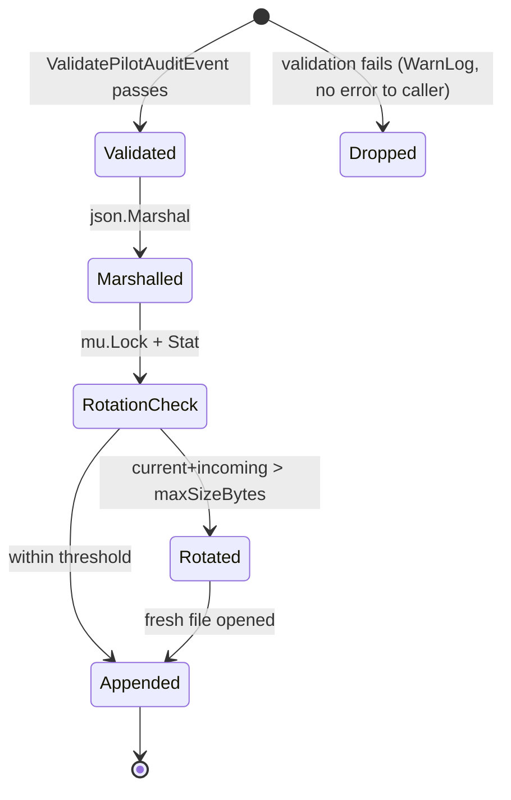

# F5 — Audit (SOP access & dispatch)

> **상태**: 착수 예정 (착수보고 기준)
> SOP 검색·preview·fetch, evidence 수집, AI summary 요청/결과를 JSONL로 영속 기록한다. 정책은 best-effort — sink 실패는 원 operation을 막지 않는다.

## F5.1 개요

본 모듈은 `PilotAuditEventSink` 추상화와 두 구현(`NopPilotAuditEventSink` default, `PilotAuditEventJSONLSink` 운영용)을 제공한다.

운영 sink는 newline-delimited JSON을 로컬 파일에 append하고, 50 MiB 임계치마다 timestamped sibling으로 rotate한다 (`<path>.20260528T120000.000000000Z`). 기본 경로는 `cmd/community/main.go`에서 등록한 `var/audit/pilot-events.jsonl`.

이벤트 타입은 8종으로 고정 (`sop.search | sop.preview | sop.fetch | sop.health_check | evidence.collect_request | evidence.collect_result | ai.summary_request | ai.summary_result`). 결과(outcome)는 `allowed | denied | redacted | failed | deferred` 5종. **모든 이벤트는 validation 통과 후에만 기록되며, validation 실패는 dropped (caller에 error 전파 X).**

## F5.2 인터페이스

```go
// pkg/types/ruletypes/pilot_audit_sink.go
type PilotAuditEventSink interface {
    Record(ctx context.Context, event PilotAuditEvent) error
}

type NopPilotAuditEventSink struct{}

func RegisterPilotAuditEventSink(sink PilotAuditEventSink)  // nil → reset to Nop
func CurrentPilotAuditEventSink() PilotAuditEventSink
func DispatchPilotAuditEvent(ctx context.Context, event PilotAuditEvent) error

// pkg/types/ruletypes/pilot_audit_sink_jsonl.go
const DefaultPilotAuditJSONLMaxSizeBytes int64 = 50 * 1024 * 1024

type PilotAuditEventJSONLSink struct { /* path + maxSizeBytes + mutex */ }

func NewPilotAuditEventJSONLSink(path string, maxSizeBytes int64) (*PilotAuditEventJSONLSink, error)
```

## F5.3 데이터 모델

```go
type PilotAuditEvent struct {
    ContractVersion string                    // "ds-apm.audit-event.v1"
    EventID         string
    EventType       string                    // sop.*/evidence.*/ai.* 중 1
    OccurredAt      string                    // RFC3339
    Actor           PilotAuditActor           // {Kind, ID, DisplayName}
    Tenant          PilotAuditTenant          // {ProjectID, Environment}
    Resource        PilotAuditResource        // {Kind, SourceID?, SOPID?, Version?}
    Action          string
    Outcome         string                    // allowed|denied|redacted|failed|deferred
    Reason          string                    // denied/failed/deferred 시 필수
    RequestContext  PilotAuditRequestContext  // {AlertRuleID, IncidentID, ServiceName, Severity}
    SecurityContext PilotAuditSecurityContext // {ServiceAccountProfile, SecretRefVisible=false,
                                              //  BrowserCredentialsUsed=false, RedactionApplied}
}

type PilotAuditActor struct {
    Kind        string  // user | system | service_account
    ID          string
    DisplayName string
}
```

**Security invariants** (`ValidatePilotAuditEvent` 강제):
- `securityContext.secretRefVisible` 반드시 `false`
- `securityContext.browserCredentialsUsed` 반드시 `false`
- `securityContext.serviceAccountProfile` non-empty
- `requestContext.incidentId`, `requestContext.serviceName` non-empty
- `eventType`가 `sop.*` prefix면 `resource.sourceId` non-empty

JSONL line 포맷: `json.Marshal(event) + '\n'`.

## F5.4 상태 전이



## F5.5 예외 및 복구

| 경로 | 처리 |
|---|---|
| Validation 실패 | `zap.L().Warn(...)` 후 `nil` 반환 (caller block 금지) |
| `path == ""` 또는 `maxSizeBytes <= 0` | `NewPilotAuditEventJSONLSink`가 error 반환 |
| `os.MkdirAll` 실패 | error 전파 |
| 파일 stat 실패 | error 전파 |
| Rotation 시 `os.Rename` 실패 | error 전파 (file은 그대로 유지) |
| Write 실패 (디스크 full 등) | error 전파 — caller가 best-effort로 무시 가능 |
| Sink 미등록 | `NopPilotAuditEventSink` (no-op, 항상 `nil`) |

`DispatchPilotAuditEvent`는 sink의 error를 그대로 반환하지만, **호출 컨벤션은 best-effort** — pilot 호출자는 이 error를 무시하고 원 operation을 계속 진행한다.

## F5.6 비기능 요건 (NFR)

- **NF-F5.1** Sink는 thread-safe해야 한다 (`sync.Mutex` 또는 `sync.RWMutex`).
- **NF-F5.2** Rotation은 빈 파일을 절대 rotate하지 않아야 한다 (zero-byte rotated file 방지).
- **NF-F5.3** Default rotation threshold는 50 MiB (`DefaultPilotAuditJSONLMaxSizeBytes`).
- **NF-F5.4** 모든 audit event는 JSON으로 직렬화 가능해야 한다 (binary payload 금지).
- **NF-F5.5** SOP access/fetch path의 audit event 누락률은 0%여야 한다 (in-process best-effort 범위 내). validation drop은 metric으로 집계 가능해야 한다.

## F5.7 Acceptance Criteria (Gherkin)

```gherkin
Feature: Pilot audit event sink
  Background:
    Given a PilotAuditEventJSONLSink at "/tmp/pilot-audit.jsonl" with rotation threshold 1024 bytes

  Scenario: Valid event is appended as one JSONL line
    Given a valid PilotAuditEvent with EventType "sop.fetch" and Outcome "allowed"
    When Record is called
    Then the file contains a single JSON object followed by newline
    And the object's eventType field equals "sop.fetch"

  Scenario: Invalid event is silently dropped
    Given a PilotAuditEvent with empty EventID
    When Record is called
    Then no error is returned
    And the warning "pilot audit event invalid; dropping" is logged
    And the file size remains unchanged

  Scenario: Rotation preserves prior contents
    Given a sink whose active file already contains 1000 bytes
    And an incoming event whose serialized size pushes total above 1024 bytes
    When Record is called
    Then the prior file is renamed to a "<path>.<timestamp>" sibling
    And a fresh primary file holds the new event

  Scenario: Denied outcome must carry a reason
    Given a PilotAuditEvent with Outcome "denied" and empty Reason
    When ValidatePilotAuditEvent is called
    Then validation fails mentioning "reason: field is required"
```

## F5.8 Traceability
- Implements UC: UC-001 (단계 10), UC-002, UC-003
- Covered by WBS: WBS-1.0
- Source: `pkg/types/ruletypes/pilot_audit_sink.go`, `pkg/types/ruletypes/pilot_audit_sink_jsonl.go`
- Commits: `8a55208ef`
