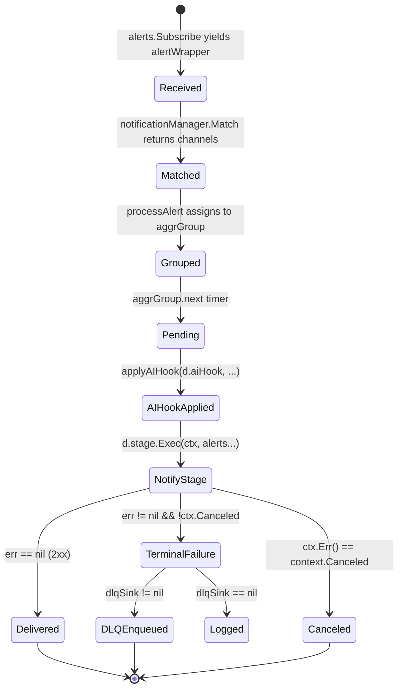

# F6 — Notification Dispatch

> **상태**: 착수 예정 (착수보고 기준)
> SOP / AI strategy annotation을 5개 채널(Slack, MS Teams v2, PagerDuty, Webhook, Email)로 dispatch한다. dispatcher hot path에서 AI hook을 호출하고, 실패 시 DLQ로 분기 (F8).

## F6.1 개요

본 모듈은 Prometheus Alertmanager의 `dispatch.Dispatcher`를 wrapping해서 다음 두 가지를 끼워넣는다.

1. **AI dispatch hook** — `aggrGroup.run()`이 flush할 때 알람별로 `dispatchhook.Hook.Apply()` 호출 → SOP grounding → AI strategy 생성 → annotations에 머지. 입력 annotations는 mutation되지 않고 새 map 반환 (caller가 cheap identity 비교 가능).
2. **DLQ wire** — terminal notify failure를 `dlq.Sink`에 best-effort write (F8).

채널은 5종 모두 SigNoz upstream에 본래 존재하던 path를 패치한다 — SOP/AI annotation을 channel-specific payload로 변환하는 책임은 각 채널 adapter + `alertmanagertemplate` 안에. Template variable은 `$incident.{project_id|sop_id|ai_headline|ai_first_actions|...}` 22종 (`knownIncidentTemplateFields`).

## F6.2 인터페이스

```go
// pkg/alertmanager/alertmanagerserver/dispatcher.go
type Dispatcher struct { /* 내부 상태 + dlqSink + aiHook */ }

func NewDispatcher(
    ap provider.Alerts, r *dispatch.Route, s notify.Stage,
    mk types.GroupMarker, to func(time.Duration) time.Duration,
    lim Limits, l *slog.Logger, m *DispatcherMetrics,
    n nfmanager.NotificationManager, orgID string,
    dlqSink dlq.Sink, aiHook *dispatchhook.Hook,
) *Dispatcher

func (d *Dispatcher) Run()
func (d *Dispatcher) Stop()
func (d *Dispatcher) Groups(routeFilter, alertFilter) (AlertGroups, map[model.Fingerprint][]string)

// pkg/types/ruletypes/notification_template_preview.go
func PreviewNotificationTemplate(
    ctx context.Context, req PreviewNotificationTemplateRequest,
) (*PreviewNotificationTemplateResponse, error)

func MissingIncidentTemplateVariables(template string) []string
```

## F6.3 데이터 모델

```go
type AlertGroup struct {
    Alerts   types.AlertSlice
    Labels   model.LabelSet
    Receiver string
    GroupKey string
    RouteID  string
    Renotify time.Duration
}

type PreviewNotificationTemplateRequest struct {
    Template    string
    Labels      map[string]string
    Annotations map[string]string
    Value       string  // default "0"
    Threshold   string  // default "0"
}
```

`knownIncidentTemplateFields` (22개) — template `$incident.{key}` 형태로 참조 가능:

| Group | Keys |
|---|---|
| Tenant | `project_id`, `environment`, `service_name`, `owner_team`, `severity` |
| Impact | `impact_summary`, `next_action`, `vendor_request`, `customer_update` |
| SOP | `sop_id`, `sop_url`, `sop_source`, `sop_title`, `sop_version`, `sop_binding_id` |
| AI | `ai_strategy_id`, `ai_strategy_status`, `ai_headline`, `ai_first_actions`, `ai_confidence`, `ai_limitations`, `ai_evidence_refs` |

### 채널별 canonical → 채널 payload 매핑

| Canonical 필드 | Slack (Block Kit) | MS Teams v2 (Adaptive Card) | PagerDuty (Events API v2) | Webhook (JSON) | Email |
|---|---|---|---|---|---|
| `severity` | header prefix `[SEV-x]` | TextBlock size=Large | `payload.severity` | `severity` field | Subject prefix |
| `service_name` | section field | FactSet entry | `payload.component` | `service` field | Body header |
| `sop_url` | actions button | `Action.OpenUrl` | `payload.custom_details.runbook_url` | `sop_url` field | inline link |
| `ai_headline` | section mrkdwn | TextBlock wrap | `payload.summary` | `ai_headline` field | Body |
| `ai_first_actions` | section mrkdwn (line-joined) | TextBlock wrap | `payload.custom_details.ai_first_actions` | array | Body bullet |
| `ai_confidence` | section field | FactSet entry | `payload.custom_details.ai_confidence` | field | Body header |

> MS Teams 제약 (research §7.2 §13.4): `Action.Submit`은 incoming webhook에서 작동하지 않음. v0.1은 `Action.OpenUrl`만 사용.

## F6.4 상태 전이



## F6.5 예외 및 복구

| 경로 | 처리 |
|---|---|
| `notificationManager.Match` 실패 | `ErrorContext` + continue (다음 alert 처리) |
| Aggregation group 한도 초과 | `metrics.aggrGroupLimitReached.Inc()` + `ErrorContext`. 신규 group 생성 차단. |
| `aiHook == nil` | hook 건너뛰기 (AIOpsAgent 미설치 시 동작) |
| `aiHook.Apply` 내부 실패 | annotations 그대로 — F3.5 참조 |
| `notify.Stage.Exec` ctx Canceled | `DebugContext` (config reload / shutdown 정상 경로) |
| `notify.Stage.Exec` terminal error | `recordTerminalFailure` → DLQ enqueue (F8) |
| DLQ marshal 실패 | empty payload로 DLQ entry 생성 + `WarnContext` |
| Template expand 실패 | `PreviewNotificationTemplate` error 반환 (caller가 처리) |

## F6.6 비기능 요건 (NFR)

- **NF-F6.1** AI hook 적용은 dispatcher hot path에서 동기적으로 일어나며 1초(`DefaultGenerateTimeout`)를 초과하지 않아야 한다.
- **NF-F6.2** Maintenance ticker는 30초 주기로 empty aggregation group을 GC한다.
- **NF-F6.3** Renotify interval은 per-rule `NotificationConfig.Renotify.{RenotifyInterval, NoDataInterval}`에서 가져온다.
- **NF-F6.4** Template variable이 `knownIncidentTemplateFields`에 없으면 `MissingIncidentTemplateVariables`가 prefix-qualified 이름으로 보고한다 (정렬됨).
- **NF-F6.5** 채널 dispatch 실패는 dispatcher 자체를 중단시키지 않아야 한다 — error는 항상 log + (선택적으로) DLQ로 흡수.

## F6.7 Acceptance Criteria (Gherkin)

```gherkin
Feature: Notification dispatch with AI hook
  Background:
    Given a Dispatcher constructed with a non-nil aiHook and a non-nil dlqSink
    And the notificationManager matches the alert to receiver "ops-slack"

  Scenario: Successful dispatch merges AI annotations
    Given the AI strategy hook returns merged annotations containing "ai_headline"
    When the aggrGroup flushes
    Then notify.Stage.Exec receives an alert whose Annotations include ai_headline
    And recordTerminalFailure is not invoked

  Scenario: Terminal failure is persisted to DLQ
    Given notify.Stage.Exec returns a non-canceled error
    When the aggrGroup flushes
    Then dlqSink.Write is called with an Entry whose Channel equals "ops-slack"
    And the entry's EventID equals the alert fingerprint

  Scenario: Context cancellation is treated as graceful shutdown
    Given notify.Stage.Exec returns context.Canceled
    When the aggrGroup flushes
    Then the failure is logged at debug level
    And dlqSink.Write is not invoked

  Scenario: Unknown template variable is reported
    Given a template containing "$incident.foo_bar"
    When MissingIncidentTemplateVariables runs
    Then the result contains "incident_foo_bar"
```

## F6.8 Traceability
- Implements UC: UC-001 (단계 8), UC-002 (실패 분기)
- Covered by WBS: WBS-1.3
- Source: `pkg/alertmanager/alertmanagernotify/{slack,msteamsv2,pagerduty,webhook,email}/`, `pkg/alertmanager/alertmanagerserver/dispatcher.go`, `pkg/types/ruletypes/notification_template_preview.go`
- Commits: `5c036c806`
