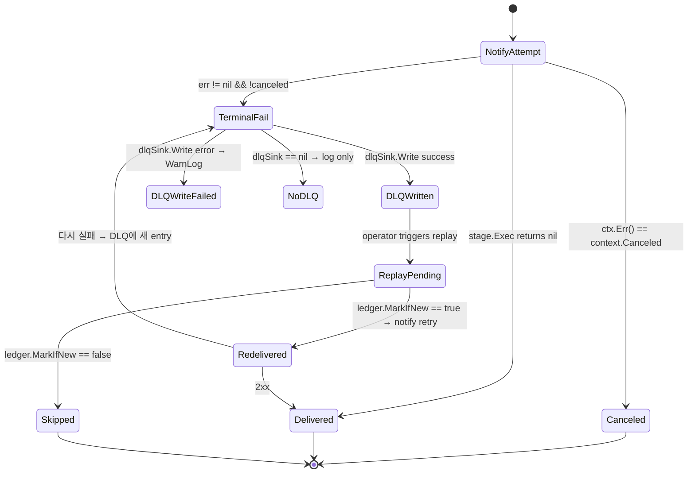

# F8 — DLQ + Idempotent Replay

> **상태**: 구현 완료 (HMAC 정책 미해결 — `open_items` 참조)
> Terminal notify-stage 실패를 JSONL DLQ에 best-effort 영속화하고, replay 시 ledger로 중복 dispatch를 방지한다.

## F8.1 개요

본 모듈은 Python orchestrator의 `RetryingSink / DLQSink / replay_dlq` trio를 Go로 재구현한 것이다. 두 컴포넌트로 구성된다.

1. **`JSONLDeadLetterSink`** — Dispatcher가 terminal notify failure(2xx 아닌 응답 + context not canceled)를 잡으면 `Entry`를 newline-delimited JSON으로 append. 50 MiB 임계치마다 timestamped sibling으로 rotate.
2. **`ReplayLedger`** — append-only set of `EventID`. open 시 파일 스캔으로 in-memory set 재구성. Replay loop은 `MarkIfNew`가 `true`일 때만 재전송 → crash mid-batch에서도 idempotent.

Dispatcher hot path에서 DLQ write는 best-effort: `sink.Write` 실패 시 `WarnContext`만 남기고 알람 자체는 계속 흐른다. **미해결**: replay 시 payload 무결성/위변조 방지를 위한 HMAC 정책 미정 (NF-5.3.1, `open_items`).

## F8.2 인터페이스

```go
// pkg/alertmanager/alertmanagernotify/dlq/dlq.go
type Entry struct {
    EventID  string    `json:"event_id"`
    Channel  string    `json:"channel"`
    Payload  []byte    `json:"payload"`
    FailedAt time.Time `json:"failed_at"`
    Reason   string    `json:"reason,omitempty"`
}

type Sink interface {
    Write(e *Entry) error
}

type JSONLDeadLetterSink struct { /* path + rotateBytes + mutex + file handle */ }

func NewJSONLDeadLetterSink(path string, rotateBytes int64) (*JSONLDeadLetterSink, error)
func (s *JSONLDeadLetterSink) Write(e *Entry) error
func (s *JSONLDeadLetterSink) Close() error

const DefaultJSONLDeadLetterMaxSizeBytes int64 = 50 * 1024 * 1024

// pkg/alertmanager/alertmanagernotify/dlq/ledger.go
type ReplayLedger struct { /* seen map + file + bufio.Writer */ }

func NewReplayLedger(path string) (*ReplayLedger, error)
func (l *ReplayLedger) MarkIfNew(eventID string) bool
func (l *ReplayLedger) Has(eventID string) bool
func (l *ReplayLedger) Close() error
```

## F8.3 데이터 모델

DLQ entry 1건 = JSON 1줄. 예:

```json
{
  "event_id":"abc123fingerprint",
  "channel":"ops-slack",
  "payload":"<base64 of marshalled []*types.Alert>",
  "failed_at":"2026-05-29T03:21:55.123Z",
  "reason":"slack: 5xx persistent"
}
```

Ledger 1줄 = `EventID` 문자열. 빈 줄은 무시. 1 MiB per line scanner buffer.

### Idempotency Key (권장)

Dispatcher가 현재 사용하는 `EventID`는 alert fingerprint 단일 값이다 (`alerts[0].Fingerprint().String()`). research-skills-c-domain.md §10.2가 권장하는 형식은 `sha256(alert.fingerprint || channel.id || dispatch.round_no)`. 현재 구현은 fingerprint만 사용 — 동일 alert가 여러 채널로 갈 때 entry는 `Channel` 필드로 구분되지만 ledger 키는 fingerprint뿐이라 한 채널이 idempotent하면 다른 채널도 skip된다. **`(fingerprint, channel)` 튜플로 ledger 키 확장이 follow-up.**

## F8.4 상태 전이



## F8.5 예외 및 복구

| 경로 | 처리 |
|---|---|
| `notify.Stage.Exec` ctx Canceled | `DebugContext` (정상 종료), DLQ write 안 함 |
| `dlqSink == nil` | DLQ 비활성. terminal failure는 log만 |
| `json.Marshal(alerts)` 실패 | empty payload로 entry 생성 + `WarnContext("dlq: failed to marshal alerts payload")` |
| `dlqSink.Write` 실패 | `WarnContext("dlq: failed to persist terminal failure")` — dispatcher는 계속 |
| Sink가 closed (`s.f == nil`) | `Write` error 반환 |
| Rotation `os.Rename` 실패 | best-effort reopen primary; error 전파 |
| Ledger 파일 corruption | `bufio.Scanner` error → `NewReplayLedger`가 error 반환 |
| Ledger write 실패 | `MarkIfNew`가 `false` 반환 — caller는 재전송 skip (safe default) |
| Empty `EventID` | `MarkIfNew=false` — 재전송 안 함 (저장도 안 함) |

## F8.6 비기능 요건 (NFR)

- **NF-F8.1** DLQ persistence는 **best-effort** — dispatcher hot path를 절대 막지 않아야 한다.
- **NF-F8.2** Default rotation threshold는 50 MiB (`DefaultJSONLDeadLetterMaxSizeBytes`), pilot audit sink와 동일 컨벤션.
- **NF-F8.3** Rotation은 빈 파일을 절대 rotate하지 않아야 한다 (zero-byte sibling 방지).
- **NF-F8.4** `ReplayLedger.MarkIfNew`는 idempotent + durable해야 한다 — 동일 `EventID`로 두 번 호출 시 두 번째는 `false`, 그리고 process restart 후에도 일관성 유지.
- **NF-F8.5** Sink + Ledger 모두 `sync.Mutex` 보호 — concurrent caller 안전.
- **NF-F8.6** Scanner buffer는 1 MiB per line — pathological entry로 ledger가 silently truncate되지 않아야 한다.
- **NF-5.3.1 (open)** Replay payload는 HMAC으로 서명되어야 한다. 정책 미정 — `open_items` 참조.

## F8.7 Acceptance Criteria (Gherkin)

```gherkin
Feature: Dead-letter queue and idempotent replay
  Background:
    Given a Dispatcher whose dlqSink is a JSONLDeadLetterSink at "/tmp/dlq.jsonl"
    And a ReplayLedger at "/tmp/dlq.ledger"

  Scenario: Terminal failure produces one DLQ entry per channel
    Given notify.Stage.Exec returns a non-canceled error for receiver "ops-slack"
    When recordTerminalFailure runs
    Then the DLQ file contains a JSON line with channel "ops-slack"
    And the entry's event_id equals the alert fingerprint
    And the entry's reason matches the underlying error string

  Scenario: Context cancellation never enqueues a DLQ entry
    Given notify.Stage.Exec returns context.Canceled
    When the aggregation group flushes
    Then dlqSink.Write is not called
    And the DLQ file size is unchanged

  Scenario: Replay is skipped for previously processed event
    Given a ReplayLedger containing event_id "abc123"
    When MarkIfNew("abc123") is invoked
    Then it returns false
    And no extra line is appended to the ledger

  Scenario: Replay marks a new event durably
    Given a fresh ReplayLedger
    When MarkIfNew("xyz789") is invoked
    Then it returns true
    And the ledger file ends with the line "xyz789"
    And reopening the ledger preserves the seen entry

  Scenario: Rotation preserves prior contents
    Given an active DLQ file already at 50 MiB
    When the next Entry pushes the size above the threshold
    Then the file is renamed to a "<path>.<timestamp>" sibling
    And the new entry lives in a fresh primary file
```

## F8.8 Traceability
- Implements UC: UC-002
- Covered by WBS: WBS-1.5
- Source: `pkg/alertmanager/alertmanagernotify/dlq/{dlq.go,ledger.go}`, `pkg/alertmanager/alertmanagerserver/dispatcher.go`
- Commits: `ade174bb8`, `91b9ff5db`

## F8.9 Open Items
- **HMAC 정책 follow-up** — replay 시 payload 무결성·재전송 위변조 방지를 위한 서명 정책 미정 (NF-5.3.1).
- **Idempotency 키 확장** — 현재 `EventID = alert.fingerprint`만 사용. research §10.2 권장 `sha256(fingerprint || channel.id || round_no)`로의 이행이 권장됨.
- **Replay loop** — operator-facing replay CLI/UI는 본 모듈 범위 밖. ledger는 redelivery에 필요한 idempotency 기반만 제공.
