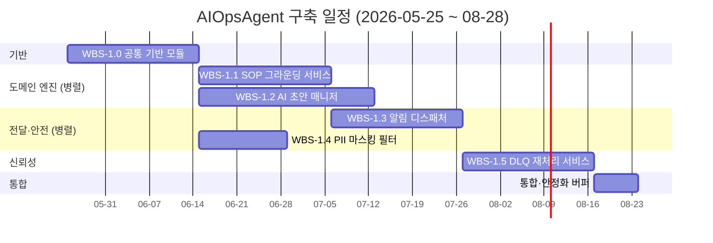

# DS-APM WBS

> **템플릿**: PMI Practice Standard for WBS 2nd ed. (상위 Lv1-3, 100% rule, deliverable-oriented) + Agile (하위 Lv4-5, Epic→Story)
> **Lv2 분해 논리**: component-oriented (실제 `pkg/` 디렉토리에 1:1 매핑)
> **시간선(Phase)은 부록 §A로 분리** (역사 추적용)
> **상태**: 본문 작성 완료. Work package 6건은 `packages/`에 분산.

## 100% Rule

DS-APM 범위 = `WBS-1.0 ∪ WBS-1.1 ∪ ... ∪ WBS-1.5` (자식 합 = 부모 100%, 누락·중복 없음)
**Excluded scope** (OUT OF SCOPE)는 §Excluded Scope 참조.

## WBS Tree (Component-oriented)

```
WBS-1   DS-APM Project (root)
├─ WBS-1.0  공통 기반 모듈 (Foundation Core)              — pilot contract, managed markdown, audit sink, tenant policy
│           Covers: F0, F4, F5
├─ WBS-1.1  SOP 그라운딩 서비스 (SOP Grounding Service)   — SOP store, grounding, file persistence
│           Covers: F1
├─ WBS-1.2  AI 초안 매니저 (AI Drafter Manager)          — runbook drafter, AI generator, quota controls, strategy history
│           Covers: F2, F3
├─ WBS-1.3  알림 디스패처 (Notification Dispatcher)      — 5 채널 adapter + dispatcher
│           Covers: F6
├─ WBS-1.4  PII 마스킹 필터 (PII Masking Filter)         — incident payload redaction
│           Covers: F7
└─ WBS-1.5  DLQ 재처리 서비스 (DLQ Replay Service)       — JSONL DLQ, idempotent replay ledger
            Covers: F8
```

## Work Package 일람

| ID | 제목 | 상태 | 커버 Feature | 파일 |
|---|---|---|---|---|
| WBS-1.0 | 공통 기반 모듈 (Foundation Core) | planned | F0, F4, F5 | [WBS-1-0-foundation.md](packages/WBS-1-0-foundation.md) |
| WBS-1.1 | SOP 그라운딩 서비스 (SOP Grounding Service) | planned | F1 | [WBS-1-1-sop-engine.md](packages/WBS-1-1-sop-engine.md) |
| WBS-1.2 | AI 초안 매니저 (AI Drafter Manager) | planned | F2, F3 | [WBS-1-2-ai-drafter.md](packages/WBS-1-2-ai-drafter.md) |
| WBS-1.3 | 알림 디스패처 (Notification Dispatcher) | planned | F6 | [WBS-1-3-notification-dispatcher.md](packages/WBS-1-3-notification-dispatcher.md) |
| WBS-1.4 | PII 마스킹 필터 (PII Masking Filter) | planned | F7 | [WBS-1-4-pii-redactor.md](packages/WBS-1-4-pii-redactor.md) |
| WBS-1.5 | DLQ 재처리 서비스 (DLQ Replay Service) | planned | F8 | [WBS-1-5-dlq-replay.md](packages/WBS-1-5-dlq-replay.md) |

## 구축 일정

전체 기간: **2026-05-25 ~ 2026-08-28 (약 14주)**

| 컴포넌트 | 기간 | 시작 | 종료 | 의존 |
|---|---|---|---|---|
| WBS-1.0 공통 기반 모듈 | 3주 | 2026-05-25 | 2026-06-12 | (선행, 전체 의존) |
| WBS-1.1 SOP 그라운딩 서비스 | 3주 | 2026-06-15 | 2026-07-03 | WBS-1.0 |
| WBS-1.2 AI 초안 매니저 | 4주 | 2026-06-15 | 2026-07-10 | WBS-1.0 (1.1과 병렬) |
| WBS-1.3 알림 디스패처 | 3주 | 2026-07-13 | 2026-07-31 | WBS-1.1, 1.2 |
| WBS-1.4 PII 마스킹 필터 | 2주 | 2026-07-13 | 2026-07-24 | WBS-1.0 (1.3과 병렬) |
| WBS-1.5 DLQ 재처리 서비스 | 3주 | 2026-08-03 | 2026-08-21 | WBS-1.3 |
| 통합·안정화 버퍼 | 1주 | 2026-08-24 | 2026-08-28 | 전체 (E2E·HMAC 결정·검수) |



## Excluded Scope (명시적 OUT OF SCOPE)

- **SigNoz upstream 기능 자체** — AIOpsAgent 범위 밖
- **Enterprise 모듈** (`ee/`, `cmd/enterprise/`) — 별도 라이선스
- **y2i 관련 기능** — 영구 비활성화 (메모리 정책)

## WBS Dictionary

각 work package의 Deliverable / Acceptance / Owner / Effort / Dependencies / Verification은 `packages/` 안 개별 파일에서 관리.

## Milestones

WBS 자체는 정적 scope 문서이며 진행률을 박지 않는다 (research-skills-a-methods.md §4.4). 다음 milestone은 시간선 부록 §A의 phase와 다르게 **production-readiness gate** 기준으로 분리한다.

| Milestone | 목표일 | 기준 | 현재 상태 | 의존 |
|---|---|---|---|---|
| **M-1 기반 완료** | 2026-06-12 | WBS-1.0 acceptance 통과. F0~F8 9 모듈 정의, UC-001~003 본문·시퀀스·NFR 작성, 산출물 4종 합의. | **예정** (Phase 0 진입) | WBS-1.0 |
| **M-2 도메인 엔진 완료** | 2026-07-10 | WBS-1.1 + WBS-1.2 acceptance 통과. SOP grounding + AI 초안 생성 E2E 동작. | **미진입** | M-1 |
| **M-3 전달·안전 완료** | 2026-07-31 | WBS-1.3 + WBS-1.4 acceptance 통과. 5채널 dispatch + PII 마스킹 E2E 동작. | **미진입** | M-2 |
| **M-4 신뢰성·Beta GA** | 2026-08-21 | WBS-1.5 acceptance 통과. HMAC 정책 결정 (NF-5.3.1). DLQ 운영 UI/CLI 최소 1종 제공. Frontend 변경 영역 식별·문서화. | **미진입 (NF-5.3.1 미해결, frontend R-5 open)** | M-3 + ADR-003 결정 |
| **M-5 Production-readiness** | 2026-08-28 | 통합·안정화 버퍼 소화. Multi-tenant 격리 강화. PII Collector 단 이동 결정. HMAC 정책 운영 검증. | **미진입** | M-4 + R-3, R-4, R-7 follow-up 클리어 |

추가 milestone 후보 (현재 미일정):
- **M-X Vector retrieval 도입** — explicit-label binding을 vector retrieval로 확장 (현재 OUT OF SCOPE).
- **M-X 6번째 채널 추가** — ADR-002 (channel adapter pattern) 결정 트리거.

## Appendix
- [Phase 시간선 (P0~P5)](appendix-phases.md) — 착수 전 사전 검토 단계의 시간선 분할 (역사 추적용)

## Traceability
- WBS × Feature × Use Case 매트릭스: [`../_shared/traceability.md`](../_shared/traceability.md)
- Open items (HMAC, frontend, archive 자료): traceability.md §6
