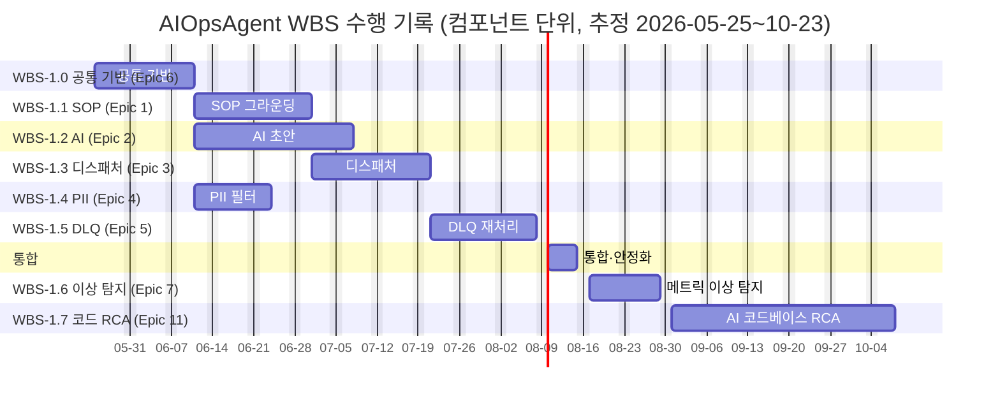

# DS-APM WBS

> **PMI WBS** — 컴포넌트·일정 분해(독립 산출물). **WBS 항목 = 에픽/스토리에서 파생**([`../03-epics/`](../03-epics/index.md)·[`../04-stories/`](../04-stories/)) — 스토리/태스크가 바뀌면 항목도 따라 바뀐다. WBS는 거기에 **시작/종료일·상태**를 얹는 일정 층.
> **에픽 ≠ WBS**: 에픽/스토리=애자일 작업 정의, WBS=PMI 컴포넌트·일정.
> **상태 = as-built 수행 기록 + 계획**: Epic 1~6 스토리 **완료**(5.3 HMAC만 planned), Epic 7(WBS-1.6, 메트릭 이상 탐지) **완료**, Epic 11(WBS-1.7, AI 코드베이스 RCA) 코어 **완료**(HTTP·FE·디스패치 훅 트리거 seam 미배선 → impl-mvp). 날짜는 **추정 수행 기간**(실제 커밋 일자 아님 — 공개 repo squash). 완료 항목도 **삭제 않고 유지**.

## 100% Rule
DS-APM 범위 = `WBS-1.0 ∪ … ∪ WBS-1.7` (자식 합 = 부모 100%). Excluded scope는 §Excluded Scope.

## WBS Tree (Component Lv2) ↔ Epic ↔ CF
```
WBS-1   DS-APM Project (root)
├─ WBS-1.0  공통 기반 모듈        ← Epic 6 · Covers CF-6 (+CF-1 테넌트)
├─ WBS-1.1  SOP 그라운딩 서비스   ← Epic 1 · Covers CF-1
├─ WBS-1.2  AI 초안 매니저        ← Epic 2 · Covers CF-2
├─ WBS-1.3  알림 디스패처         ← Epic 3 · Covers CF-3
├─ WBS-1.4  PII 마스킹 필터       ← Epic 4 · Covers CF-4
├─ WBS-1.5  DLQ 재처리 서비스     ← Epic 5 · Covers CF-5
├─ WBS-1.6  메트릭 이상 탐지       ← Epic 7 · Covers CF-7  ★ implemented
└─ WBS-1.7  AI 코드베이스 RCA      ← Epic 11 · Covers CF-11 ◑ implemented-mvp
```
> Lv2 컴포넌트(8) = 에픽(8) = CF(8) 1:1(파운데이션만 WBS-1.0↔Epic 6↔CF-6). Lv3 = 스토리. WBS-1.7은 코어 구현·TDD 완료, 표면·디스패치 배선은 통합 seam.

## 작업 패키지 일람

| ID | 컴포넌트 | 상태 | 커버 CF | 관련 에픽 |
|---|---|---|---|---|
| WBS-1.0 | 공통 기반 모듈 (Foundation Core) | implemented | CF-6 (+CF-1 테넌트) | [Epic 6](../03-epics/epic-6-foundation-audit.md) |
| WBS-1.1 | SOP 그라운딩 서비스 | implemented | CF-1 | [Epic 1](../03-epics/epic-1-sop-grounding.md) |
| WBS-1.2 | AI 초안 매니저 | implemented | CF-2 | [Epic 2](../03-epics/epic-2-ai-assist.md) |
| WBS-1.3 | 알림 디스패처 | implemented | CF-3 | [Epic 3](../03-epics/epic-3-handoff.md) |
| WBS-1.4 | PII 마스킹 필터 | implemented | CF-4 | [Epic 4](../03-epics/epic-4-pii-safety.md) |
| WBS-1.5 | DLQ 재처리 서비스 | implemented-mvp | CF-5 | [Epic 5](../03-epics/epic-5-reliable-delivery.md) |
| WBS-1.6 | 메트릭 이상 탐지 (Anomaly Detection) | implemented | CF-7 | [Epic 7](../03-epics/epic-7-anomaly.md) |
| WBS-1.7 | AI 코드베이스 RCA (coderca) | **implemented-mvp** (코어 완료 · 표면·디스패치 seam) | CF-11 | [Epic 11](../03-epics/epic-11-code-rca.md) |

## 컴포넌트 일정 (Lv2 · 추정 수행 기간)

WBS-1.0~1.6 **완료**, WBS-1.7 코어 완료(표면 seam). 수행 기간(추정): **2026-05-25 ~ 2026-10-23** — 실제 커밋 일자 아님. 전략 로드맵 1~2단계 해당(§A).

| 컴포넌트 | 기간 | 시작 | 종료 | 의존 |
|---|---|---|---|---|
| WBS-1.0 공통 기반 | 3주 | 2026-05-25 | 2026-06-12 | (선행) |
| WBS-1.1 SOP 그라운딩 | 3주 | 2026-06-15 | 2026-07-03 | WBS-1.0 |
| WBS-1.2 AI 초안 | 4주 | 2026-06-15 | 2026-07-10 | WBS-1.0 (1.1 병렬) |
| WBS-1.3 알림 디스패처 | 3주 | 2026-07-13 | 2026-07-31 | WBS-1.1, 1.2 |
| WBS-1.4 PII 필터 | 2주 | 2026-07-13 | 2026-07-24 | WBS-1.0 (1.3 병렬) |
| WBS-1.5 DLQ 재처리 | 3주 | 2026-08-03 | 2026-08-21 | WBS-1.3 |
| 통합·안정화 | 1주 | 2026-08-24 | 2026-08-28 | 전체 |
| WBS-1.6 메트릭 이상 탐지 | 2주 | 2026-08-31 | 2026-09-11 | WBS-1.0 (rule 엔진 확장) |
| **WBS-1.7 AI 코드베이스 RCA** *(impl-mvp)* | 6주 | 2026-09-14 | 2026-10-23 | WBS-1.0~1.6 (기존 인프라 재사용 + CF-7 트리거) |

> WBS-1.7 표면(HTTP·FE)·디스패치 훅 트리거는 **통합 seam**(설계 §11) — 위 종료일은 코어(M1~M3) 기준 추정. 배선 완료 시 갱신.

## 스토리 일정 (Lv3 · 에픽/스토리 파생 · 영업일 · 추정)

> WBS Lv3 항목 = **스토리**([`../04-stories/`](../04-stories/)). Epic 1~6 완료(5.3 planned), Epic 7·11 추가. 완료 항목도 유지.

| 컴포넌트 (Epic) | 스토리 | 제목 | 시작 | 종료 | 상태 |
|---|---|---|---|---|---|
| WBS-1.0 (Epic 6) | [6.1](../04-stories/6.1.story.md) | 팀별 정책 설정 | 2026-05-25 | 2026-05-29 | ✅ 완료 |
| WBS-1.0 (Epic 6) | [6.2](../04-stories/6.2.story.md) | 행위 1건당 감사 기록 | 2026-06-01 | 2026-06-05 | ✅ 완료 |
| WBS-1.0 (Epic 6) | [6.3](../04-stories/6.3.story.md) | 감사 실패 무중단 | 2026-06-08 | 2026-06-12 | ✅ 완료 |
| WBS-1.1 (Epic 1) | [1.2](../04-stories/1.2.story.md) | SOP 보관·매칭 | 2026-06-15 | 2026-06-19 | ✅ 완료 |
| WBS-1.1 (Epic 1) | [1.1](../04-stories/1.1.story.md) | SOP 자동 연계 | 2026-06-22 | 2026-06-24 | ✅ 완료 |
| WBS-1.1 (Epic 1) | [1.3](../04-stories/1.3.story.md) | 테넌트 격리 | 2026-06-25 | 2026-06-26 | ✅ 완료 |
| WBS-1.1 (Epic 1) | [1.4](../04-stories/1.4.story.md) | SOP 존재 비노출 | 2026-06-29 | 2026-06-30 | ✅ 완료 |
| WBS-1.1 (Epic 1) | [1.5](../04-stories/1.5.story.md) | 비활성·만료 미적용 | 2026-07-01 | 2026-07-03 | ✅ 완료 |
| WBS-1.2 (Epic 2) | [2.1](../04-stories/2.1.story.md) | AI 대응 가이드 생성 | 2026-06-15 | 2026-06-19 | ✅ 완료 |
| WBS-1.2 (Epic 2) | [2.2](../04-stories/2.2.story.md) | 전문가 없이 1차 대응 | 2026-06-22 | 2026-06-24 | ✅ 완료 |
| WBS-1.2 (Epic 2) | [2.3](../04-stories/2.3.story.md) | 사람 승인 강제(HITL) | 2026-06-25 | 2026-06-26 | ✅ 완료 |
| WBS-1.2 (Epic 2) | [2.6](../04-stories/2.6.story.md) | 과거 대응 이력 참조 | 2026-06-29 | 2026-07-01 | ✅ 완료 |
| WBS-1.2 (Epic 2) | [2.5](../04-stories/2.5.story.md) | 사용량 제어 | 2026-07-02 | 2026-07-07 | ✅ 완료 |
| WBS-1.2 (Epic 2) | [2.4](../04-stories/2.4.story.md) | fail-open hook | 2026-07-08 | 2026-07-10 | ✅ 완료 |
| WBS-1.3 (Epic 3) | [3.1](../04-stories/3.1.story.md) | 5채널 수신 | 2026-07-13 | 2026-07-18 | ✅ 완료 |
| WBS-1.3 (Epic 3) | [3.2](../04-stories/3.2.story.md) | 알림 템플릿 정의 | 2026-07-21 | 2026-07-24 | ✅ 완료 |
| WBS-1.3 (Epic 3) | [3.3](../04-stories/3.3.story.md) | 채널 실패 무중단 | 2026-07-25 | 2026-07-31 | ✅ 완료 |
| WBS-1.4 (Epic 4) | [4.1](../04-stories/4.1.story.md) | 민감정보 마스킹 | 2026-07-13 | 2026-07-24 | ✅ 완료 |
| WBS-1.5 (Epic 5) | [5.1](../04-stories/5.1.story.md) | 무유실 보존 | 2026-08-03 | 2026-08-07 | ✅ 완료 |
| WBS-1.5 (Epic 5) | [5.2](../04-stories/5.2.story.md) | 멱등 재발송 | 2026-08-10 | 2026-08-14 | ✅ 완료 |
| WBS-1.5 (Epic 5) | [5.3](../04-stories/5.3.story.md) | 재발송 HMAC | 2026-08-17 | 2026-08-21 | ○ planned |
| WBS-1.6 (Epic 7) | [7.1](../04-stories/7.1.story.md) | 메트릭 이상 탐지 (z-score 기준선) | 2026-08-31 | 2026-09-11 | ✅ 완료 |
| WBS-1.7 (Epic 11) | [11.3](../04-stories/11.3.story.md) | 폭주 비용·볼륨 제어 (M1 게이팅) | 2026-09-14 | 2026-09-25 | ✅ 완료 |
| WBS-1.7 (Epic 11) | [11.5](../04-stories/11.5.story.md) | 분석 기준 커밋 pin·echo (M2) | 2026-09-28 | 2026-10-02 | ✅ 완료 |
| WBS-1.7 (Epic 11) | [11.4](../04-stories/11.4.story.md) | HITL 수정 제안·read-only (M2·M3) | 2026-10-05 | 2026-10-09 | ✅ 완료 |
| WBS-1.7 (Epic 11) | [11.1](../04-stories/11.1.story.md) | 트리거 게이트 + AI 코드 RCA (M3) | 2026-10-12 | 2026-10-16 | ◐ 코어 완료 (디스패치 seam) |
| WBS-1.7 (Epic 11) | [11.2](../04-stories/11.2.story.md) | 저장소·서비스 매핑·기능 토글 (M1·M4) | 2026-10-19 | 2026-10-21 | ◐ store 완료 (HTTP/FE seam) |
| WBS-1.7 (Epic 11) | [11.6](../04-stories/11.6.story.md) | 분석 실패에도 알람 무영향 (M3) | 2026-10-22 | 2026-10-23 | ◐ 코어 완료 (e2e seam) |



## Excluded Scope (명시적 OUT OF SCOPE)
- **SigNoz upstream + OTel/ClickHouse 수집·저장**(전제 환경) · **Enterprise 모듈**(`ee/`) · **y2i**(영구 비활성)
- **로드맵 역량 CF-7 학습형 후속(계절성 기준선)·CF-8~10**(자동조치·자동보고서·ITSM) — §A 부록. CF-7 이상 탐지(WBS-1.6)·CF-11 코드 RCA(WBS-1.7)는 **범위 내**(구현/구현-mvp).

## Milestones (달성 현황 · gate 기준)

| Milestone | 상태 | 기준 | 비고 |
|---|---|---|---|
| **M-1 기반** | ✅ 완료 | WBS-1.0. CF-6 정책·감사, 마이그레이션 078·079·080. | |
| **M-2 도메인 엔진** | ✅ 완료 | WBS-1.1+1.2. CF-1 그라운딩 + CF-2 AI 가이드 (UJ-1·3). | |
| **M-3 전달·안전** | ✅ 완료 | WBS-1.3+1.4. CF-3 5채널 + CF-4 PII (UJ-1). | |
| **M-4 신뢰성·Beta** | ◐ 부분 | WBS-1.5 코어 완료. **HMAC 미정·DLQ 기본 배선 nil**(open). | Story 5.3 · PRD §9.3 |
| **M-5 Production** | ✗ 미달 | Multi-tenant RLS·PII OTel Collector 단 미적용. | PRD §9.2 |
| **M-6 메트릭 이상 탐지** | ✅ 완료 | WBS-1.6. CF-7 z-score 기준선 이상 알람(`anomaly_rule.go`). | Epic 7 |
| **M-7 AI 코드베이스 RCA** | ◐ 부분 | WBS-1.7. CF-11 코어(admission·lease·source·clirunner·engine·parser) TDD 완료. **HTTP·FE·디스패치 훅 트리거 seam 미배선.** | Epic 11 · 설계 §11·§13 |

> 로드맵 마일스톤(미일정): 이상탐지 학습형 후속(CF-7 계절성 기준선)·자동조치(CF-8)·자산화(CF-9)·ITSM(CF-10). → §A.

## Appendix
- [전략 로드맵 ↔ WBS·CF 연계 (§A)](appendix-phases.md)

## Traceability
- CF × UJ × WBS: [`../_shared/traceability.md`](../_shared/traceability.md) · Epic/Story: [`../03-epics/index.md`](../03-epics/index.md)
- Open: HMAC(Story 5.3)·DLQ 배선·RLS·OTel·CF-11 통합 seam — PRD §9.3
